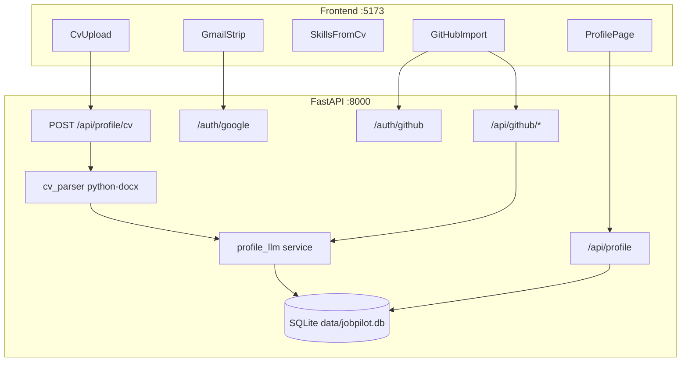

# JobPilot Backend Profile API — Build Plan

> **Plan naming:** `.agent/plans/jobpilot_<domain>_<scope>_plan.md`  
> This plan: `jobpilot_backend_profile_api_plan.md` · Related: [`jobpilot_frontend_web_app_plan.md`](jobpilot_frontend_web_app_plan.md)  
> **Execute:** `/build .agent/plans/jobpilot_backend_profile_api_plan.md`

## Scope (this build)

Ship the profile pipeline discussed in chat — **not** search agents / LangGraph yet.

| Feature | Backend | Frontend change |
|---------|---------|-----------------|
| CV upload (`.docx` multipart) | `python-docx` → text → profile LLM → `skills[]` | Upload file to API; no local-only filename |
| Skills | Extracted only (read-only UI) | Remove [`SkillsInput.tsx`](frontend/src/components/profile/SkillsInput.tsx); add `SkillsFromCv` |
| Target roles | User-editable via `PUT /profile` | Keep [`RolesInput.tsx`](frontend/src/components/profile/RolesInput.tsx) |
| Projects | Manual **and** GitHub import | Keep [`ProjectsList.tsx`](frontend/src/components/profile/ProjectsList.tsx); replace [`GitHubComingSoon.tsx`](frontend/src/components/profile/GitHubComingSoon.tsx) |
| Gmail | Real OAuth (Google already in `.env`) | Replace `toggleGmail` mock in [`GmailStrip.tsx`](frontend/src/components/profile/GmailStrip.tsx) |
| GitHub | OAuth + list repos + import selected READMEs | New `GitHubImport` flow on Profile |

OAuth credentials are already in [`.env`](.env) (`GOOGLE_*`, `GITHUB_*`). Callback URLs stay at `http://localhost:8000/auth/{google,github}/callback`.

---

## STRICT: Git workflow — commit after every single change

After **each** discrete unit of work (one file created, one route, one service, one frontend component swap, one config tweak):

```bash
git add <specific-files>
git commit -m "<short imperative message>"
```

Rules:
- **Never** batch unrelated files into one commit
- **Never** commit [`.env`](.env) or secrets
- Commit message style: match existing repo — short, why-focused
- Update [`progress.md`](progress.md) / [`frontend/progress.md`](frontend/progress.md) / [`currently-working-feature.md`](currently-working-feature.md) in its **own** commit when a phase completes

Example sequence:
1. Add `backend/app/main.py` → commit
2. Add `backend/app/db.py` → commit
3. Add `profile_store.py` → commit
4. Add `routes/profile.py` → commit
5. Wire `frontend/src/api/profile.ts` to fetch → commit
6. …each file or tightly related pair separately

---

## Architecture



### LLM split (config file + `.env` overrides)

| Task | Config default | Env override |
|------|----------------|--------------|
| Profile extraction (CV skills, README → project) | Cheaper model in `config/llm.yaml` | `PROFILE_LLM_MODEL` |
| Main agent (later) | `QWEN_MODEL` in `.env` | unchanged |

Reuse existing Qwen client pattern from [`scripts/test_qwen.py`](scripts/test_qwen.py) (`openai` SDK + `DASHSCOPE_API_KEY`).

### Processing chain (locked from discussion)

**Step 1 — CV upload (always first)**
1. Save `.docx` to `data/uploads/`
2. `python-docx` → `cv_text`
3. Profile LLM → `skills[]` (structured JSON, temperature 0.1)
4. Set `skills_extraction_status = ready | failed`

**Step 2 — GitHub import (optional, after connect)**
1. `GET /api/github/repos` — all user repos (public, private, forks)
2. User selects repos in UI
3. `POST /api/github/import` with `{ "repos": ["owner/name", ...] }`
4. Per repo (parallel, max 3–5): fetch README (truncate ~4k chars) + short CV summary → Profile LLM → `{ name, description, repo_skills[] }`
5. Merge: append projects, union + dedupe skills in Python (no extra LLM call for merge)

---

## Backend layout (new)

```
backend/
  app/
    main.py              # FastAPI + CORS + route mount
    config.py            # pydantic-settings: env + llm.yaml
    db.py                # SQLite init, single-user profiles row
    models/
      profile.py         # Pydantic schemas
      oauth.py
    routes/
      profile.py         # GET/PUT /api/profile, POST /api/profile/cv
      auth_google.py     # GET /auth/google, /auth/google/callback, DELETE disconnect
      auth_github.py     # GET /auth/github, /auth/github/callback, DELETE disconnect
      github.py          # GET /api/github/repos, POST /api/github/import
    services/
      cv_parser.py       # python-docx text extraction
      profile_llm.py     # extract_skills(cv_text), summarize_repo(readme, cv_summary)
      github_service.py  # PyGithub: list repos, get README
      gmail_oauth.py     # token exchange + refresh helpers (send deferred)
      oauth_store.py     # oauth_tokens CRUD
      profile_store.py   # profiles CRUD
config/
  llm.yaml               # profile vs agent model defaults
data/
  jobpilot.db            # gitignored
  uploads/               # gitignored CV files
```

Extend root [`requirements.txt`](requirements.txt) with: `fastapi`, `uvicorn[standard]`, `python-multipart`, `python-docx`, `authlib`, `httpx`, `PyGithub`, `google-auth`, `google-auth-oauthlib`, `google-api-python-client`, `pydantic-settings`, `pyyaml`.

Entry: `uvicorn backend.app.main:app --reload --port 8000`

---

## Database schema (SQLite, single-user MVP)

**`profiles`** (one row)

| Column | Type | Notes |
|--------|------|-------|
| `cv_filename` | TEXT | |
| `cv_path` | TEXT | `data/uploads/...` |
| `cv_text` | TEXT | from python-docx |
| `skills` | JSON | string array — **backend only** |
| `skills_extraction_status` | TEXT | `idle` \| `pending` \| `ready` \| `failed` |
| `target_roles` | JSON | user-edited |
| `projects` | JSON | `{id,name,description,source?}` — manual or `github` |
| `updated_at` | TIMESTAMP | |

**`oauth_tokens`**

| Column | Type | Notes |
|--------|------|-------|
| `provider` | TEXT | `google` \| `github` |
| `email` | TEXT | Gmail address or GitHub login |
| `access_token` | TEXT | |
| `refresh_token` | TEXT | Google only |
| `expires_at` | TIMESTAMP | nullable |

---

## API surface

| Method | Path | Behavior |
|--------|------|----------|
| `GET` | `/api/profile` | Full profile + `gmail_connected`, `github_connected` flags from `oauth_tokens` |
| `PUT` | `/api/profile` | Update `target_roles`, `projects` (manual edits). **Reject** direct `skills` writes |
| `POST` | `/api/profile/cv` | `multipart/form-data` file field `cv`; replace file; parse + LLM extract skills |
| `GET` | `/auth/google` | Redirect to Google consent (`gmail.send`, `userinfo.email`) |
| `GET` | `/auth/google/callback` | Store tokens; redirect to `http://localhost:5173/profile?gmail=connected` |
| `DELETE` | `/api/auth/google` | Disconnect Gmail |
| `GET` | `/auth/github` | Redirect with scopes `repo`, `read:user` |
| `GET` | `/auth/github/callback` | Store token; redirect to `http://localhost:5173/profile?github=connected` |
| `DELETE` | `/api/auth/github` | Disconnect GitHub |
| `GET` | `/api/github/repos` | List repos (name, full_name, private, fork, description, default_branch) |
| `POST` | `/api/github/import` | Body `{ "repos": ["owner/repo"] }`; fetch READMEs; LLM; merge projects + skills |

CORS: allow `http://localhost:5173`. OAuth connect buttons use **full backend URL** (`http://localhost:8000/auth/...`) — not Vite proxy (redirect must hit FastAPI).

Profile API uses existing Vite proxy: `fetch('/api/profile')` → `:8000`.

---

## Frontend changes

### Types ([`frontend/src/types/profile.ts`](frontend/src/types/profile.ts))

Add:
- `skillsExtractionStatus: 'idle' | 'pending' | 'ready' | 'failed'`
- `gmailConnected`, `gmailEmail`, `githubConnected`, `githubUsername` (from API, not local mock)
- Optional `source?: 'manual' | 'github'` on `Project`

Remove user-editable skills from context API.

### API layer ([`frontend/src/api/profile.ts`](frontend/src/api/profile.ts))

Replace localStorage with `fetch`:
- `getProfile()`, `updateProfile()`, `uploadCv(file: File)`, `disconnectGmail()`, `disconnectGitHub()`, `listGitHubRepos()`, `importGitHubRepos(repos[])`

Keep localStorage as fallback only if `VITE_USE_MOCK_API=true` (optional dev flag).

### Components

| File | Change |
|------|--------|
| [`CvUpload.tsx`](frontend/src/components/profile/CvUpload.tsx) | `POST` multipart; show `pending` spinner while extracting |
| `SkillsFromCv.tsx` (new) | Read-only chips; states: no CV / extracting / ready / failed |
| [`SkillsInput.tsx`](frontend/src/components/profile/SkillsInput.tsx) | Delete |
| `GitHubImport.tsx` (new) | Connect → repo checklist modal → Import → loading state |
| [`GitHubComingSoon.tsx`](frontend/src/components/profile/GitHubComingSoon.tsx) | Replace with `GitHubImport` |
| [`GmailStrip.tsx`](frontend/src/components/profile/GmailStrip.tsx) | `window.location.href = 'http://localhost:8000/auth/google'`; Disconnect calls API |
| [`ProfileContext.tsx`](frontend/src/context/ProfileContext.tsx) | Load from API on mount; remove `addSkill`, `removeSkill`, `toggleGmail` |
| [`useProfileGate.ts`](frontend/src/hooks/useProfileGate.ts) | `hasMinSkills = skills.length >= 3 && skillsExtractionStatus === 'ready'` |
| [`WelcomePage.tsx`](frontend/src/pages/WelcomePage.tsx) | Checklist row: "Skills from CV" (auto-extracted), not "Add skills" |

### Env

Add to [`frontend/.env`](frontend/.env) or vite config:
- `VITE_API_BASE=http://localhost:8000` for OAuth redirects

---

## Gmail scope (this plan)

- **In scope:** OAuth connect/disconnect, show connected email, persist refresh token per [design-decisions.md](System Design/design-decisions.md) §3
- **Out of scope:** `POST /jobs/{id}/send` — deferred to agent/HITL phase

---

## Validation checklist

- [ ] `POST /api/profile/cv` accepts `.docx` only; rejects PDF
- [ ] Skills appear read-only on Profile after upload (no manual add)
- [ ] Gate blocks Search until CV parsed + ≥3 skills + ≥1 project
- [ ] Gmail Connect opens Google → Allow → shows real email on Profile
- [ ] GitHub Connect → list repos → import 2 repos → projects appended; skills merged
- [ ] Manual project add/edit/remove still works alongside GitHub projects
- [ ] Profile survives refresh (SQLite, not localStorage)
- [ ] `npm run build` + `uvicorn` both run; no secrets committed

---

## Docs to update after build

- [`progress.md`](progress.md), [`frontend/progress.md`](frontend/progress.md), [`currently-working-feature.md`](currently-working-feature.md)
- [`.env.example`](.env.example): add `PROFILE_LLM_MODEL`, `FRONTEND_URL=http://localhost:5173`

---

## Implementation phases

### Phase 1 — Scaffold

| Step | Task | Commit |
|------|------|--------|
| 1 | Extend [`requirements.txt`](requirements.txt) with FastAPI deps | yes |
| 2 | Add [`config/llm.yaml`](config/llm.yaml) profile vs agent models | yes |
| 3 | `backend/app/main.py` — FastAPI, CORS, health check | yes |
| 4 | `backend/app/config.py` — pydantic-settings + llm.yaml load | yes |
| 5 | `backend/app/db.py` — SQLite init (`profiles`, `oauth_tokens`) | yes |

**Validation:** `uvicorn backend.app.main:app --port 8000` returns health OK.

### Phase 2 — Profile API

| Step | Task | Commit |
|------|------|--------|
| 6 | `backend/app/models/profile.py` — Pydantic schemas | yes |
| 7 | `backend/app/services/profile_store.py` — CRUD | yes |
| 8 | `backend/app/routes/profile.py` — `GET` / `PUT /api/profile` | yes |
| 9 | `frontend/src/api/profile.ts` — fetch layer (replace localStorage) | yes |
| 10 | `ProfileContext.tsx` — load/save via API | yes |

**Validation:** Profile `target_roles` + manual projects persist across refresh via SQLite.

### Phase 3 — CV + skills pipeline

| Step | Task | Commit |
|------|------|--------|
| 11 | `backend/app/services/cv_parser.py` — python-docx | yes |
| 12 | `backend/app/services/profile_llm.py` — `extract_skills` | yes |
| 13 | `POST /api/profile/cv` multipart route | yes |
| 14 | `SkillsFromCv.tsx` (new); delete `SkillsInput.tsx` | yes |
| 15 | `CvUpload.tsx` — multipart upload + pending state | yes |
| 16 | `useProfileGate.ts` + `WelcomePage.tsx` — skills-from-CV copy | yes |

**Validation:** Upload `.docx` → read-only skills; gate requires ≥3 extracted skills.

### Phase 4 — Gmail OAuth

| Step | Task | Commit |
|------|------|--------|
| 17 | `backend/app/services/oauth_store.py` | yes |
| 18 | `backend/app/services/gmail_oauth.py` | yes |
| 19 | `backend/app/routes/auth_google.py` — start + callback + disconnect | yes |
| 20 | `GmailStrip.tsx` — real connect/disconnect (remove mock toggle) | yes |

**Validation:** Connect Gmail → Allow → shows real email; disconnect works.

### Phase 5 — GitHub OAuth + repos

| Step | Task | Commit |
|------|------|--------|
| 21 | `backend/app/routes/auth_github.py` — start + callback + disconnect | yes |
| 22 | `backend/app/services/github_service.py` — list repos | yes |
| 23 | `backend/app/routes/github.py` — `GET /api/github/repos` | yes |
| 24 | `GitHubImport.tsx` (new); remove `GitHubComingSoon.tsx` | yes |

**Validation:** Connect GitHub → repo list loads (public, private, forks).

### Phase 6 — GitHub import + LLM projects

| Step | Task | Commit |
|------|------|--------|
| 25 | `profile_llm.py` — `summarize_repo` | yes |
| 26 | `POST /api/github/import` — README fetch + merge | yes |
| 27 | `GitHubImport.tsx` — select repos + import UI | yes |

**Validation:** Import 2 repos → projects appended; skills merged; manual projects still work.

### Phase 7 — Integration

| Step | Task | Commit |
|------|------|--------|
| 28 | End-to-end fixes (errors, loading states, CORS edge cases) | yes per fix |
| 29 | [`.env.example`](.env.example) — `PROFILE_LLM_MODEL`, `FRONTEND_URL` | yes |
| 30 | Update progress docs | yes (own commit) |

---

## Success criteria

This plan is **done** when:
1. FastAPI runs at `localhost:8000`; frontend uses API instead of localStorage for profile
2. CV upload parses `.docx`, extracts skills via profile LLM (read-only in UI)
3. Gmail OAuth connect/disconnect works with real Google tokens
4. GitHub OAuth → list repos → import selected READMEs → project cards + merged skills
5. Manual projects and target roles still editable; gate rules pass end-to-end
6. `npm run build` + `uvicorn` both succeed; no secrets committed
7. **Every change committed individually throughout build**
8. Progress docs updated
