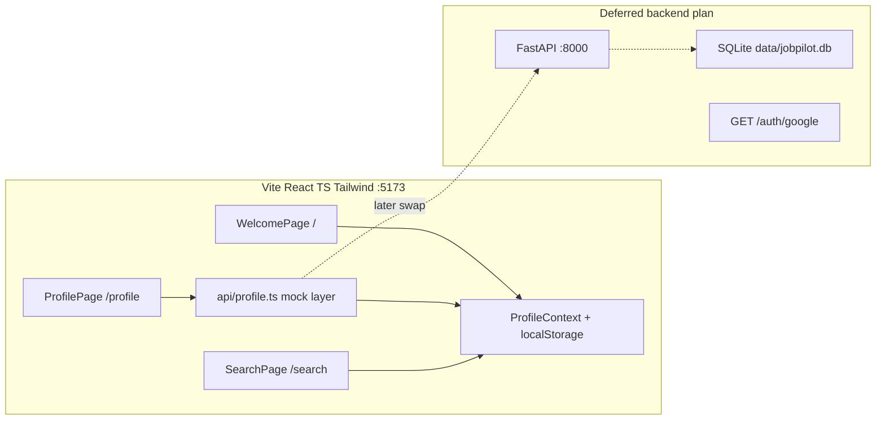
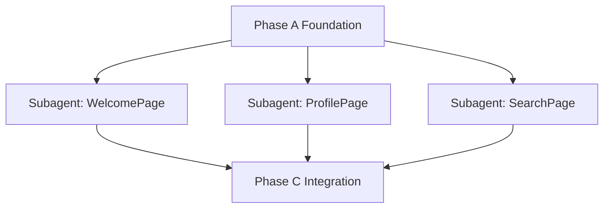

# JobPilot Frontend Web App — Build Plan

> **Plan naming:** `.agent/plans/jobpilot_<domain>_<scope>_plan.md`  
> This plan: `jobpilot_frontend_web_app_plan.md` · Related: `jobpilot_stitch_ui_plan.md`  
> **Execute:** `/build .agent/plans/jobpilot_frontend_web_app_plan.md`

## Locked decisions (from discussion)

| Topic | Decision |
|-------|----------|
| Frontend stack | **Vite + React + TypeScript + Tailwind** (locked; not Next.js) |
| Backend (later) | FastAPI on `:8000` — separate follow-up plan, not this build |
| In-scope screens | `/`, `/profile`, `/search` only ([`frontend/UI Design/01-welcome`](frontend/UI Design/01-welcome), [`02-profile`](frontend/UI Design/02-profile), [`03-search`](frontend/UI Design/03-search)) |
| Design source | **Desktop Stitch exports are reference only** — adapt for universal responsive web per [`frontend/progress.md`](frontend/progress.md) |
| Profile memory (now) | `localStorage` mock API layer; **swap to SQLite DB later** |
| CV format | **`.docx` only** (required for future swap optimization); replaceable via re-upload |
| Skills / roles / projects | Add, edit, remove anytime |
| Target roles | **Multiple roles** stored on Profile; Search picks **one role per run** |
| Gmail | Google Console credentials in [`.env`](.env) (done); UI **mock connect** until `GET /auth/google` backend exists |
| GitHub | **“Coming soon”** disabled button on Profile; manual projects only |
| Search CTA | Mock only (toast/stub); no real `POST /search` yet |
| UI quality process | **ui-ux-pro-max** skill — workflow + checklists only; **Stitch tokens win** over skill-generated colors/fonts |
| Icons | **Heroicons** (`@heroicons/react`) — no emoji as nav icons; no Material Symbols |
| Brand name | **JobPilot** (not “DevCopilot AI” from Stitch HTML) |

---

## UI/UX Pro Max — selective integration (STRICT)

Use [`.cursor/skills/ui-ux-pro-max/SKILL.md`](.cursor/skills/ui-ux-pro-max/SKILL.md) for **process and quality**, not to replace Stitch branding.

### What to use from the skill

| Use | Do not use (Stitch wins) |
|-----|--------------------------|
| Pre-build `--design-system --persist` | Skill-generated primary blue `#0369A1` |
| UX domain searches before ship | Skill-generated Plus Jakarta Sans font |
| Pre-delivery checklist (web-relevant items) | React Native stack guidance |
| `cursor-pointer`, hover 150–300ms, focus-visible | shadcn/ui (optional; defer this build) |
| `prefers-reduced-motion`, keyboard nav, contrast | Dark mode (defer this build) |
| Touch targets ≥44px | Copy-paste Stitch fixed desktop layout |

### Phase A0 — Persist design system (before coding)

```bash
python .cursor/skills/ui-ux-pro-max/scripts/search.py "developer job search SaaS productivity dashboard professional calm" --design-system --persist -p "JobPilot" -f markdown
```

Then create or edit `design-system/MASTER.md` with this **override block at the top**:

```markdown
## JobPilot overrides (authoritative)
- Colors, sidebar, cards: .stitch/DESIGN.md (primary #0D9488, sidebar #0F172A)
- Typography: Inter (not skill-recommended fonts)
- Layout/nav: frontend/progress.md
- Icons: @heroicons/react
- Skill output below is reference only for UX patterns, not brand tokens.
```

Commit `design-system/MASTER.md` in its own commit.

### Pre-ship UX validation (Phase C)

```bash
python .cursor/skills/ui-ux-pro-max/scripts/search.py "navigation accessibility responsive forms" --domain ux -n 10
```

Apply fixes for High-severity items before marking this plan complete.

### Agent reading order (every build task)

1. `design-system/MASTER.md` (JobPilot overrides first)
2. [`.stitch/DESIGN.md`](.stitch/DESIGN.md)
3. [`frontend/progress.md`](frontend/progress.md)
4. [`.cursor/skills/ui-ux-pro-max/SKILL.md`](.cursor/skills/ui-ux-pro-max/SKILL.md) — web checklist only

---

## STRICT: App shell navigation (left sidebar)

Stitch mocks use a **fixed left sidebar** (240px, dark `#0F172A`). Adapt per [`frontend/progress.md`](frontend/progress.md) — do not clone `ml-[240px]` on `<main>` without responsive behavior.

### Nav items (all viewports — same labels)

| Item | Route | Nav behavior |
|------|-------|----------------|
| *(logo)* | `/` | JobPilot logo + tagline → Welcome |
| Profile | `/profile` | Always enabled |
| Search | `/search` | **Disabled** until profile gate passes; then enabled |
| Applications | — | **Disabled** (greyed, not clickable); deferred screen |
| Settings | — | **Disabled** (greyed, not clickable); deferred screen |

**Welcome (`/`) is not a sidebar label** — users reach it via logo or initial load. Do not highlight Profile as active when on `/`.

### Active state rules

| Route | Active nav item |
|-------|-----------------|
| `/` | None (or logo only) |
| `/profile` | Profile |
| `/search` | Search |

Disabled items: reduced opacity, `cursor-not-allowed`, `aria-disabled`, no navigation.

### Responsive pattern (locked: drawer on mobile)

| Viewport | Pattern |
|----------|---------|
| Desktop `≥1024px` | Persistent left sidebar ~240px |
| Mobile / tablet `<1024px` | **Hamburger → slide-in drawer** (not bottom tabs for this build) |

### Shell requirements (Phase A7 acceptance)

- Logo block at top: **JobPilot** + “Your AI job application copilot”
- Heroicons for nav icons (outline style, consistent 24px)
- Main content **must not sit under** fixed sidebar/drawer — use responsive offset / padding
- `viewport` meta tag in `index.html`
- Optional: defer Stitch “New Application” sidebar CTA (not required this build)

---

## STRICT: Design reference rule

**Do not copy-paste Stitch HTML.** The mocks use fixed `ml-[240px]`, `max-w-[960px]`, and 1440px desktop layout.

| Take from Stitch / [`DESIGN.md`](.stitch/DESIGN.md) | Adapt for web |
|-----------------------------------------------------|---------------|
| Colors, Inter font, tone, card style, copy hierarchy | Breakpoints, fluid widths, mobile nav |
| Sidebar always visible | Sidebar desktop only; drawer on mobile |
| `resume_hamza.pdf` in mock | `.docx` only; show filename from state |
| “PDF or Word” on Welcome | **“.docx only”** copy |
| “Sync from GitHub” copy | **Manual projects** + **Coming soon** on Profile |
| “DevCopilot AI” in Stitch HTML | **JobPilot** everywhere |

Breakpoints (from [`frontend/progress.md`](frontend/progress.md)): mobile `<640px`, tablet `640–1023px`, desktop `≥1024px`. Test at **375px**, **768px**, **1280px**.

---

## STRICT: Git workflow — commit after every single change

After **each** discrete unit of work (one file created, one component, one route, one config tweak):

```bash
git add <specific-files>
git commit -m "<short imperative message>"
```

Rules:
- **Never** batch unrelated files into one commit
- **Never** commit [`.env`](.env) or secrets
- Commit message style: match existing repo (`7b0d47b` style) — short, why-focused
- Update [`frontend/progress.md`](frontend/progress.md) / [`progress.md`](progress.md) in its **own** commit when a task completes

Example sequence:
1. Scaffold Vite → commit
2. Add Tailwind config → commit
3. Add `AppShell` → commit
4. Add `WelcomePage` → commit
5. …each component/file separately

---

## Architecture (this plan)



### Profile data shape (localStorage now → DB later)

```typescript
interface Project {
  id: string;
  name: string;
  description: string;
}

interface Profile {
  cvFilename: string | null;      // .docx only
  cvFileMeta: { size: number } | null;  // no binary in localStorage; file kept in memory/session or IndexedDB stub
  skills: string[];
  targetRoles: string[];          // multiple roles
  projects: Project[];
  gmailConnected: boolean;        // mock
  gmailEmail: string | null;      // mock
}
```

**Gate rules** (Welcome + nav):
- Required: CV uploaded + **≥3 skills** + **≥1 project**
- Optional: Gmail (does not block Search)
- Search nav disabled until gate passes

### Database schema (document now; implement in backend plan)

SQLite at `data/jobpilot.db` — single `profiles` row (single-user MVP):

| Column | Type | Notes |
|--------|------|-------|
| `cv_filename` | TEXT | |
| `cv_path` | TEXT | `data/uploads/` local |
| `cv_text` | TEXT | parsed from docx |
| `skills` | JSON | string array |
| `target_roles` | JSON | string array |
| `projects` | JSON | `{id,name,description}[]` |
| `updated_at` | TIMESTAMP | |

`oauth_tokens` table (Gmail, later): `provider`, `email`, `refresh_token`, `access_token`, `expires_at`.

API surface (backend plan): `GET /profile`, `PUT /profile`, `POST /profile/cv` (multipart, replaces file), `GET /auth/google`, `GET /auth/google/callback`.

---

## Target folder structure

```
frontend/
  package.json
  vite.config.ts
  tailwind.config.js
  index.html
  src/
    main.tsx
    App.tsx
    index.css
    types/profile.ts
    api/profile.ts          # localStorage mock; swap to fetch later
    context/ProfileContext.tsx
    components/
      shell/AppShell.tsx
      shell/Sidebar.tsx
      shell/MobileNav.tsx
      ui/Button.tsx
      ui/ChipInput.tsx
      ui/ProgressBar.tsx
      profile/CvUpload.tsx
      profile/SkillsInput.tsx
      profile/RolesInput.tsx
      profile/ProjectsList.tsx
      profile/GmailStrip.tsx
      profile/GitHubComingSoon.tsx
    pages/
      WelcomePage.tsx
      ProfilePage.tsx
      SearchPage.tsx
    hooks/useProfileGate.ts
```

Keep existing [`frontend/UI Design/`](frontend/UI Design/) as read-only reference — do not modify Stitch exports.

```
design-system/
  MASTER.md                 # ui-ux-pro-max persist + Stitch overrides
```

---

## Implementation phases

### Phase A0 — Design system persist (before code)

| Step | Task | Commit |
|------|------|--------|
| A0 | Run ui-ux-pro-max `--design-system --persist`; add Stitch override block to `design-system/MASTER.md` | yes |

### Phase A — Foundation (sequential, ~1 agent)

| Step | Task | Commit |
|------|------|--------|
| A1 | `npm create vite@latest` in `frontend/` — React + TS | yes |
| A2 | Install Tailwind, PostCSS, React Router, Inter font, `@heroicons/react` | yes |
| A3 | Tailwind theme from [`.stitch/DESIGN.md`](.stitch/DESIGN.md) tokens (`primary`, `sidebar`, etc.) | yes |
| A4 | `vite.config.ts` proxy `/api` → `localhost:8000` (ready for backend plan) | yes |
| A5 | `Profile` types + `api/profile.ts` localStorage CRUD | yes |
| A6 | `ProfileContext` + `useProfileGate` hook | yes |
| A7 | `AppShell` + `Sidebar` + `MobileNav` — **full nav spec above** (4 items + logo, drawer mobile) | yes |
| A8 | React Router routes `/`, `/profile`, `/search` wrapped in `AppShell` | yes |

**Validation:** `npm run dev` loads shell; all 4 nav labels visible; Search/Applications/Settings greyed per rules; drawer works at 375px; sidebar at 1280px.

---

### Phase B — Three screens (parallel subagents)

Launch **3 subagents in parallel** after Phase A completes. Each subagent:
- Reads `design-system/MASTER.md`, [`frontend/progress.md`](frontend/progress.md), [`.cursor/skills/ui-ux-pro-max/SKILL.md`](.cursor/skills/ui-ux-pro-max/SKILL.md) (web checklist)
- Reads its Stitch `screen.html` + `screenshot.png` for **content/colors only**
- Commits after every file change
- Does **not** touch `AppShell`, `Sidebar`, `MobileNav`, router, or other agents’ page files



#### Subagent 1 — Welcome (`/`)

Reference: [`frontend/UI Design/01-welcome/`](frontend/UI Design/01-welcome/)

| Task | Detail |
|------|--------|
| Hero | JobPilot logo, tagline, HITL banner (from mock) |
| Checklist | 4 rows: CV **(.docx)**, skills, projects, Gmail optional — **state-driven** checkmarks from `ProfileContext` |
| Copy fixes | No “Sync from GitHub”; CV row says **.docx only** (not PDF) |
| Progress | “X of 3 required steps” + progress bar (roles tracked on Profile, not in welcome count) |
| CTA | “Set up your profile” → `/profile` |
| Responsive | Stacked mobile; centered card desktop; content inside `AppShell` main area only |

#### Subagent 2 — Profile (`/profile`)

Reference: [`frontend/UI Design/02-profile/`](frontend/UI Design/02-profile/)

| Task | Detail |
|------|--------|
| Completeness bar | Derived from gate fields |
| CV upload | `.docx` only; drag-drop; filename display; **re-upload replaces** |
| Skills | Chip input add/remove (min 44px tap targets) |
| Target roles | Chip input add/remove (same pattern as skills) |
| Projects | Repeatable cards; add/remove/edit |
| GitHub | **“Coming soon”** button (disabled, tooltip) |
| Gmail strip | Mock connect toggle + fake email; wire-ready comment for `GET /auth/google` |
| Save | Persist via `api/profile.ts` on change or explicit Save button |
| Continue | Enabled when gate passes → `/search` |

#### Subagent 3 — Search (`/search`)

Reference: [`frontend/UI Design/03-search/`](frontend/UI Design/03-search/)

| Task | Detail |
|------|--------|
| Route guard | Redirect to `/profile` if gate incomplete |
| Role picker | **Dropdown** from `profile.targetRoles` (not free text); show hint if empty |
| Platform | LinkedIn / Indeed radio |
| Summary line | `{cvFilename} · N skills · M projects` from profile |
| Start search | Mock: disabled state + toast “Search coming soon” |
| Tips cards | From mock; responsive grid (1 col mobile, 2 col desktop) |

---

### Phase C — Integration (sequential, parent agent)

| Step | Task | Commit |
|------|------|--------|
| C1 | Merge subagent branches / resolve conflicts if any | yes |
| C2 | Verify nav: Search disabled until gate; **Applications + Settings** always disabled; active states per route | yes |
| C3 | End-to-end flow: Welcome → Profile → fill data → Search | yes |
| C4 | Responsive + a11y pass (focus rings, labels, contrast, `prefers-reduced-motion`) | yes |
| C4b | Run ui-ux-pro-max UX domain search; fix High-severity nav/a11y/responsive issues | yes |
| C5 | Update [`frontend/progress.md`](frontend/progress.md), [`progress.md`](progress.md), [`currently-working-feature.md`](currently-working-feature.md) | yes |

**Validation checklist:**
- [ ] `npm run build` succeeds
- [ ] Profile survives page refresh (localStorage)
- [ ] CV re-upload replaces previous filename (.docx only)
- [ ] Skills, roles, projects add/remove works
- [ ] Search nav + route blocked until gate passes
- [ ] All 4 nav items visible; Applications + Settings greyed
- [ ] Mobile drawer + desktop sidebar both work
- [ ] `cursor-pointer` on clickables; hover transitions 150–300ms
- [ ] No horizontal scroll at 375px
- [ ] Heroicons only (no emoji nav icons)
- [ ] Screens 4–8 not implemented

---

### Phase D — Deferred (separate plan)

Not built in this plan. Follow-up: **`jobpilot_backend_profile_api_plan.md`** (TBD).

1. FastAPI scaffold + `profiles` + `oauth_tokens` tables
2. `GET/PUT /profile`, `POST /profile/cv` (python-docx parse)
3. Replace `api/profile.ts` mock with `fetch('http://localhost:8000/...')`
4. Gmail OAuth routes (credentials already in `.env`)

---

## Subagent launch instructions (for `/build` or parent agent)

**Prerequisites:** Phase A complete; `frontend/` runs with shell + empty route stubs.

**Parallel launch (single message, 3 Task tools):**

| Agent | `subagent_type` | Scope | Files owned |
|-------|-----------------|-------|-------------|
| Welcome | `generalPurpose` | WelcomePage + checklist components | `pages/WelcomePage.tsx`, `components/welcome/*` |
| Profile | `generalPurpose` | ProfilePage + all profile components | `pages/ProfilePage.tsx`, `components/profile/*` |
| Search | `generalPurpose` | SearchPage + form | `pages/SearchPage.tsx`, `components/search/*` |

Each prompt must include:
- `design-system/MASTER.md` + [`frontend/progress.md`](frontend/progress.md) + ui-ux-pro-max web checklist
- “Stitch is desktop reference only — do not copy fixed layouts”
- “Stitch tokens (teal/Inter) override skill-generated colors/fonts”
- Profile types and `ProfileContext` API
- **Git commit after every single file change**
- Do not edit `AppShell`, `Sidebar`, `MobileNav`, router, or other agents’ files

**Parent agent after parallel completion:** Phase C integration only.

---

## Key file references

| Purpose | Path |
|---------|------|
| This plan | [`.agent/plans/jobpilot_frontend_web_app_plan.md`](.agent/plans/jobpilot_frontend_web_app_plan.md) |
| UX process + checklist | [`.cursor/skills/ui-ux-pro-max/SKILL.md`](.cursor/skills/ui-ux-pro-max/SKILL.md) |
| Persisted design system | `design-system/MASTER.md` |
| Responsive rules | [`frontend/progress.md`](frontend/progress.md) |
| Design tokens | [`.stitch/DESIGN.md`](.stitch/DESIGN.md) |
| Welcome mock | [`frontend/UI Design/01-welcome/screen.html`](frontend/UI Design/01-welcome/screen.html) |
| Profile mock | [`frontend/UI Design/02-profile/screen.html`](frontend/UI Design/02-profile/screen.html) |
| Search mock | [`frontend/UI Design/03-search/screen.html`](frontend/UI Design/03-search/screen.html) |
| Gmail OAuth design | [`System Design/design-decisions.md`](System Design/design-decisions.md) §3 |
| Build command | [`.cursor/commands/build.md`](.cursor/commands/build.md) |

---

## Success criteria

This plan is **done** when:
1. Vite app runs at `localhost:5173` with all 3 screens inside `AppShell`
2. Left sidebar (desktop) + drawer (mobile) with Profile, Search, Applications, Settings per nav spec
3. Responsive at mobile/tablet/desktop per rules + ui-ux-pro-max web checklist
4. Profile long-term memory works via localStorage (editable CV/skills/roles/projects)
5. GitHub = Coming soon; Gmail = mock connect; brand = JobPilot; CV = .docx only
6. Search uses role dropdown from profile; mock start only
7. ui-ux-pro-max UX validation pass completed (Phase C4b)
8. Every change committed individually throughout build
9. Progress docs updated; backend follow-up plan scoped
