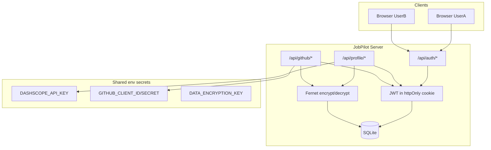
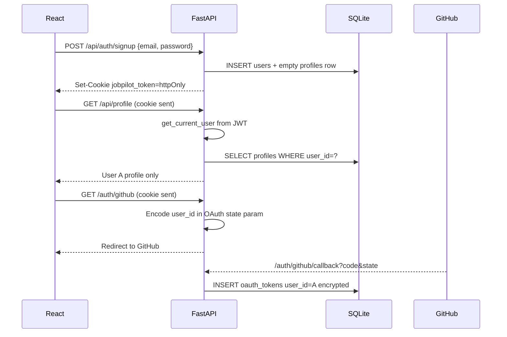

# Multi-User Profiles & Data Protection Plan

## Goals

- Replace the single global profile (`profiles.id = 1`) with **one complete workspace per user**
- **Email + password** for signup/login; **GitHub connect** only inside a logged-in account (per-user token)
- **Encrypt sensitive data at rest** in SQLite (tokens, CV text); **hash** passwords (bcrypt)
- Keep **shared server secrets** (`DASHSCOPE_API_KEY`, `GITHUB_CLIENT_ID/SECRET`) in [`.env`](.env.example) for hackathon demos
- Lay **future-ready schema** for `search_runs`, `job_packages`, `job_applications` with `user_id` (no agent APIs yet)

## Architecture



## Data model (target)

| Table | Key change | Sensitive fields |
|-------|------------|------------------|
| `users` | **new** — `id`, `email` (unique), `password_hash`, `created_at` | `password_hash` (bcrypt, one-way) |
| `profiles` | `user_id` FK unique; drop `CHECK (id = 1)` | `cv_text` encrypted |
| `oauth_tokens` | PK `(user_id, provider)` | `access_token`, `refresh_token` encrypted |
| `search_runs` | **new stub** — `id`, `user_id`, `role`, `platform`, `status` | — |
| `job_packages` | **new stub** — `id`, `user_id`, `run_id`, … | draft content later |
| `job_applications` | **new stub** — `id`, `user_id`, `job_package_id` | — |

**Disk layout:** `data/uploads/{user_id}/` for CV files ([`backend/app/config.py`](backend/app/config.py) today uses flat `data/uploads/`).

## Encryption strategy (practical for SQLite hackathon)

Industry split (not everything is “encrypted” the same way):

| Data | Method | Why |
|------|--------|-----|
| Passwords | **bcrypt** via `passlib` | One-way hash; never decrypt |
| OAuth tokens | **Fernet** (AES) app-level before INSERT | Reversible; needed at runtime |
| `cv_text` | **Fernet** app-level | PII protection at rest |
| Skills, roles, projects JSON | Plaintext JSON | Lower sensitivity; queryable |
| SQLite file | OS volume permissions on ECS | Full DB encryption (SQLCipher) deferred |

New env vars in [`.env.example`](.env.example) and [`deploy/env.production.example`](deploy/env.production.example):

```env
JWT_SECRET=           # long random string
JWT_EXPIRE_MINUTES=10080   # 7 days
DATA_ENCRYPTION_KEY=  # Fernet key (generate once; store in GitHub Secrets)
```

New module: `backend/app/services/crypto.py` — `encrypt(plaintext) -> str`, `decrypt(ciphertext) -> str` using `cryptography.fernet`.

## Auth flow



- **Session:** JWT in **httpOnly, Secure (prod), SameSite=Lax** cookie — not `localStorage` (XSS-safe)
- **Dependency:** `get_current_user()` used on all `/api/profile*`, `/api/github*`, `/api/auth/github` DELETE
- **GitHub OAuth:** Add `state` param tying callback to logged-in `user_id` (signed or HMAC with `JWT_SECRET`)

## Files to change (by layer)

### Backend (core)

| File | Change |
|------|--------|
| [`requirements.txt`](requirements.txt) | Add `passlib[bcrypt]`, `python-jose[cryptography]`, `cryptography` |
| [`backend/app/config.py`](backend/app/config.py) | `jwt_secret`, `jwt_expire_minutes`, `data_encryption_key` |
| [`backend/app/db.py`](backend/app/db.py) | New schema + migration from single-user |
| `backend/app/services/crypto.py` | **new** — Fernet helpers |
| `backend/app/services/auth_service.py` | **new** — signup, login, password verify, JWT create/decode |
| `backend/app/services/user_store.py` | **new** — users CRUD |
| [`backend/app/services/profile_store.py`](backend/app/services/profile_store.py) | All functions take `user_id`; encrypt/decrypt `cv_text` |
| [`backend/app/services/oauth_store.py`](backend/app/services/oauth_store.py) | Scope by `(user_id, provider)`; encrypt tokens |
| `backend/app/deps/auth.py` | **new** — `get_current_user` FastAPI dependency |
| `backend/app/routes/auth.py` | **new** — `POST /api/auth/signup`, `login`, `logout`, `GET /api/auth/me` |
| [`backend/app/routes/profile.py`](backend/app/routes/profile.py) | Require auth; per-user upload dir |
| [`backend/app/routes/auth_github.py`](backend/app/routes/auth_github.py) | Require auth on start; bind state to user |
| [`backend/app/routes/github.py`](backend/app/routes/github.py) | Use current user's token |
| [`backend/app/main.py`](backend/app/main.py) | Register auth router |

### Frontend

| File | Change |
|------|--------|
| `frontend/src/context/AuthContext.tsx` | **new** — user session, login/logout |
| `frontend/src/api/auth.ts` | **new** — signup/login/me with `credentials: 'include'` |
| [`frontend/src/api/profile.ts`](frontend/src/api/profile.ts) | Add `credentials: 'include'` to all fetches |
| `frontend/src/pages/LoginPage.tsx`, `SignupPage.tsx` | **new** |
| `frontend/src/components/auth/ProtectedRoute.tsx` | **new** — redirect to `/login` if unauthenticated |
| [`frontend/src/App.tsx`](frontend/src/App.tsx) | Public `/login`, `/signup`; protect `/profile`, `/search`, `/settings` |
| [`frontend/src/context/ProfileContext.tsx`](frontend/src/context/ProfileContext.tsx) | Load profile only when authenticated |
| [`frontend/src/components/shell/Sidebar.tsx`](frontend/src/components/shell/Sidebar.tsx) | Show user email + logout |

### Docs & deploy

| File | Change |
|------|--------|
| [`currently-working-feature.md`](currently-working-feature.md) | Mark items done as shipped |
| [`progress.md`](progress.md) | Update phase 2b status |
| [`deploy/env.production.example`](deploy/env.production.example) | Add `JWT_SECRET`, `DATA_ENCRYPTION_KEY` |
| GitHub Actions secrets | Document adding new secrets for deploy |

## Migration (existing single-user data)

On startup in [`backend/app/db.py`](backend/app/db.py):

1. If old `profiles` table has `CHECK (id = 1)` — run one-time migration
2. Create new tables; alter `profiles` / `oauth_tokens`
3. **Do not auto-migrate** orphan global data into a random user (data integrity risk)
4. Log warning if legacy row exists; optional manual script `scripts/migrate_single_user.py` to assign to a chosen email

## API contract (new endpoints)

```
POST /api/auth/signup   { email, password }  → 201 + cookie
POST /api/auth/login    { email, password }  → 200 + cookie
POST /api/auth/logout                        → 204, clear cookie
GET  /api/auth/me                            → { id, email }

GET  /api/profile       → 401 if no session; else user's profile
PUT  /api/profile       → scoped to user
POST /api/profile/cv    → saves to uploads/{user_id}/
```

All existing profile/GitHub routes return **401** when unauthenticated; **403** if resource `user_id` mismatch (future `run_id` checks).

## Git commit strategy (one commit per logical unit)

Each step: implement → test → `git add` relevant files → `git commit` with focused message.

| # | Commit message (draft) | Scope |
|---|------------------------|-------|
| 1 | `Add auth and encryption dependencies` | `requirements.txt` |
| 2 | `Add JWT and encryption settings to config` | `config.py`, `.env.example`, `deploy/env.production.example` |
| 3 | `Add Fernet encryption service for sensitive fields` | `crypto.py` + unit test |
| 4 | `Add users table and multi-tenant database schema` | `db.py`, migration logic |
| 5 | `Add auth service with bcrypt passwords and JWT sessions` | `auth_service.py`, `user_store.py`, models |
| 6 | `Add signup, login, logout, and me API routes` | `routes/auth.py`, `main.py` |
| 7 | `Add get_current_user auth dependency` | `deps/auth.py` |
| 8 | `Scope profile store and routes by user_id` | `profile_store.py`, `routes/profile.py` |
| 9 | `Encrypt cv_text and scope uploads per user` | `profile_store.py`, `routes/profile.py` |
| 10 | `Scope OAuth tokens by user with encryption` | `oauth_store.py` |
| 11 | `Bind GitHub OAuth flow to authenticated user` | `auth_github.py`, `github.py` |
| 12 | `Add future search and job tables with user_id` | `db.py` schema stubs only |
| 13 | `Add frontend auth API and AuthContext` | `api/auth.ts`, `AuthContext.tsx` |
| 14 | `Add login and signup pages` | `LoginPage.tsx`, `SignupPage.tsx` |
| 15 | `Protect app routes and send credentials on API calls` | `App.tsx`, `ProtectedRoute.tsx`, `api/profile.ts` |
| 16 | `Add logout to shell and gate profile on auth` | `Sidebar.tsx`, `ProfileContext.tsx` |
| 17 | `Update progress docs for multi-user auth phase` | `progress.md`, `currently-working-feature.md` |

## Testing checklist (manual, per commit where relevant)

- User A signs up → sees empty profile; User B signs up → sees empty profile (no shared CV)
- User A uploads CV → User B does not see it
- User A connects GitHub → imports repos → User B's GitHub stays disconnected
- Logout → `/api/profile` returns 401
- Restart API → tokens and cv_text still decrypt correctly (key persisted in `.env`)
- Production: set `JWT_SECRET` + `DATA_ENCRYPTION_KEY` in GitHub Secrets before deploy

## Out of scope (this plan)

- GitHub as login provider (email/password only per your choice)
- LangGraph search agents and job APIs (schema stubs only)
- SQLCipher full-database encryption
- Email verification / password reset
- Rate limiting and audit logs (note in docs as post-hackathon hardening)

## Shared API keys (unchanged)

- `DASHSCOPE_API_KEY` — one server key; all users' LLM calls go through backend ([`backend/app/services/profile_llm.py`](backend/app/services/profile_llm.py))
- `GITHUB_CLIENT_ID/SECRET` — one OAuth app; each user gets their own encrypted access token after connecting on Profile
