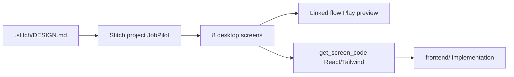
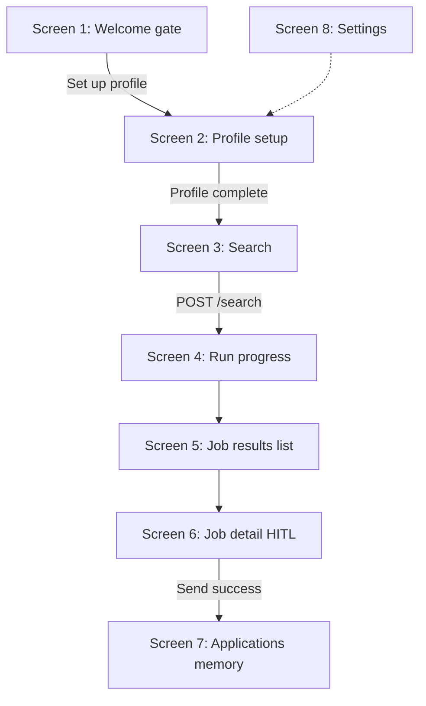

# JobPilot UI Design Plan (Google Stitch)

## How Stitch fits JobPilot

Google Stitch is an AI-native design canvas ([stitch.withgoogle.com](https://stitch.withgoogle.com)) that turns **text prompts** into high-fidelity **desktop web screens**, links them into **multi-screen flows**, and exports **HTML / Tailwind / React** via the **Stitch MCP** into Cursor.



**Stitch workflow (official pattern from google-labs stitch-skills):**
1. Write or upload `DESIGN.md` (design tokens + tone)
2. `create_project` → get numeric `projectId`
3. `create_design_system_from_design_md` or `upload_design_md`
4. `generate_screen_from_text` per screen (always pass `designSystem` for consistency)
5. `edit_screens` for targeted fixes (do not regenerate from scratch)
6. `apply_design_system` when updating all screens after token changes
7. Link screens in Stitch canvas → **Play** to validate user journey
8. MCP `get_screen` / code export → implement in `frontend/`

**Prerequisite (before any design work):** Fix [`.cursor/mcp.json`](.cursor/mcp.json) — replace remote URL config with local proxy (known Cursor issue with `https://stitch.googleapis.com/mcp`):

```json
{
  "mcpServers": {
    "stitch": {
      "command": "npx",
      "args": ["-y", "@_davideast/stitch-mcp", "proxy"],
      "env": { "STITCH_API_KEY": "from stitch.withgoogle.com" }
    }
  }
}
```

Add `.cursor/mcp.json` to [`.gitignore`](.gitignore); use `.cursor/mcp.json.example` for the template. Rotate the key currently committed in the repo.

---

## Design direction (locked for Stitch prompts)

| Attribute | Value |
|-----------|-------|
| Platform | **DESKTOP** (1440px web app) |
| Product type | B2C developer tool / job search copilot |
| Tone | Professional, calm, trustworthy — user approves before anything is sent |
| Layout | Left sidebar nav + main content area |
| Primary accent | `#0D9488` (teal) |
| Secondary | `#1E40AF` (blue for links/actions) |
| Background | `#F8FAFC` content, `#0F172A` sidebar |
| Score colors | Red &lt;50, amber 50–69, green 70+ |
| Typography | Inter or similar sans-serif; clear hierarchy |
| HITL | Amber banner: "You approve before anything is sent" on job detail |

All prompts below should reference this design system once `DESIGN.md` exists.

---

## App structure (maps to backend)

Aligns with [JobPilot-System-Design.md](System%20Design/JobPilot-System-Design.md) Section 8 API and our UI flow decisions.



**Profile gate (frontend logic to design for):**
- Search nav item **disabled** until: CV uploaded + ≥3 skills + ≥1 project
- Send button **disabled** until Gmail connected

---

## Phase 0 — Repo + Stitch project setup

**Create in repo (before generating screens):**

```text
.stitch/
  DESIGN.md              # design tokens + Stitch prompt snippets (source of truth)
  designs/               # downloaded screenshots + HTML per screen
  prompts/               # enhanced prompt text per screen (optional)
  project.json           # { "projectId": "...", "title": "JobPilot" }
```

**Stitch MCP steps (once MCP is green in Cursor):**
1. `list_projects` — check if JobPilot exists
2. `create_project` with title `"JobPilot"`
3. Save numeric `projectId` to `.stitch/project.json`
4. `upload_design_md` or `create_design_system_from_design_md` using `.stitch/DESIGN.md`
5. Note `designSystem` asset ID for all `generate_screen_from_text` calls

**`.stitch/DESIGN.md` contents to write first:**
- Product name, tagline, audience (developers job searching)
- Color palette (hex codes above)
- Typography scale (h1–h4, body, caption)
- Component rules: cards, chips/tags, progress bars, score badges, tabs, primary/secondary buttons, empty states
- Section 6: reusable Stitch prompt snippets (e.g. "sidebar nav item active state", "match score badge green")

---

## Phase 1 — Generate screens (order matters)

Generate in this order so the first screen establishes the shell reused in later prompts. Always set `deviceType: "DESKTOP"` and pass `designSystem`.

### Screen 1 — Welcome / setup gate (`/`)

**Purpose:** First visit when profile incomplete. No search UI.

**Stitch prompt structure:**
- App shell with sidebar (Profile active, Search + Applications greyed/disabled)
- Hero: JobPilot logo, tagline "Your AI job application copilot"
- Subtext: one sentence on browser search + human approval
- Checklist card: 4 rows — Upload CV, Add skills, Add projects, Connect Gmail (optional badge)
- Progress: "0 of 3 required steps"
- Primary CTA: "Set up your profile"
- Empty state feel — no job cards, no search form

**Data shown:** static; checklist states are UI placeholders

---

### Screen 2 — Profile setup (`/profile`)

**Purpose:** Collect long-term memory inputs (CV, skills, projects, Gmail).

**Sections (top to bottom):**
1. **Progress bar** — "Profile completeness 80%"
2. **CV** — drag-drop zone, uploaded filename, read-only text preview panel, Re-upload button
3. **Skills** — chip/tag input with 5–8 example chips (Python, React, FastAPI…)
4. **Projects** — repeatable cards: Name + Description textarea, Add project, Remove
5. **Gmail strip** — status badge (Not connected / Connected as email), Connect Gmail button
6. **Footer** — Save profile (secondary), Continue to Search (primary, enabled at 100% core)

**API mapping:** `POST /profile`, `GET /auth/google`

---

### Screen 3 — Search (`/search`)

**Purpose:** Start agent run. Only reachable when profile complete.

**Layout:**
- Sidebar: Search active
- "New search" card:
  - Target role text input (placeholder: "Senior Full-Stack Developer")
  - Platform radio: LinkedIn / Indeed
  - Summary line: "Using profile: resume.pdf · 8 skills · 3 projects"
  - Primary: "Start search"
  - Helper text: "~1–2 min · opens your Chrome · scores jobs against your profile"
- No results on this page

**API mapping:** `POST /search` → navigate to Screen 4 with `run_id`

---

### Screen 4 — Run in progress (`/runs/:runId`)

**Purpose:** Async agent feedback while LangGraph + subgraphs run.

**Layout:**
- Header: role + platform + status pill (Running)
- **Progress bar:** "5 / 8 jobs analyzed"
- **Agent step log** (vertical checklist):
  - Done: Opened LinkedIn and searched
  - Done: Found 24 listings · 8 passed filter
  - In progress: Scoring and drafting applications
- **Live job cards** (partial list, grows while polling):
  - Company, title, match %, View button
- Footer: subtle "Polling for updates…"

**API mapping:** `GET /runs/{run_id}/status`, `GET /jobs?run_id=...` (poll every 2–3s)

**Design note:** Show incremental cards — key demo moment for hackathon

---

### Screen 5 — Job results list (`/runs/:runId/jobs`)

**Purpose:** Full results after run completes.

**Layout:**
- Header: "Results · 6 jobs" + sort dropdown (Match score) + filter (All / Ready / Failed)
- Job cards (repeatable):
  - Large match score badge (color-coded)
  - Company + title + platform icon
  - Meta: "CV: Swap suggested" or "CV: Keep" · "Email drafted"
  - Status chip: ready / failed
  - CTA: "Review application"
- Empty state variant (generate as `generate_variants` if needed): "No matches found"

**API mapping:** `GET /jobs?run_id=...`

---

### Screen 6 — Job detail HITL (`/jobs/:id`) — most important screen

**Purpose:** Human-in-the-loop review before send.

**Layout:**
- Top bar: company, title, match score, "Open job description" external link
- **HITL amber banner:** "You approve before anything is sent"
- **Tabs:** Overview | CV | Email | Job description

**Tab: Overview**
- CV recommendation summary
- Score comparison: "Current CV fit 65% → After swap 82%"
- Quick actions linking to other tabs

**Tab: CV**
- Swap suggestion text ("Replace Todo App with…")
- Buttons: Preview swap | Apply to CV
- Side-by-side diff panel (before / after)

**Tab: Email**
- Editable-looking email draft (textarea)
- Refine instruction input + Refine button
- Attachment line: resume_acme.pdf

**Tab: Job description**
- Scrollable JD text

**Footer actions:** Reject (ghost) | Approve and Send (primary, mail icon)
- Disabled state variant: Send greyed + "Connect Gmail in Profile"

**API mapping:** `GET /jobs/{id}`, `POST edit-cv`, `POST refine-email`, `POST send`

**Stitch tip:** Generate Overview tab first, then `edit_screens` to add tab variants or generate separate detail states

---

### Screen 7 — Applications / memory (`/applications`)

**Purpose:** Long-term memory visibility (applied jobs + past runs).

**Two sections:**
1. **Applied** — list with checkmark, company, title, date sent (never searched again)
2. **Past searches** — run history rows: date, role, platform, job count, status Done

**API mapping:** reads from `job_applications` + `search_runs` tables (future `GET /applications` endpoint)

---

### Screen 8 — Settings (`/settings`)

**Purpose:** Gmail + about.

**Sections:**
- Gmail connection (same as profile strip but expanded)
- About JobPilot (version, hackathon track)
- Optional: default platform preference

---

## Phase 2 — Stitch flow linking (prototype)

In Stitch canvas (manual or via agent after screens exist):
1. Link: Welcome → Profile → Search → Run progress → Job list → Job detail → Applications
2. Click **Play** to walk the journey
3. Use Stitch auto-generate next screen on click only where it helps explore; prefer our defined screens for consistency

Validate:
- Profile gate is obvious before Search
- Run progress shows live incremental results
- HITL banner visible on job detail
- Send disabled without Gmail

---

## Phase 3 — Iteration with Stitch (not full regen)

| Issue | Stitch tool |
|-------|-------------|
| Wrong color / font | `update_design_system` + `apply_design_system` |
| One section wrong | `edit_screens` with annotation-style prompt |
| Explore layout options | `generate_variants` (3 variants) |
| Add empty/error state | `generate_screen_from_text` with "empty state" prompt + same design system |

Download assets after each approved screen to `.stitch/designs/{screen-slug}.png` and `.html`.

---

## Phase 4 — Design → code handoff

**Target implementation stack** (matches Stitch output):
- Vite + React + TypeScript + Tailwind
- React Router for routes below
- `frontend/` folder at repo root

| Stitch screen | React route | Component |
|---------------|-------------|-----------|
| Welcome | `/` | `WelcomePage` |
| Profile | `/profile` | `ProfilePage` |
| Search | `/search` | `SearchPage` |
| Run progress | `/runs/:runId` | `RunProgressPage` |
| Job list | `/runs/:runId/jobs` | `JobListPage` |
| Job detail | `/jobs/:id` | `JobDetailPage` |
| Applications | `/applications` | `ApplicationsPage` |
| Settings | `/settings` | `SettingsPage` |

**MCP export steps:**
1. `get_screen` per approved screen → HTML/Tailwind
2. Extract shared shell → `AppShell` (sidebar + header)
3. Extract reusable components: `ScoreBadge`, `JobCard`, `SkillChips`, `ProgressSteps`, `HitlBanner`, `ProfileChecklist`
4. Map static text to API-driven props (document in a short `frontend/API_MAPPING.md` when implementing)

**Do not copy Stitch HTML blindly** — refactor into components; wire to real FastAPI endpoints from [design-decisions.md](System%20Design/design-decisions.md).

---

## Phase 5 — Document the UI spec in repo

After Stitch designs are approved, save a permanent reference:
- Create [`System Design/JobPilot-Frontend-Design.md`](System%20Design/JobPilot-Frontend-Design.md) with screen inventory, routes, profile gate rules, and data storage (frontend = UI state only; backend SQLite → Alibaba RDS/OSS)
- Link from [JobPilot-System-Design.md](System%20Design/JobPilot-System-Design.md) Section 11

---

## Stitch MCP tool cheat sheet (for when MCP is live)

| Step | Tool | Key params |
|------|------|------------|
| Create container | `create_project` | `title: "JobPilot"` |
| Design system | `upload_design_md` | projectId + DESIGN.md content |
| New screen | `generate_screen_from_text` | `projectId` (numeric), `prompt`, `deviceType: "DESKTOP"`, `designSystem` |
| Fix screen | `edit_screens` | `selectedScreenIds`, `prompt` |
| Consistency pass | `apply_design_system` | all screen IDs |
| List work | `list_screens` | `projects/{id}` |
| Export | `get_screen` | projectId + screenId |

---

## Success criteria

- [ ] Stitch MCP shows green + tools in Cursor
- [ ] One Stitch project with design system applied to all 8 screens
- [ ] Play prototype covers Welcome → Profile → Search → Run → List → Detail
- [ ] Job detail has HITL banner, 4 tabs, Send + disabled Gmail state
- [ ] Screenshots + HTML saved under `.stitch/designs/`
- [ ] `DESIGN.md` committed (no API keys)
- [ ] Ready to implement `frontend/` from exported React/Tailwind

## Estimated effort

| Phase | Time |
|-------|------|
| MCP fix + DESIGN.md | 1–2 hours |
| Screens 1–4 (shell + core flow) | 2–3 hours |
| Screens 5–6 (results + HITL) | 2–3 hours |
| Screens 7–8 + linking + iteration | 1–2 hours |
| Export + component planning | 1–2 hours |
| **Total** | **~1–2 days** |
