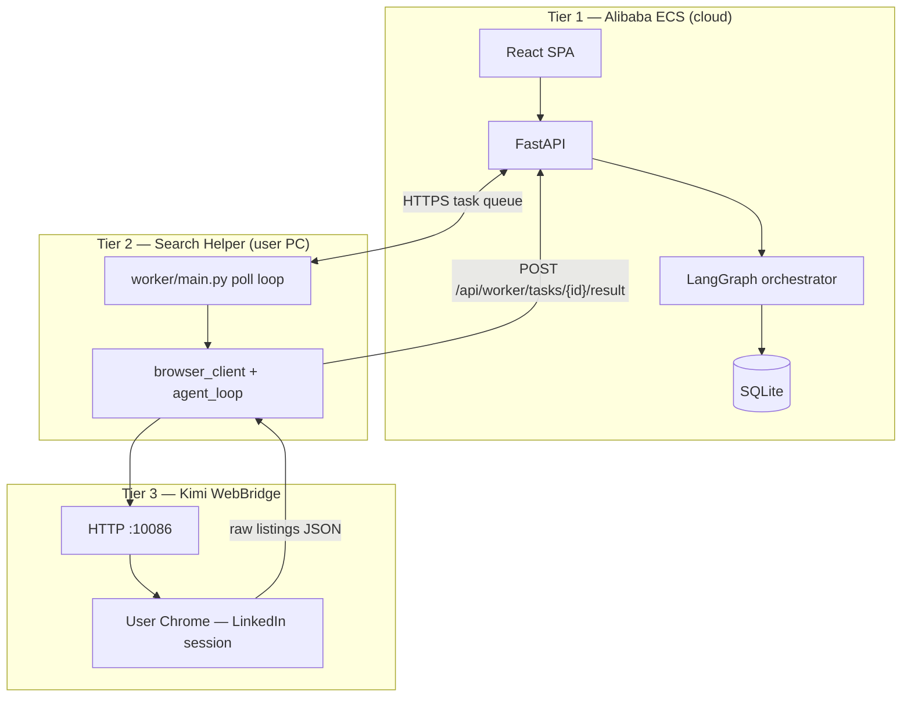
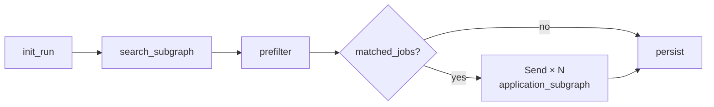
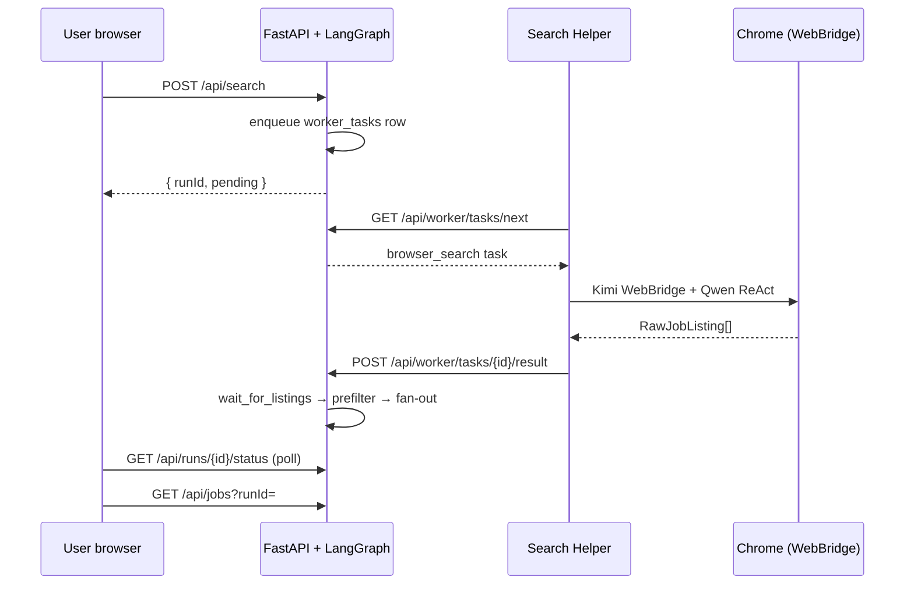

# JobPilot

**AI job application copilot — LangGraph orchestration, distributed browser automation, and human-in-the-loop control.**

[](http://43.98.197.132)
[](#tech-stack)
[](https://home.qwencloud.com)
[](#features)

---

## Overview

JobPilot is a **multi-tier agentic system** built for developers who want high-quality job applications without manual grind on every listing. Users build a profile from their CV and GitHub, start a search from the web app, and a **cloud orchestrator** coordinates a **desktop Search Helper** that browses LinkedIn Posts in the user's real Chrome session. Listings return to the server, pass through normalization and deduplication, and flow into **per-job application sub-agents** that score, summarize, and package each opportunity.

The platform is optimized for **LinkedIn Posts** — the format where hiring managers and recruiters post roles directly in the feed.

| Tier | Components |
|------|------------|
| **Cloud (Alibaba ECS)** | React UI · FastAPI · LangGraph · SQLite · Qwen API |
| **Desktop** | JobPilot Search Helper — Windows `.exe`, task queue client |
| **Browser** | Kimi WebBridge + Qwen ReAct loop in logged-in Chrome |

**Live demo:** [http://43.98.197.132](http://43.98.197.132)

---

## The problem

Technical job search at scale breaks down in two directions:

- **Manual:** reading every post, tailoring every CV, writing every email — accurate but exhausting
- **Bulk automation:** fast but low conversion, platform risk, no user control

JobPilot delivers the middle path: **agentic search, scoring, and drafting with human approval before anything is sent.**

---

## Features

- **Multi-user accounts** — signup, login, JWT httpOnly sessions, per-user data isolation
- **Profile intelligence** — CV upload (`.docx`), Qwen skill extraction, target roles, GitHub OAuth repo import
- **LinkedIn Posts search** — Search Helper captures hiring posts via Kimi WebBridge in real Chrome
- **LangGraph orchestration** — parent graph with search subgraph, prefilter, and parallel application subgraphs
- **Listing prefilter** — normalize, dedupe, drop already-applied jobs (no LLM cost)
- **Per-job application agents** — structured Qwen scoring, match summary, CV guidance, draft email
- **Worker task queue** — device pairing, heartbeat, async `browser_search` tasks over HTTPS
- **Run polling API** — `POST /api/search`, status polling, `job_packages` results per run
- **Encrypted storage** — Fernet for CV text and OAuth tokens; all tables scoped by `user_id`
- **Cloud deploy** — Docker Compose, Nginx, GitHub Actions on Alibaba ECS

---

## Agentic architecture

JobPilot uses a **deterministic LangGraph pipeline** — code routes between subgraphs. Qwen is invoked where structured judgment is required: the browser ReAct agent on the user's PC and `enrich_job` on the server.

### Three-tier deployment



LinkedIn requires the user's home IP and logged-in session — ECS orchestrates; the Search Helper executes in real Chrome.

### Parent graph pipeline



| Node | Layer | Responsibility |
|------|-------|----------------|
| `init_run` | Parent | Load profile snapshot, validate gates, set `search_runs.status` |
| `search_subgraph` | Subgraph | Enqueue worker task → poll until listings arrive |
| `prefilter` | Parent | Normalize → dedupe → drop already-applied |
| `fan_out_applications` | Parent | LangGraph `Send` — parallel per-job subgraphs |
| `application_subgraph` | Subgraph | `enrich_job` → score threshold → write `job_packages` |
| `persist` | Parent | Finalize run status and counts |

### End-to-end search flow



**Contract:** one task out, one result back. ECS never imports browser SDKs — only HTTP and JSON across the boundary.

### Data flow

```text
Search Helper
  POST /api/worker/tasks/{taskId}/result
  { listings: RawJobListing[], warnings: string[] }
       ↓
worker_tasks.result_json
       ↓
search_subgraph.wait_for_listings()
       ↓
prefilter → matched_jobs
       ↓
application_subgraph (per job) → job_packages
       ↓
search_runs (jobs_ready_count, status)
```

Posts without a public URL receive an internal `linkedin-post://{hash}` identifier for deduplication and storage — used server-side only, not shown as a user-facing link.

---

## Engineering highlights

| Decision | Rationale |
|----------|-----------|
| **LangGraph parent + subgraphs** | Clean separation: search wait loop, per-job scoring, browser ReAct |
| **Worker task queue (HTTP)** | Resilient polling; simple to debug; no WebSocket infra |
| **Kimi WebBridge** | Real Chrome session, residential IP, existing LinkedIn login |
| **Targeted Qwen usage** | Profile extraction, browser agent, `enrich_job` — no LLM supervisor router |
| **Code-only prefilter** | Normalize, URL/email dedupe, drop applied before fan-out |
| **Fernet + per-user scope** | Encrypted secrets; every row keyed by `user_id` |
| **Docker + GitHub Actions** | Repeatable ECS deploy with public demo URL |

**Key modules:**

| Path | Role |
|------|------|
| [`backend/app/graph/orchestrator.py`](./backend/app/graph/orchestrator.py) | Parent LangGraph — nodes, edges, `Send` fan-out |
| [`backend/app/graph/subgraphs/search/`](./backend/app/graph/subgraphs/search/) | Enqueue + wait for worker listings |
| [`backend/app/graph/subgraphs/application/`](./backend/app/graph/subgraphs/application/) | Per-job enrich, score gate, package output |
| [`backend/app/services/listing_prefilter.py`](./backend/app/services/listing_prefilter.py) | Normalize, dedupe, drop applied |
| [`backend/app/services/worker_store.py`](./backend/app/services/worker_store.py) | Device pairing, task queue, result polling |
| [`worker/agent_loop.py`](./worker/agent_loop.py) | Qwen ReAct loop over WebBridge snapshots |
| [`worker/api_client.py`](./worker/api_client.py) | Search Helper ↔ ECS HTTP client |

---

## Tech stack

| Layer | Technology |
|-------|------------|
| **Frontend** | React 19, TypeScript, Vite, Tailwind CSS, Heroicons |
| **Design** | Stitch UI exports, `design-system/MASTER.md`, responsive AppShell |
| **Backend** | Python 3.11+, FastAPI, Uvicorn, Pydantic v2 |
| **Database** | SQLite on ECS (schema ready for RDS migration) |
| **Agents** | LangGraph — parent graph + compiled subgraphs |
| **LLM** | Qwen Cloud (Dashscope OpenAI-compatible API) |
| **Browser automation** | Kimi WebBridge (HTTP daemon + Chrome extension) |
| **Desktop worker** | PyInstaller `.exe`, PySide6 settings UI |
| **Auth** | Email/password + JWT httpOnly cookie; GitHub OAuth |
| **Deploy** | Docker Compose, Nginx, GitHub Actions → Alibaba ECS |

---

## Quick start

### Prerequisites

- Python 3.11+
- Node.js 18+
- [Qwen Cloud API key](https://home.qwencloud.com) (`DASHSCOPE_API_KEY`)
- Kimi WebBridge extension + daemon
- GitHub OAuth app (for repo import)

### 1. Clone and configure

```bash
git clone <repo-url>
cd JobPilot
cp .env.example .env
# Set DASHSCOPE_API_KEY, JWT_SECRET, DATA_ENCRYPTION_KEY, GITHUB_*
```

### 2. Setup

**Windows:**
```bat
setup.cmd
```

**Manual:**
```bash
python -m venv .venv
.venv\Scripts\activate
pip install -r requirements.txt
cd frontend && npm install
```

### 3. Run locally

**Windows:**
```bat
dev.cmd
```

**Manual:**
```bash
# Terminal 1 — API
uvicorn backend.app.main:app --reload --port 8000

# Terminal 2 — UI
cd frontend && npm run dev

# Terminal 3 — Search Helper (after pairing in UI)
cd worker && python main.py
```

| Service | URL |
|---------|-----|
| Frontend | http://localhost:5173 |
| API | http://localhost:8000 |
| Health | http://localhost:8000/health |

Search Helper: [`worker/README.md`](./worker/README.md) · WebBridge: [`System Design/kimi-webbridge-provider.md`](./System%20Design/kimi-webbridge-provider.md)

---

## Project structure

```text
JobPilot/
├── backend/app/
│   ├── graph/              # LangGraph orchestrator + subgraphs
│   ├── routes/             # FastAPI routers (auth, search, worker, jobs)
│   ├── services/           # worker_store, search_store, listing_prefilter, profile_llm
│   └── models/             # Pydantic contracts (browser, search, worker)
├── frontend/src/           # React SPA (Welcome, Profile, Search)
├── worker/                 # JobPilot Search Helper (WebBridge + Qwen agent loop)
├── config/llm.yaml         # Model routing defaults
├── design-system/          # Design tokens (Stitch overrides)
├── System Design/          # Architecture specs and ADRs
├── deploy/                 # Docker, Nginx, ECS bootstrap
└── tests/                  # Backend + worker unit tests
```

---

## API surface

### User & profile

| Method | Path | Description |
|--------|------|-------------|
| `POST` | `/api/auth/signup` | Create account |
| `POST` | `/api/auth/login` | Login (JWT cookie) |
| `GET` | `/api/profile` | Profile + search preferences |
| `PUT` | `/api/profile` | Update roles, projects, search prefs |
| `POST` | `/api/profile/cv` | Upload `.docx`, extract skills (Qwen) |
| `GET` | `/auth/github` | GitHub OAuth start |
| `POST` | `/api/github/import` | Import READMEs → project cards |

### Search & jobs

| Method | Path | Description |
|--------|------|-------------|
| `POST` | `/api/search` | Start search run → background graph |
| `GET` | `/api/runs/latest/status` | Latest run for current user |
| `GET` | `/api/runs/{runId}/status` | Poll run progress |
| `GET` | `/api/jobs?runId=` | List scored `job_packages` for a run |

### Search Helper (worker)

| Method | Path | Description |
|--------|------|-------------|
| `POST` | `/api/worker/pair` | Issue `WORKER_TOKEN` |
| `POST` | `/api/worker/heartbeat` | Liveness + browser health |
| `GET` | `/api/worker/tasks/next` | Claim next `browser_search` task |
| `POST` | `/api/worker/tasks/{id}/result` | Post `RawJobListing[]` |
| `POST` | `/api/worker/tasks/{id}/fail` | Report task failure |

---

## Design & UI

- **Stitch** desktop reference screens adapted to responsive web (`frontend/UI Design/`)
- **Design tokens:** [`.stitch/DESIGN.md`](./.stitch/DESIGN.md), [`design-system/MASTER.md`](./design-system/MASTER.md)
- **App shell:** sidebar desktop, drawer mobile, profile gate before search
- **Core screens:** Welcome (`/`), Profile (`/profile`), Search (`/search`)

---

## Documentation

| Document | Purpose |
|----------|---------|
| [`System Design/JobPilot-System-Design.md`](./System%20Design/JobPilot-System-Design.md) | System topology and state shapes |
| [`System Design/jobpilot-agent-build-guide.md`](./System%20Design/jobpilot-agent-build-guide.md) | Agent architecture and API contracts |
| [`System Design/kimi-webbridge-provider.md`](./System%20Design/kimi-webbridge-provider.md) | WebBridge integration |
| [`System Design/browser-provider-abstraction.md`](./System%20Design/browser-provider-abstraction.md) | Browser provider protocol |
| [`docs/database-schema.md`](./docs/database-schema.md) | SQLite schema reference |

---

## Principles

1. **Human-in-the-loop** — user approves before any application is sent
2. **Real browser sessions** — LinkedIn automation uses the user's Chrome, not datacenter bots
3. **Server-side secrets** — Qwen keys stay on ECS; never exposed in the frontend bundle
4. **Per-user isolation** — profiles, runs, tokens, and job packages scoped by `user_id`
5. **Production patterns** — deterministic graph routing, typed contracts, tested worker protocol

---

## Hackathon

Submitted to the **Qwen Cloud Global AI Hackathon** (Track 4: Autopilot Agent).

- **Alibaba Cloud deployment** — ECS, Docker, public URL
- **Qwen Cloud APIs** — CV skills, README summarization, browser ReAct agent, per-job scoring
- **Agentic system** — LangGraph multi-subgraph orchestration with distributed Search Helper

---

<p align="center">
  <strong>JobPilot</strong> — agentic job search with production architecture patterns.
  <br />
  <sub>July 2026</sub>
</p>
