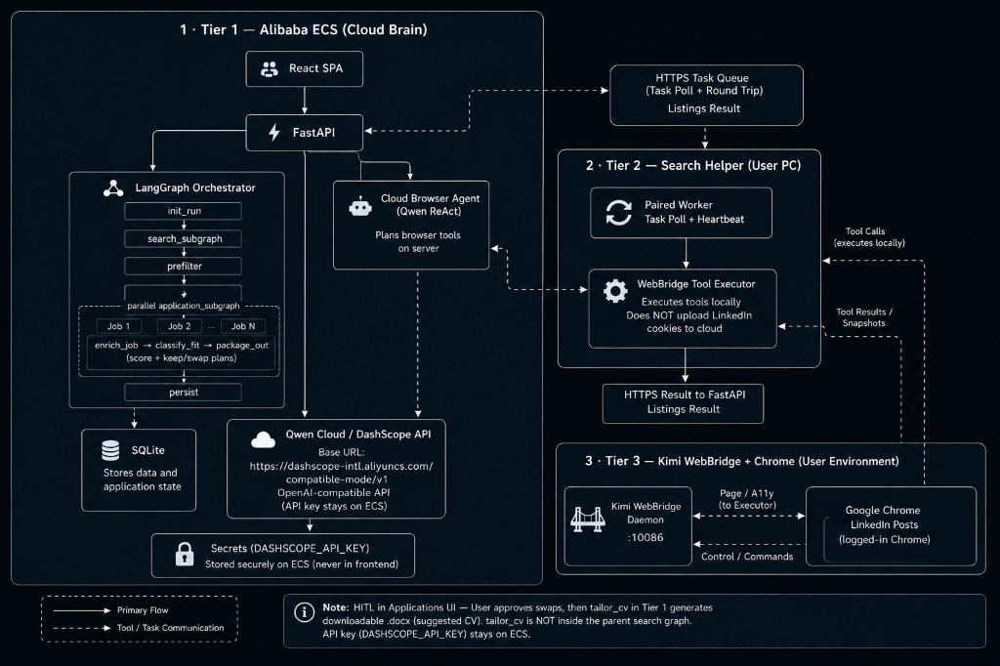
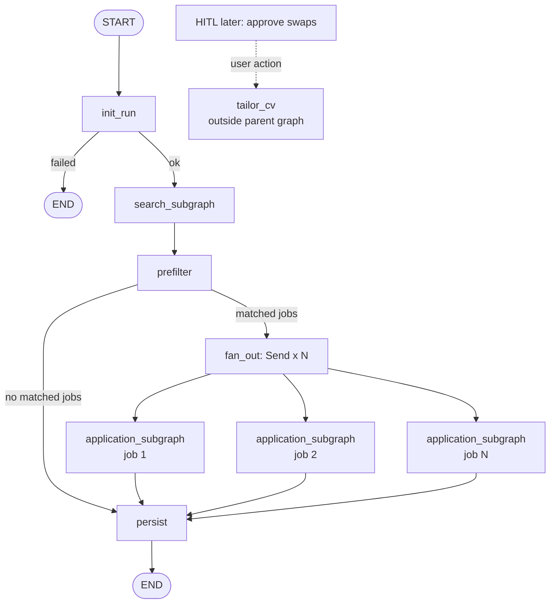
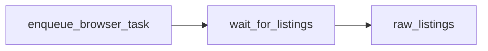
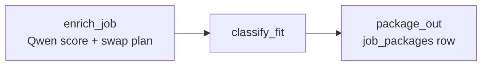

# JobPilot

**JobPilot | Track 4 - Autopilot Agent**

AI job application copilot: LangGraph orchestration, distributed browser automation, and human-in-the-loop control.

<a id="hackathon"></a>

### Hackathon (written once)

| | |
|--|--|
| **Event** | [Qwen Cloud Global AI Hackathon](https://qwencloud-hackathon.devpost.com/) |
| **Track** | **Track 4 - Autopilot Agent** |
| **License** | [MIT](./LICENSE) |
| **Live demo** | [http://47.237.150.6](http://47.237.150.6) |
| **Status** | Product complete; packaging for Devpost (demo video ready + optional blog) |
| **Contact** | [hamza.fayaz.ai@gmail.com](mailto:hamza.fayaz.ai@gmail.com) |

> ## Live demo capacity (judges — please read)
>
> ### **The live demo UI only allows up to 8 jobs per search (higher counts cannot be selected).**
>
> **Current live server resources:** `ecs.e-c1m2.xlarge` — **4 vCPU · 8 GiB** (kept up through judging).  
> **That UI cap matches this machine’s capacity so the shared live demo stays stable — it is not a JobPilot product or architecture limit.**  
> On a larger server the same system can run more jobs in parallel.

**Required judge links**

- **Qwen Cloud API (code):** [`backend/app/config.py`](./backend/app/config.py)  
  Base URL: `https://dashscope-intl.aliyuncs.com/compatible-mode/v1`  
  Models: [`config/llm.yaml`](./config/llm.yaml)

- **Alibaba Cloud deploy proof (code):**  
  - ECS notes: [`System Design/alibaba-cloud-trial.md`](./System%20Design/alibaba-cloud-trial.md)  
  - API image: [`deploy/Dockerfile.api`](./deploy/Dockerfile.api)  
  - Deploy workflow: [`.github/workflows/deploy.yml`](./.github/workflows/deploy.yml) (SSH/rsync + Docker to Alibaba ECS)  
  - Recent runs: [github.com/HamzaFayaz/JobPilot/actions](https://github.com/HamzaFayaz/JobPilot/actions)

- **Architecture:** [Agentic architecture](#agentic-architecture) · [Technical depth](#technical-depth--engineering)

[](http://47.237.150.6)
[](./backend/app/config.py)
[](./System%20Design/alibaba-cloud-trial.md)
[](./.github/workflows/deploy.yml)
[](#hackathon)
[](./LICENSE)
[](#tech-stack)
[](#features)

---

## Overview

JobPilot is a **multi-tier agentic system** for developers who want high-quality applications without grinding every listing by hand. Build a profile from CV + GitHub, start a search from the web app, and the **cloud orchestrator** coordinates a **desktop Search Helper** that browses **LinkedIn Posts** in the user's real Chrome. Listings return to the server, pass prefilter, then **per-job application sub-agents** score and propose CV keep/swap plans. The user approves before a **suggested CV** draft is generated.

| Tier | Components |
|------|------------|
| **Cloud (Alibaba ECS)** | React UI · FastAPI · LangGraph · SQLite · Qwen Cloud (DashScope) |
| **Desktop** | JobPilot Search Helper - Windows `.exe`, task queue client |
| **Browser** | Kimi WebBridge in the user's logged-in Chrome |

## The problem

Technical job search at scale breaks down in two directions:

- **Manual:** reading every post, tailoring every CV, writing every application - accurate but exhausting
- **Bulk automation:** fast but low conversion, platform risk, no user control

JobPilot is the middle path: agentic search and scoring with **human approval before any tailored CV draft is kept or downloaded**.

---

## Features

- **Multi-user accounts** - signup, login, JWT httpOnly sessions, per-user data isolation
- **Profile intelligence** - CV upload (`.docx`), Qwen skill extraction, target roles, GitHub OAuth repo import
- **LinkedIn Posts search** - Search Helper captures hiring posts via Kimi WebBridge in real Chrome
- **LangGraph orchestration** - parent graph with search subgraph, prefilter, and parallel application subgraphs
- **Listing prefilter** - normalize, dedupe, drop already-applied jobs (no LLM cost)
- **Per-job application agents** - structured Qwen scoring, match summary, CV keep/swap plans
- **Suggested CV** - user-approved, layout-preserving `.docx` drafts (never overwrites the master CV)
- **Search Helper downloads** - Windows `.exe` + supported CV template from Settings / Profile
- **Worker task queue** - device pairing, heartbeat, async `browser_search` tasks over HTTP
- **Run polling API** - `POST /api/search`, status polling, `job_packages` results per run
- **Encrypted storage** - Fernet for CV text and OAuth tokens; all tables scoped by `user_id`
- **Cloud deploy** - Docker Compose, Nginx, GitHub Actions on Alibaba ECS

**Submit focus:** LinkedIn Posts search, scoring, HITL suggested CV download. (Gmail send, Indeed / LinkedIn Jobs boards, and Windows code-signing are not in this demo path.)

## Principles

Product rules that stay true across the stack (detail in [Technical depth](#technical-depth--engineering)):

1. **Human-in-the-loop** - user approves swaps before a suggested CV draft is generated or kept
2. **Real browser sessions** - LinkedIn automation uses the user's Chrome, not datacenter bots
3. **Server-side secrets** - Qwen keys stay on ECS; never exposed in the frontend bundle
4. **Scoped Search Helper** - intentionally thin: acts for the paired user only, executes browser tools; Qwen keys and orchestration stay on ECS
5. **Per-user isolation** - profiles, runs, tokens, and job packages scoped by `user_id`
6. **Production patterns** - deterministic graph routing, typed contracts, tested worker protocol

---

## Agentic architecture

JobPilot uses a **deterministic LangGraph pipeline** - code routes between subgraphs. **Qwen Cloud** runs on the ECS backend (browser ReAct, scoring, suggested CV). The Search Helper executes **Kimi WebBridge** tools in the user's Chrome.

### Three-tier deployment

Main architecture for judges / Devpost / demo video end-card:



| Tier | Where | What judges should see |
|------|--------|-------------------------|
| **1** | Alibaba ECS | React · FastAPI · LangGraph · Qwen ReAct · scoring / `tailor_cv` · SQLite · DashScope |
| **2** | User PC | Paired Search Helper - task poll, WebBridge tool executor |
| **3** | User Chrome | WebBridge daemon + LinkedIn Posts session (home IP) |

**Track 4 fit:** ambiguous posts + external tools + human checkpoint + production deploy on Alibaba.

### Parent graph pipeline

Current LangGraph parent run (code: [`orchestrator.py`](./backend/app/graph/orchestrator.py)). Suggested CV is **not** inside this graph - it runs later on explicit user approve.



| Node | Layer | Responsibility |
|------|-------|----------------|
| `init_run` | Parent | Load profile snapshot, validate gates, set run status |
| `search_subgraph` | Subgraph | Enqueue Helper task → wait for listings (Qwen ReAct + WebBridge) |
| `prefilter` | Parent | Normalize → dedupe → drop already-applied |
| `fan_out` / `Send` | Parent | Parallel per-job `application_subgraph` |
| `application_subgraph` | Subgraph | Enrich → classify fit → package `job_packages` |
| `persist` | Parent | Finalize run status and counts |
| `tailor_cv` | API / HITL | After Applications approve - not a parent-graph node |

### Subgraph detail

One diagram per **compiled subgraph** (not every leaf helper). Enough for judges to see depth without noise.

#### `search_subgraph`

LangGraph nodes are enqueue → wait. While waiting, the cloud **Qwen ReAct** agent + **Search Helper / WebBridge** collect LinkedIn Posts and POST the result.



**Outside those nodes (same task):** ECS Qwen ReAct ↔ Helper WebBridge → `POST /api/worker/tasks/{id}/result`  
**Contract:** one task out, one result back over HTTP. ECS never imports browser SDKs.

#### `application_subgraph` (per job, parallel)



Code: [`subgraphs/search/`](./backend/app/graph/subgraphs/search/) · [`subgraphs/application/`](./backend/app/graph/subgraphs/application/)

Posts without a public URL receive an internal `linkedin-post://{hash}` identifier for deduplication and storage - used server-side only, not shown as a user-facing link.

---

## Technical depth / Engineering

Scannable map of the autopilot stack (Track 4): what each piece does and why it matters.

### Agents and components

| Piece | What it does | Why it matters |
|-------|----------------|----------------|
| **Parent LangGraph** | Routes `init_run` → search → prefilter → parallel application subgraphs → persist | Deterministic orchestration; code owns control flow |
| **Search subgraph** | Enqueues a worker task and waits for listings | Separates "order" (cloud) from "delivery" (desktop browser) |
| **Cloud browser agent (Qwen ReAct)** | On ECS, decides WebBridge tool calls for LinkedIn Posts | Qwen Cloud drives search; tools run on the user PC |
| **Search Helper (`worker/`)** | Paired desktop app; polls tasks; executes WebBridge actions | Real Chrome + home IP; LinkedIn session never uploaded to ECS |
| **Kimi WebBridge** | Local bridge into the user's Chrome | Browser tools without shipping cookies to the cloud |
| **Prefilter (code)** | Normalize, dedupe, drop already-applied | Cheap gate before LLM scoring |
| **Application subgraph** | Per-job `enrich_job` (score, summary, keep/swap plan) | Parallel Qwen judgment per listing |
| **Suggested CV (`tailor_cv`)** | User-approved slot swaps → layout-preserving `.docx` | HITL; analysis never writes the master CV |
| **Profile / evidence LLMs** | CV skills, GitHub overview, embeddings + rerank | Grounds scoring in the user's real projects |

### Search Helper and session boundary

LinkedIn automation needs the user's logged-in Chrome and residential network. Running that browser on Alibaba ECS would use a datacenter IP and would not see the user's session. JobPilot keeps **orchestration and Qwen keys on ECS**, and keeps **browser execution on the paired Search Helper**.

The Helper is intentionally thin and scoped: it acts for the paired user only and executes browser tools, while Qwen keys and orchestration stay on ECS.

- Helper code: [`worker/`](./worker/)  
- WebBridge provider notes: [`System Design/kimi-webbridge-provider.md`](./System%20Design/kimi-webbridge-provider.md)  
- Pairing and task queue: [`backend/app/services/worker_store.py`](./backend/app/services/worker_store.py)

The Helper talks to ECS over a device-paired HTTP task API. Review the `worker/` package for how tasks are fetched and how WebBridge is invoked locally.

### Engineering decisions

| Decision | Rationale |
|----------|-----------|
| **LangGraph parent + subgraphs** | Clean separation: search wait loop, per-job scoring, browser ReAct |
| **Worker task queue (HTTP)** | Resilient polling; simple to debug; no WebSocket infra |
| **Kimi WebBridge on user PC** | Real Chrome session and home IP for LinkedIn Posts |
| **Targeted Qwen usage** | Profile, browser agent, `enrich_job`, `tailor_cv`, embeddings - no LLM supervisor router |
| **Code-only prefilter** | Normalize, URL/email dedupe, drop applied before fan-out |
| **Fernet + per-user scope** | Encrypted secrets; every row keyed by `user_id` |
| **Docker + GitHub Actions** | Repeatable Alibaba ECS deploy ([`deploy.yml`](./.github/workflows/deploy.yml)) |

### Key modules

| Path | Role |
|------|------|
| [`backend/app/graph/orchestrator.py`](./backend/app/graph/orchestrator.py) | Parent LangGraph - nodes, edges, `Send` fan-out |
| [`backend/app/graph/subgraphs/search/`](./backend/app/graph/subgraphs/search/) | Enqueue + wait for worker listings |
| [`backend/app/graph/subgraphs/application/`](./backend/app/graph/subgraphs/application/) | Per-job enrich, score gate, package output |
| [`backend/app/services/browser_agent/`](./backend/app/services/browser_agent/) | Cloud Qwen ReAct loop (ECS) |
| [`backend/app/services/listing_prefilter.py`](./backend/app/services/listing_prefilter.py) | Normalize, dedupe, drop applied |
| [`backend/app/services/worker_store.py`](./backend/app/services/worker_store.py) | Device pairing, task queue, result polling |
| [`backend/app/services/tailor_cv_llm.py`](./backend/app/services/tailor_cv_llm.py) | Suggested CV generation after user approve |
| [`worker/`](./worker/) | Search Helper - WebBridge executor + UI |
| [`worker/api_client.py`](./worker/api_client.py) | Search Helper ↔ ECS HTTP client |

---

## Tech stack

| Layer | Technology |
|-------|------------|
| **Frontend** | React 19, TypeScript, Vite, Tailwind CSS, Heroicons |
| **Design** | Stitch UI exports, `design-system/MASTER.md`, responsive AppShell |
| **Backend** | Python 3.11+, FastAPI, Uvicorn, Pydantic v2 |
| **Database** | SQLite on ECS (schema ready for RDS migration) |
| **Agents** | LangGraph - parent graph + compiled subgraphs |
| **LLM** | Qwen Cloud (Dashscope OpenAI-compatible API) |
| **Browser automation** | Kimi WebBridge (HTTP daemon + Chrome extension) |
| **Desktop worker** | PyInstaller `.exe`, PySide6 settings UI |
| **Auth** | Email/password + JWT httpOnly cookie; GitHub OAuth |
| **Deploy** | Docker Compose, Nginx, GitHub Actions → Alibaba ECS |

---

## Quick start

### Prerequisites

- Python 3.11+
- Node.js 18+
- [Qwen Cloud API key](https://home.qwencloud.com) (`DASHSCOPE_API_KEY`)
- Kimi WebBridge extension + daemon (locked: daemon **v1.10.0** + extension **1.11.3**)
- In-app setup video (Settings → Search Helper): [Watch setup video](https://youtu.be/tpfV_0oMgf4)
- GitHub OAuth app (for repo import)

### 1. Clone and configure

```bash
git clone https://github.com/HamzaFayaz/JobPilot.git
cd JobPilot
cp .env.example .env
# Set DASHSCOPE_API_KEY, JWT_SECRET, DATA_ENCRYPTION_KEY, GITHUB_CLIENT_ID/SECRET (see .env.example)
```

### 2. Setup

**Windows:**
```bat
setup.cmd
```

**Manual:**
```bash
python -m venv .venv
.venv\Scripts\activate
pip install -r requirements.txt
cd frontend && npm install
```

### 3. Run locally

**Windows:**
```bat
dev.cmd
```

**Manual:**
```bash
# Terminal 1 - API
uvicorn backend.app.main:app --reload --port 8000

# Terminal 2 - UI
cd frontend && npm run dev

# Terminal 3 - Search Helper (after pairing in UI)
cd worker && python main.py
```

| Service | URL |
|---------|-----|
| Frontend | http://localhost:5173 |
| API | http://localhost:8000 |
| Health | http://localhost:8000/health |

Search Helper: [`worker/README.md`](./worker/README.md) · WebBridge: [`System Design/kimi-webbridge-provider.md`](./System%20Design/kimi-webbridge-provider.md)

---

## Project structure

```text
JobPilot/
├── backend/app/
│   ├── graph/                 # LangGraph orchestrator + subgraphs
│   ├── routes/                # FastAPI (auth, search, worker, jobs, suggested CV)
│   ├── services/              # browser_agent (cloud Qwen ReAct), worker_store, tailor_cv, …
│   └── models/                # Pydantic contracts
├── frontend/src/              # React SPA (Welcome, Profile, Search, Applications, Settings)
├── worker/                    # Search Helper (WebBridge executor + settings UI)
├── config/llm.yaml            # Qwen model defaults by call site
├── docs/                      # Architecture PNG, hackathon handoff, Medium draft
├── design-system/             # Design tokens (Stitch overrides)
├── System Design/             # Architecture specs and ADRs
├── deploy/                    # Docker, Nginx, Alibaba ECS bootstrap
├── .github/workflows/         # Deploy to Alibaba ECS, Helper upload, …
├── jobpilot_prd_mimimum.md    # Shipped hackathon scope
├── jobpilot_prd.md            # Full product vision PRD
└── tests/                     # Backend + worker unit tests
```

---

## API surface

### User & profile

| Method | Path | Description |
|--------|------|-------------|
| `POST` | `/api/auth/signup` | Create account |
| `POST` | `/api/auth/login` | Login (JWT cookie) |
| `GET` | `/api/profile` | Profile + search preferences |
| `PUT` | `/api/profile` | Update roles, projects, search prefs |
| `POST` | `/api/profile/cv` | Upload `.docx`, extract skills (Qwen) |
| `GET` | `/auth/github` | GitHub OAuth start |
| `POST` | `/api/github/import` | Import READMEs → project cards |

### Search & jobs

| Method | Path | Description |
|--------|------|-------------|
| `POST` | `/api/search` | Start search run → background graph |
| `GET` | `/api/runs/latest/status` | Latest run for current user |
| `GET` | `/api/runs/{runId}/status` | Poll run progress |
| `GET` | `/api/jobs?runId=` | List scored `job_packages` for a run |
| `PATCH` | `/api/jobs/{jobId}/decision` | HITL: applied / skipped |
| `POST` | `/api/jobs/{jobId}/suggested-cv` | Generate suggested CV after approved swaps |
| `GET` | `/api/jobs/{jobId}/suggested-cv/latest` | Latest kept draft metadata |
| `GET` | `/api/jobs/{jobId}/suggested-cv/{draftId}/download` | Download `.docx` draft |

### Search Helper (worker)

Pairing and setup live under **Settings → Search Helper** (and **View step-by-step setup guide**). Short video: [Search Helper setup](https://youtu.be/tpfV_0oMgf4) (WebBridge → Helper download → pair → Start).

| Method | Path | Description |
|--------|------|-------------|
| `POST` | `/api/worker/pair` | Issue `WORKER_TOKEN` |
| `POST` | `/api/worker/heartbeat` | Liveness + browser health |
| `GET` | `/api/worker/tasks/next` | Claim next `browser_search` task |
| `POST` | `/api/worker/tasks/{id}/result` | Post `RawJobListing[]` |
| `POST` | `/api/worker/tasks/{id}/fail` | Report task failure |

---

## Design & UI

- **Stitch** desktop reference screens adapted to responsive web (`frontend/UI Design/`)
- **Design tokens:** [`.stitch/DESIGN.md`](./.stitch/DESIGN.md), [`design-system/MASTER.md`](./design-system/MASTER.md)
- **App shell:** sidebar desktop, drawer mobile, profile gate before search
- **Core screens:** Welcome (`/`), Profile (`/profile`), Search (`/search`), Applications (`/applications`), Settings (`/settings`)

---

## Documentation

| Document | Purpose |
|----------|---------|
| [`jobpilot_prd_mimimum.md`](./jobpilot_prd_mimimum.md) | Shipped hackathon / minimum scope |
| [`jobpilot_prd.md`](./jobpilot_prd.md) | Full product vision PRD |
| [`System Design/JobPilot-System-Design.md`](./System%20Design/JobPilot-System-Design.md) | System topology and state shapes |
| [`System Design/jobpilot-agent-build-guide.md`](./System%20Design/jobpilot-agent-build-guide.md) | Agent architecture and API contracts |
| [`System Design/kimi-webbridge-provider.md`](./System%20Design/kimi-webbridge-provider.md) | WebBridge integration |
| [`System Design/browser-provider-abstraction.md`](./System%20Design/browser-provider-abstraction.md) | Browser provider protocol |
| [`System Design/alibaba-cloud-trial.md`](./System%20Design/alibaba-cloud-trial.md) | Alibaba ECS deploy proof (hackathon) |
| [`docs/database-schema.md`](./docs/database-schema.md) | SQLite schema reference |
| [`docs/hackathon-official-rules-context.md`](./docs/hackathon-official-rules-context.md) | Devpost Official Rules checklist |
| [`docs/hackathon-submission-handoff.md`](./docs/hackathon-submission-handoff.md) | Submission packaging checklist |

---

<p align="center">
 <strong>JobPilot</strong> - agentic job search with production architecture patterns.
 <br />
 <sub>Qwen Cloud Global AI Hackathon · Track 4 · July 2026</sub>
</p>
