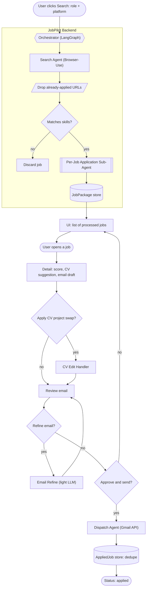
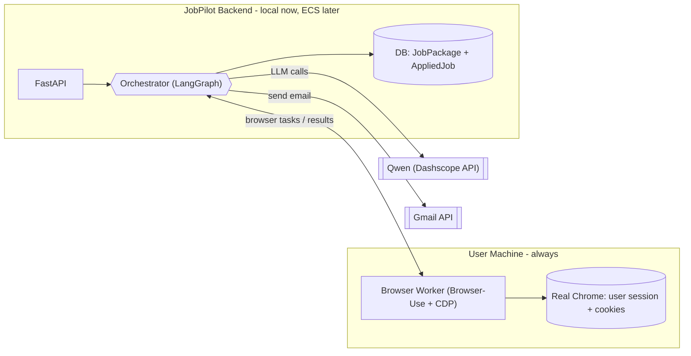
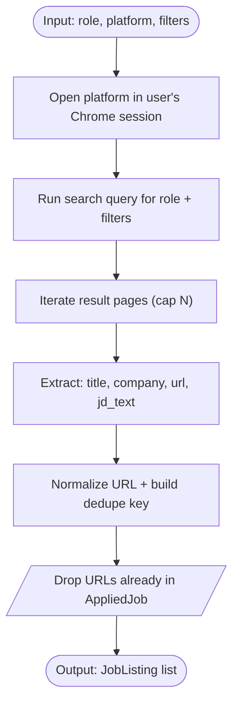
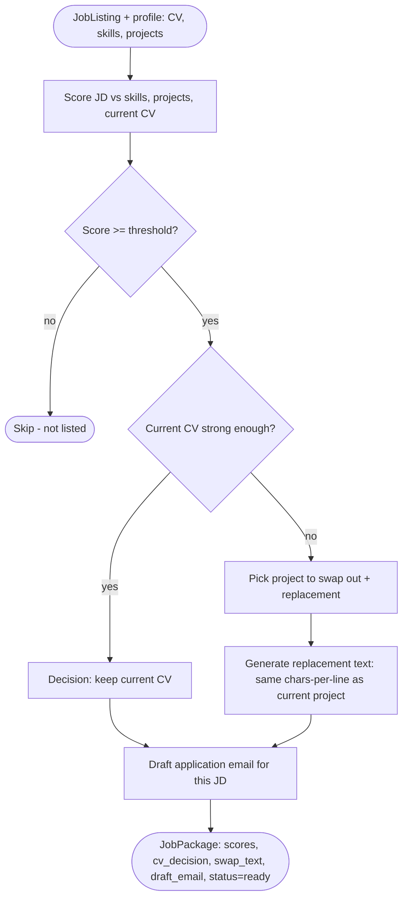
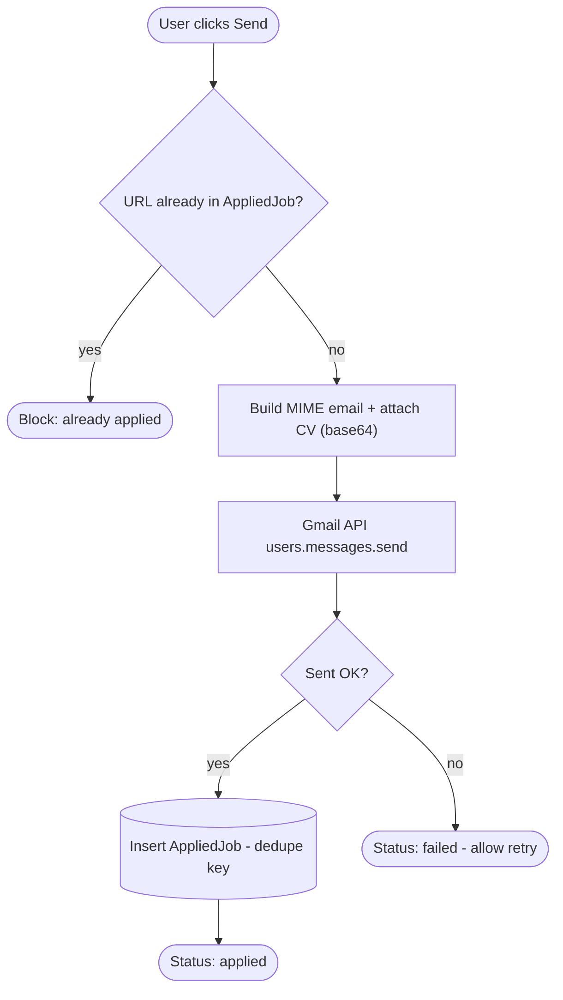
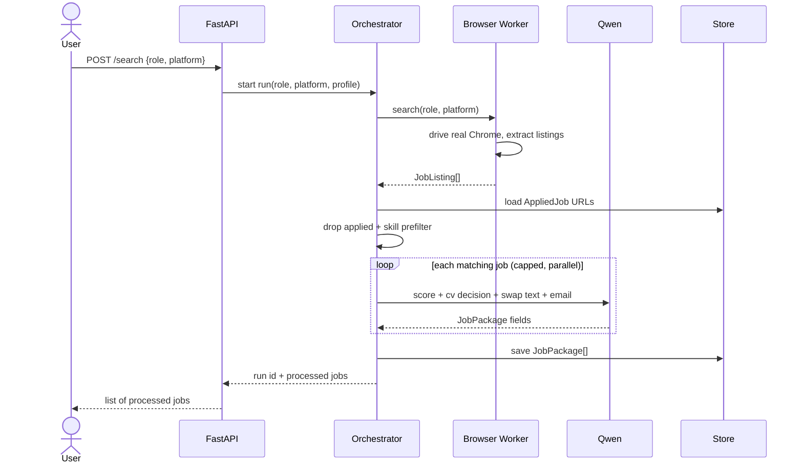
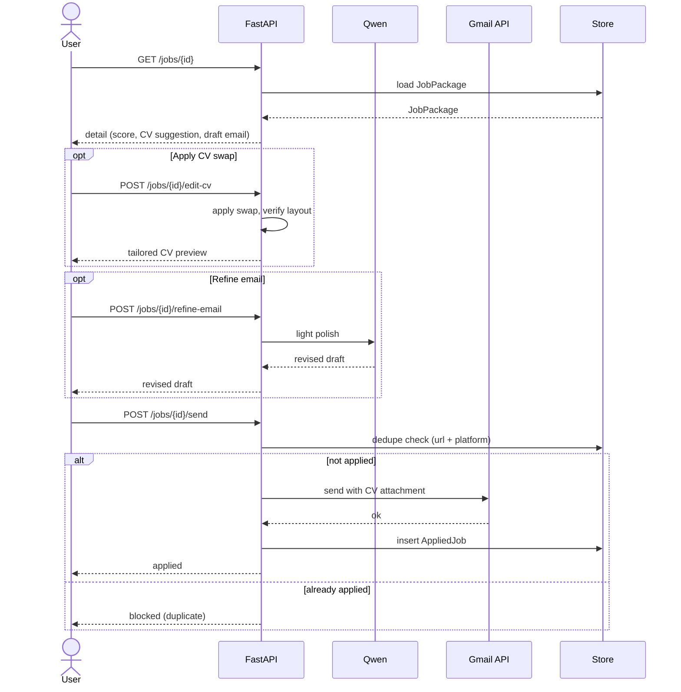

# JobPilot - Backend System Design

**Version:** 1.0
**Date:** June 28, 2026
**Scope:** Backend agentic system (the "main agent") - from the user clicking Search through sending an application, with no duplicate applies.

This document describes the backend only. It defines the agent topology, each agent's internals, the shared state, the data models, the API surface, and the cost controls. Diagrams are in mermaid so they render in the IDE and on GitHub.

> Repo status: greenfield. Today the repo holds only Qwen smoke tests (`scripts/test_qwen.py`, `scripts/test_model.py`), `requirements.txt`, and the two PRDs. This design defines the backend from scratch.

---

## 1. Scope and confirmed decisions

- **Per-job sub-agent on match.** Search finds listings cheaply. We drop already-applied jobs and run a cheap skill prefilter. Only jobs that pass get the expensive per-job **Application Sub-Agent**. We do not run heavy LLM work on every listing.
- **What the Application Sub-Agent produces per job:** a match score, a CV decision (`keep` the current CV or `swap` a project), and - if swapping - the replacement project description rewritten to the **same characters-per-line** as the current project, plus the current vs suggested CV score, plus a drafted application email. When this finishes, the job is listed in the UI. That is where the sub-agent's job ends.
- **CV editing is a separate, user-triggered step.** When the user opens a job and clicks "Edit CV", a **CV Edit Handler** applies the suggested swap into the CV. It is not part of the per-job sub-agent run.
- **Human-in-the-loop before send.** Nothing is sent without the user opening the job, reviewing, and clicking Send.
- **No duplicate applies.** On a successful send, the job is recorded in `AppliedJob`. That URL is excluded from all future searches and blocked at send time.
- **Topology = local-first.** One local process for the hackathon, with a documented path to Alibaba ECS. In both modes a **Browser Worker** drives the user's **real Chrome** using the user's own session and cookies; in cloud mode that worker is a thin local process the cloud orchestrator delegates to.

## 2. Assumptions

- **Match gate is two-stage for cost:** a free skill/keyword prefilter, then the sub-agent's LLM score with a threshold. Cap to top N jobs per run.
- **Persistence:** SQLite for the MVP (`JobPackage`, `AppliedJob`); Postgres when deployed to ECS.
- **Profile:** CV text plus a user-maintained skills/projects list. GitHub repo scanner stays post-MVP.
- **Orchestrator:** LangGraph `StateGraph` with code-based routing - no separate LLM "orchestrator agent" for the MVP.
- **Dedupe key:** normalized `job_url` + `platform`.
- **LLM:** Qwen via Dashscope (OpenAI-compatible), reused from the existing test clients.

---

## 3. Whole agentic system

The end-to-end flow. Each agent appears as a single node here; its internals are in Section 5.



**Narrative**

1. **Trigger.** The user clicks Search with a role and platform. This starts the orchestrator run.
2. **Search.** The Search Agent drives the user's real Chrome, runs the query, and extracts listings.
3. **Filter.** Already-applied URLs are dropped; a cheap skill prefilter removes obvious non-matches before any LLM cost.
4. **Per-job enrichment.** Each surviving job runs the Application Sub-Agent (score, CV decision, swap text, email draft). Output is a `JobPackage`.
5. **List.** Packages are stored and listed in the UI. The batch agent work ends here.
6. **Review (HITL).** The user opens a job, optionally applies the CV swap, optionally refines the email.
7. **Send (HITL gate).** On approval, the Dispatch Agent sends via Gmail API and records the job so it can never be applied to again.

---

## 4. Deployment topology

Local-first for the hackathon; the same components lift to ECS later. The key invariant: the **Browser Worker always runs on the user's machine** and controls the user's real Chrome session, so job platforms see a real residential session - regardless of where the orchestrator runs.



- **Local mode (MVP):** orchestrator and Browser Worker run in the same process/machine; only Qwen and Gmail are remote.
- **Cloud mode (later):** orchestrator + API + DB move to ECS. The Browser Worker stays on the user's machine and connects out to the orchestrator (websocket or task queue). Browser actions still execute against the user's real Chrome, so the residential-IP / antibot advantage is preserved.

---

## 5. Agents and their components

Roster:

- **Orchestrator** - LangGraph graph; routes the run, applies filters, fans out per-job work, persists results.
- **Search Agent** - drives Browser-Use to find and extract listings.
- **Per-Job Application Sub-Agent** - the core LLM worker per matching job.
- **CV Edit Handler** - applies the suggested project swap into the CV on user request.
- **Email Refine** - optional light LLM polish of a draft.
- **Dispatch Agent** - sends via Gmail API and records the application.

### 5.1 Search Agent



Notes: runs inside the logged-in session, so no separate login. URL normalization strips tracking params and trailing slashes so the same listing dedupes across re-searches.

### 5.2 Per-Job Application Sub-Agent (core)



Notes:

- **Threshold gate** is the second cost lever (the first is the prefilter): jobs below the score threshold are dropped before any CV/email work.
- **Keep vs swap:** the agent first decides whether the current CV is already strong for this JD. Only if not does it choose a project to swap out and a replacement from the user's project list.
- **Format-preserving swap text:** the replacement description is generated to match the current project's characters-per-line so the CV layout does not break when applied later.
- **Email draft** is produced regardless of keep/swap, tied to this specific JD and company.

### 5.3 CV Edit Handler (user-triggered)


Notes: produces a per-job tailored CV version without mutating the master CV. The saved version is what gets attached at send time.

### 5.4 Email Refine (optional, light LLM)


Notes: a single cheap call that edits only the current email text. It does not re-run scoring or CV logic.

### 5.5 Dispatch / Send Agent (no LLM)



Notes: the dedupe check runs again at send time (race-safe) even though applied jobs are already filtered from search. The attached CV is the tailored version if one was saved, otherwise the master CV.

---

## 6. End-to-end sequences

### 6.1 Search run (trigger to listed jobs)



### 6.2 Open, tailor, and send



---

## 7. State and data models

LangGraph best practice is a flat, typed state. The run state carries data between nodes; the persisted models back the UI and dedupe.

```python
from typing import TypedDict, Optional

class JobListing(TypedDict):
    job_id: str
    title: str
    company: str
    url: str          # normalized; dedupe key with platform
    platform: str
    jd_text: str

class JobPackage(TypedDict):
    job: JobListing
    match_score: int
    cv_decision: str               # "keep" | "swap"
    swap_out_project: Optional[str]
    swap_in_text: Optional[str]    # chars-per-line matched to current
    current_cv_score: int
    suggested_cv_score: int
    draft_email: str
    status: str                    # "ready" | "applied" | "failed"

class AppliedJob(TypedDict):
    url: str                       # dedupe key (with platform)
    platform: str
    title: str
    company: str
    applied_at: str
    cv_version: str

class RunState(TypedDict):         # LangGraph shared state
    role: str
    platform: str
    profile: dict                  # cv_text, skills[], projects[]
    listings: list[JobListing]
    packages: list[JobPackage]
    errors: list[str]
```

---

## 8. API surface

- `POST /search` - body `{role, platform}`; runs search + filter + per-job sub-agent; returns run id + processed jobs.
- `GET /jobs` - list processed `JobPackage`s for the current run/user.
- `GET /jobs/{id}` - detail for one job.
- `POST /jobs/{id}/edit-cv` - apply the suggested swap; returns tailored CV preview.
- `POST /jobs/{id}/refine-email` - body `{instruction?}`; light LLM polish of the current draft.
- `POST /jobs/{id}/send` - dedupe check, Gmail send, persist `AppliedJob`.
- **Setup:** `POST /profile` (CV upload + skills/projects), Gmail OAuth start + callback.

---

## 9. Persistence and dedupe

- **Stores:** `job_packages` (drafts for the current run) and `job_applications` (the dedupe source of truth).
- **Dedupe key:** normalized `url` + `platform`. URL normalization: lowercase host, strip `utm_*`/tracking params, drop trailing slash. Fallback when URL is missing: `hash(company + title + platform)`.
- **Where dedupe is enforced:** (1) filtered out of search results, (2) blocked on job open if already applied, (3) final race-safe check at send.
- **States:** `discovered` -> `ready` (package built) -> `applied` (sent, permanent) / `failed` (optional retry).

---

## 10. Cost controls

- Cheap skill/keyword prefilter before any LLM call; LLM scoring runs only on prefiltered jobs.
- Score threshold inside the sub-agent drops weak matches before CV/email work.
- Cap jobs processed per run (top N); fan out the per-job sub-agent in parallel via LangGraph's `Send` API.
- CV edit and email refine are on-demand (user click), never part of the batch run.
- The send path uses no LLM at all.

---

## 11. Proposed backend layout

```text
app/
  main.py            FastAPI app + route registration
  config.py          env loading (DASHSCOPE_API_KEY, QWEN_*, GOOGLE_*, OSS_*)
  graph/
    state.py         TypedDict / Pydantic state + data models
    orchestrator.py  LangGraph StateGraph build + routing
    nodes/
      search.py        Search Agent (Browser-Use)
      match.py         prefilter + match gate
      application.py   per-job sub-agent (score, cv decision, swap, email)
      cv_edit.py       CV Edit Handler
      email_refine.py  optional light LLM polish
      dispatch.py      Gmail send + dedupe persist
  services/
    qwen.py          Qwen client (OpenAI-compatible) - reuse test client setup
    browser.py       Browser Worker interface (local CDP)
    gmail.py         Gmail API (OAuth2, send with attachment)
    cv.py            CV parse + format-preserving rewrite
    store.py         SQLite now / Postgres later (JobPackage, AppliedJob)
  routes/
    search.py  jobs.py  cv.py  send.py  profile.py
scripts/             existing Qwen smoke tests
```

---

## 12. Keeping diagrams accurate

Once `orchestrator.py` exists, generate the live graph from code with `graph.get_graph().draw_mermaid()` and paste it back into Section 3. Because it is generated from the compiled graph, it never drifts from the implementation. The hand-drawn component diagrams (Section 5) stay as the design intent for each node's internals.

---

## 13. Open questions / next steps

- Confirm the match prefilter mechanism: pure keyword/skills overlap vs a tiny embedding similarity vs one cheap LLM call.
- Confirm per-run job cap (N) and the score threshold default.
- Confirm CV source format (PDF/DOCX) for the format-preserving swap - affects how `cv.py` measures chars-per-line.
- Decide whether failed sends allow retry or permanently reserve the URL.
