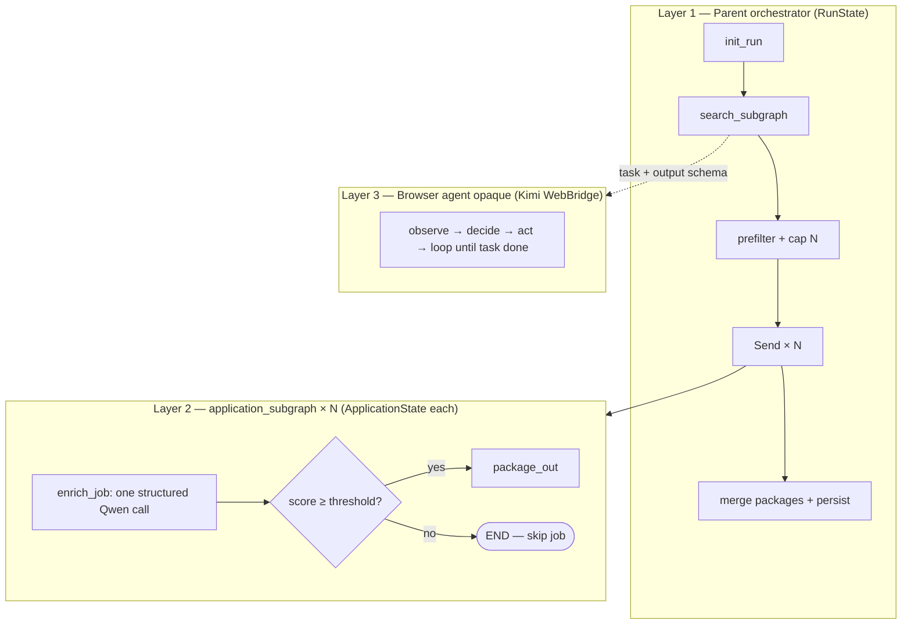
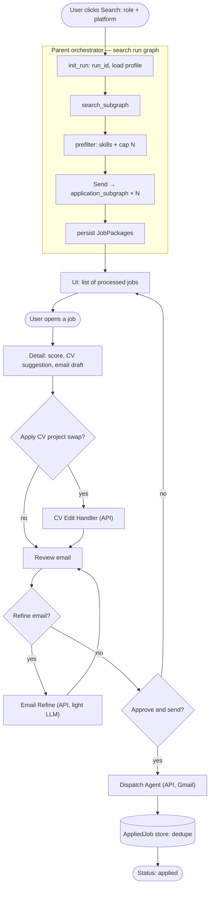
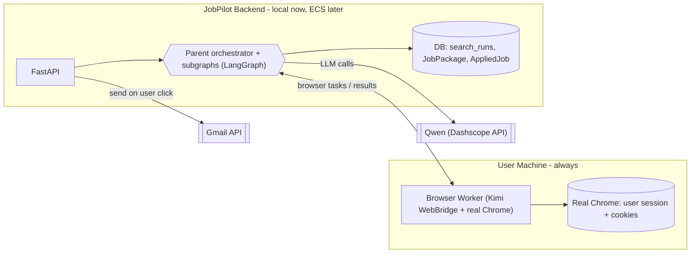
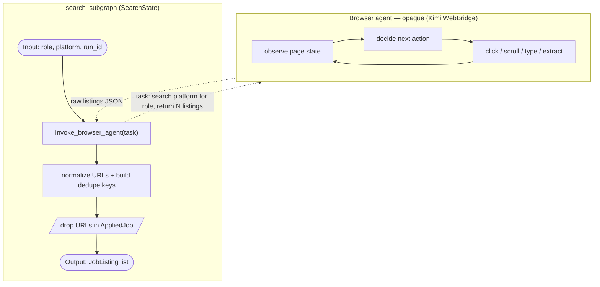
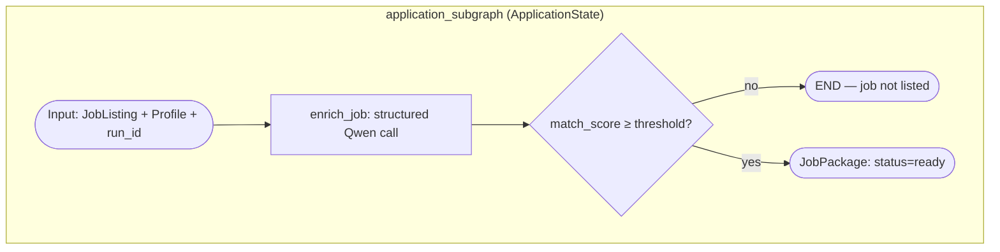
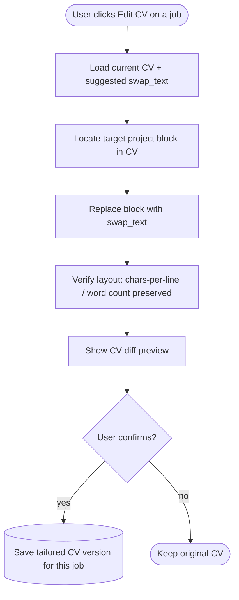
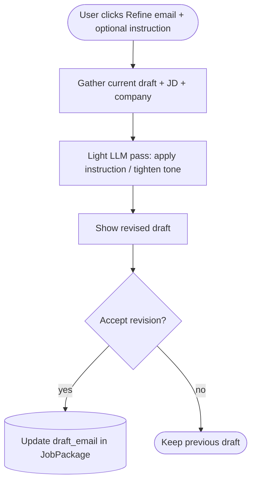
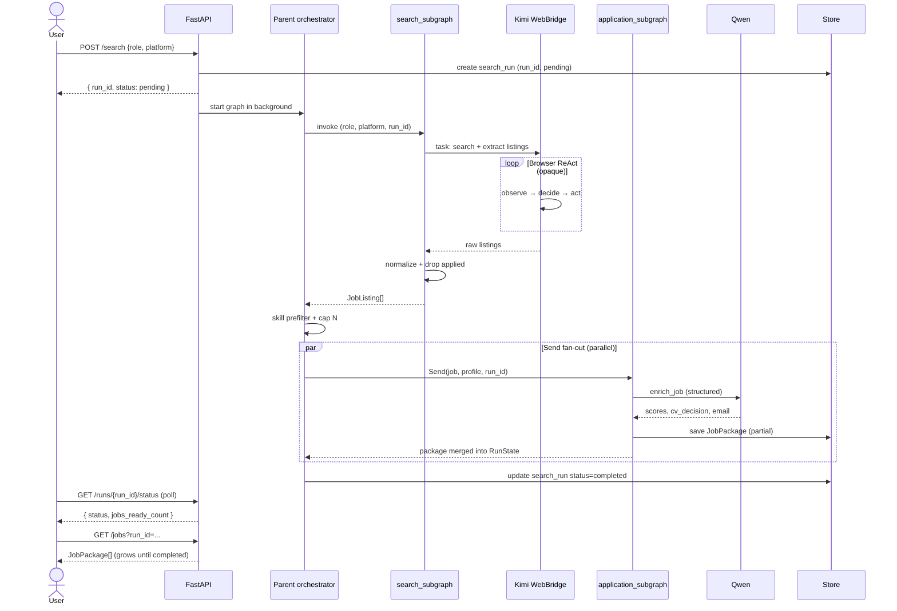
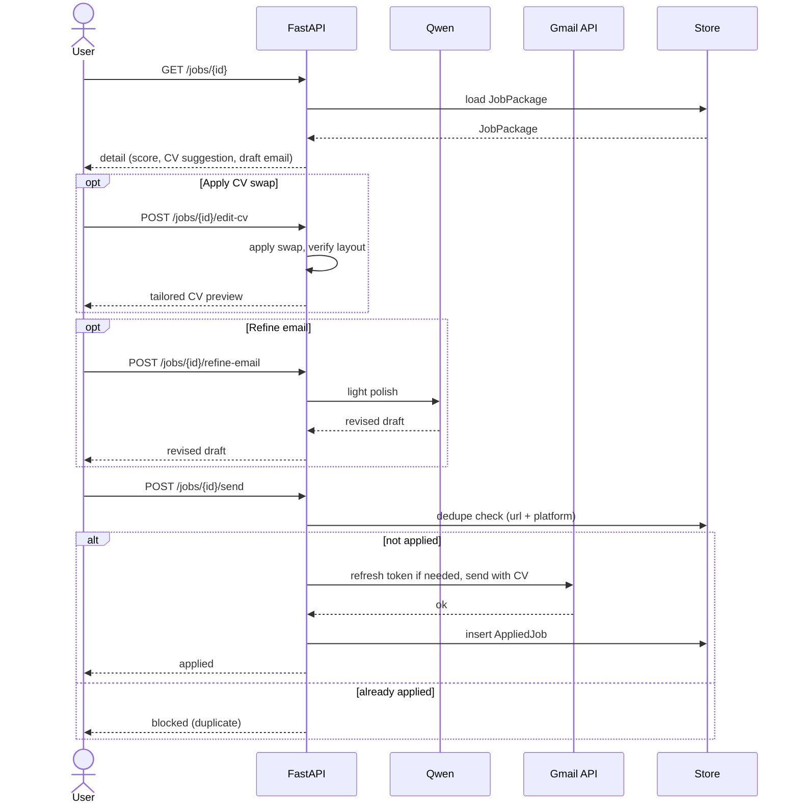

# JobPilot - Backend System Design

**Version:** 1.1
**Date:** June 29, 2026
**Scope:** Backend agentic system (the "main agent") - from the user clicking Search through sending an application, with no duplicate applies.

This document describes the backend only. It defines the LangGraph topology (parent graph + subgraphs), each agent's internals, shared and per-subgraph state, the data models, the API surface, and the cost controls. Diagrams are in mermaid so they render in the IDE and on GitHub.

> Repo status: greenfield. Today the repo holds only Qwen smoke tests (`scripts/test_qwen.py`, `scripts/test_model.py`), `requirements.txt`, and the two PRDs. This design defines the backend from scratch.
>
> **Related:** [design-decisions.md](./design-decisions.md) (locked API/async/OAuth items) · [dev-time-hardening.md](./dev-time-hardening.md) (implementation checklist)

---

## 1. Scope and confirmed decisions

- **Per-job sub-agent on match.** Search finds listings cheaply. We drop already-applied jobs and run a cheap skill prefilter. Only jobs that pass get the expensive per-job **Application Subgraph**. We do not run heavy LLM work on every listing.
- **What the Application Subgraph produces per job:** a match score, a CV decision (`keep` the current CV or `swap` a project), and - if swapping - the replacement project description rewritten to the **same characters-per-line** as the current project, plus the current vs suggested CV score, plus a drafted application email. When this finishes, the job is listed in the UI. That is where the subgraph's job ends.
- **CV editing is a separate, user-triggered step.** When the user opens a job and clicks "Edit CV", a **CV Edit Handler** applies the suggested swap into the CV. It is not part of the Application Subgraph or the search-run graph.
- **Human-in-the-loop before send.** Nothing is sent without the user opening the job, reviewing, and clicking Send.
- **No duplicate applies.** On a successful send, the job is recorded in `AppliedJob`. That URL is excluded from all future searches and blocked at send time.
- **Topology = local-first.** One local process for the hackathon, with a documented path to Alibaba ECS. In both modes a **Browser Worker** drives the user's **real Chrome** using the user's own session and cookies; in cloud mode that worker is a thin local process the cloud orchestrator delegates to.
- **LangGraph subgraphs with isolated state.** The parent orchestrator graph owns `RunState`. The **search subgraph** owns `SearchState`. Each **application subgraph** invocation owns `ApplicationState`. Subgraphs are compiled once and invoked from the parent; per-job work fans out via LangGraph `Send`.
- **Browser layer = Kimi WebBridge (v1).** Browser-Use is deprecated. Job search and listing extraction use an opaque ReAct browser agent (observe → decide → act → loop). We do **not** use Playwright scripts, Selenium, or other deterministic scrapers for the search path. Post-processing (URL normalize, dedupe) is deterministic code after the browser agent returns.
- **Three ownership layers.** LangGraph owns workflow and parallelism. The browser agent (Kimi WebBridge + Qwen ReAct in the worker) owns the browser loop. Qwen owns structured per-job enrichment. FastAPI routes own HITL actions (CV edit, email refine, send).

---

## 2. Assumptions

- **Match gate is two-stage for cost:** a free skill/keyword prefilter, then the Application Subgraph's LLM score with a threshold. Cap to top N jobs per run.
- **Persistence:** SQLite for the MVP (`search_runs`, `JobPackage`, `AppliedJob`, `oauth_tokens`); Postgres when deployed to ECS.
- **Profile:** CV text plus a user-maintained skills/projects list. GitHub repo scanner stays post-MVP.
- **Orchestrator:** LangGraph parent `StateGraph` with code-based routing — no separate LLM "orchestrator agent" for the MVP.
- **Browser tool:** **Kimi WebBridge** (v1) — HTTP to local daemon + Chrome extension; Qwen ReAct loop in Search Helper. Browser-Use is deprecated. The LangGraph graph never models individual browser clicks as nodes.
- **Dedupe key:** normalized `job_url` + `platform`.
- **LLM:** Qwen via Dashscope (OpenAI-compatible), reused from the existing test clients.
- **Async search:** `POST /search` returns immediately with `run_id`; client polls for status and partial job results. See [design-decisions.md](./design-decisions.md).

---

## 3. LangGraph topology (three layers)

The system has three nested execution layers. Only Layer 1 and Layer 2 are LangGraph graphs we compile. Layer 3 is an opaque ReAct loop inside the browser tool.



### 3.1 Whole agentic system (batch + HITL)

The parent graph covers the **search run** only. HITL steps after listing are API-driven, not nodes in the search graph.



**Narrative**

1. **Trigger.** `POST /search` creates `run_id`, starts the parent graph in the background, returns `{ run_id, status: "pending" }`.
2. **Search subgraph.** Invokes the browser agent (opaque ReAct) with a task prompt; normalizes URLs and drops already-applied listings.
3. **Prefilter.** Cheap skill overlap removes obvious non-matches; cap to top N jobs.
4. **Fan-out.** `Send("application_subgraph", {...})` runs N parallel Application Subgraph invocations, each with its own `ApplicationState`.
5. **Merge.** Each completed subgraph writes a `JobPackage` to the DB as it finishes (partial results before run completes).
6. **List.** UI polls `GET /runs/{run_id}/status` and `GET /jobs?run_id=...`.
7. **Review (HITL, outside graph).** User opens a job; CV edit, email refine, and send are FastAPI routes — not LangGraph nodes.

---

## 4. Deployment topology

Local-first for the hackathon; the same components lift to ECS later. The key invariant: the **Browser Worker always runs on the user's machine** and controls the user's real Chrome session, so job platforms see a real residential session — regardless of where the orchestrator runs.



- **Local mode (MVP):** orchestrator and Browser Worker run in the same process/machine; only Qwen and Gmail are remote.
- **Cloud mode (later):** orchestrator + API + DB move to ECS. The Browser Worker stays on the user's machine and connects out to the orchestrator (websocket or task queue). Browser actions still execute against the user's real Chrome.
- **Browser tool choice:** **Kimi WebBridge** (v1) — extension + daemon on user's PC; Qwen ReAct loop in Search Helper. Browser-Use deprecated. `app/services/browser.py` abstracts the provider.

---

## 5. Agents, subgraphs, and components

**Roster**

| Component | LangGraph? | State | Role |
|-----------|------------|-------|------|
| Parent orchestrator | Yes — parent graph | `RunState` | init, invoke subgraphs, prefilter, `Send` fan-out, persist |
| Search subgraph | Yes — compiled subgraph | `SearchState` | opaque browser invoke + normalize + drop applied |
| Application subgraph | Yes — compiled subgraph | `ApplicationState` | one structured Qwen call per job; threshold gate |
| CV Edit Handler | No — API route | — | apply swap on user click |
| Email Refine | No — API route | — | optional light LLM polish |
| Dispatch Agent | No — API route | — | Gmail send + dedupe persist |

### 5.1 Search subgraph

The search path is **not** a fixed script of LangGraph click nodes. Kimi WebBridge + Qwen ReAct loop runs inside the Search Helper; LangGraph only sees the boundary.



**Task prompt (example)**

```
Search {platform} for "{role}" jobs.
Extract up to {N} listings. For each return: title, company, url, full job description text.
Stop when you have {N} results or no more pages.
Return as JSON array.
```

**Notes**

- The ReAct loop (observe → decide → act) lives **inside** the browser agent — not as LangGraph nodes. Do not duplicate it in the orchestrator.
- Runs inside the user's logged-in Chrome session — no separate platform login.
- URL normalization (strip tracking params, trailing slashes) is deterministic code in the subgraph after the browser returns.
- Playwright, Selenium, and fixed-selector scrapers are **out of scope** for search.

### 5.2 Application subgraph (per job)

Each matching job gets its own subgraph invocation via `Send`, with isolated `ApplicationState`. MVP uses **one structured Qwen call** per job (`enrich_job`) for cost and latency; the logical steps below are what that call produces, not separate LLM nodes.



**`enrich_job` output (single structured response)**

- `match_score`, `current_cv_score`, `suggested_cv_score`
- `cv_decision`: `keep` | `swap`
- If `swap`: `swap_out_project`, `swap_in_text` (chars-per-line matched to current project)
- `draft_email`

**Parent fan-out**

```python
from langgraph.types import Send

def fan_out_applications(state: RunState):
    return [
        Send("application_subgraph", {
            "job": job,
            "profile": state["profile"],
            "run_id": state["run_id"],
        })
        for job in state["matched_jobs"]
    ]
```

**Notes**

- Threshold gate is the second cost lever (first is prefilter): jobs below threshold exit the subgraph without a `JobPackage`.
- Post-MVP: split `enrich_job` into separate subgraph nodes (score → cv_decision → draft_email) for per-step retries and tracing.
- Results merge into `RunState.packages` via a reducer; each package is persisted to DB as its subgraph completes.

### 5.3 CV Edit Handler (user-triggered, not in graph)



Notes: produces a per-job tailored CV version without mutating the master CV. The saved version is what gets attached at send time.

### 5.4 Email Refine (optional, light LLM, not in graph)



Notes: a single cheap call that edits only the current email text. It does not re-run scoring or CV logic.

### 5.5 Dispatch / Send Agent (no LLM, not in graph)


Notes: the dedupe check runs again at send time (race-safe). Gmail OAuth refresh happens at send time, not at search start — see [design-decisions.md](./design-decisions.md). Failed sends keep `JobPackage.status = ready` for retry.

---

## 6. End-to-end sequences

### 6.1 Search run (async, trigger to listed jobs)



### 6.2 Open, tailor, and send (HITL — API only)



---

## 7. State and data models

LangGraph uses **separate state per graph**. The parent orchestrator owns `RunState`. Each subgraph owns its own `TypedDict`. Persisted models back the UI and dedupe.

```python
from typing import Literal, TypedDict, Optional, Annotated
import operator

CvDecision = Literal["keep", "swap"]
PackageStatus = Literal["ready", "applied", "failed"]
RunStatus = Literal["pending", "running", "completed", "failed"]

class Project(TypedDict):
    name: str
    description: str              # full text as it appears in CV
    chars_per_line: int | None    # precomputed at profile upload for swap formatting

class Profile(TypedDict):
    cv_text: str
    skills: list[str]
    projects: list[Project]

class JobListing(TypedDict):
    job_id: str
    title: str
    company: str
    url: str                      # normalized; dedupe key with platform
    platform: str
    jd_text: str

class JobPackage(TypedDict):
    job: JobListing
    run_id: str
    match_score: int
    cv_decision: CvDecision
    swap_out_project: Optional[str]
    swap_in_text: Optional[str]   # chars-per-line matched to current
    current_cv_score: int
    suggested_cv_score: int
    draft_email: str
    status: PackageStatus
    error: Optional[str]          # set when sub-agent fails

class AppliedJob(TypedDict):
    url: str                      # dedupe key (with platform)
    platform: str
    title: str
    company: str
    applied_at: str
    cv_version: str

# --- Parent orchestrator state ---
class RunState(TypedDict):
    run_id: str
    role: str
    platform: str
    profile: Profile
    listings: list[JobListing]
    matched_jobs: list[JobListing]    # after prefilter + cap
    packages: Annotated[list[JobPackage], operator.add]  # reducer for Send merge
    errors: list[str]
    status: RunStatus

# --- search_subgraph state ---
class SearchState(TypedDict):
    run_id: str
    role: str
    platform: str
    raw_listings: list[dict]          # browser agent output before normalize
    listings: list[JobListing]        # after normalize + drop applied
    errors: list[str]

# --- application_subgraph state (one instance per Send) ---
class ApplicationState(TypedDict):
    run_id: str
    job: JobListing
    profile: Profile
    match_score: int | None
    cv_decision: CvDecision | None
    swap_out_project: str | None
    swap_in_text: str | None
    current_cv_score: int | None
    suggested_cv_score: int | None
    draft_email: str | None
    status: PackageStatus
    error: str | None
```

---

## 8. API surface

| Endpoint | Behavior |
|----------|----------|
| `POST /search` | Body `{role, platform}`. Create `run_id`, start parent graph in background. Return immediately `{ run_id, status: "pending" }`. |
| `GET /runs/{run_id}/status` | Poll: `{ status, progress?, jobs_ready_count?, error? }`. |
| `GET /jobs?run_id={run_id}` | List `JobPackage`s as subgraphs complete (includes `ready` and `failed`). |
| `GET /jobs/{id}` | Detail for one job. |
| `POST /jobs/{id}/edit-cv` | Apply suggested swap; returns tailored CV preview. |
| `POST /jobs/{id}/refine-email` | Body `{instruction?}`; light LLM polish. |
| `POST /jobs/{id}/send` | Dedupe check, Gmail send, persist `AppliedJob`. |
| `POST /profile` | CV upload + skills/projects. |
| `GET /auth/google` | Start Gmail OAuth. |
| `GET /auth/google/callback` | Exchange code; store refresh token. |

See [design-decisions.md](./design-decisions.md) for Gmail error codes and OAuth lifecycle.

---

## 9. Persistence and dedupe

- **Stores:** `search_runs`, `job_packages`, `job_applications` (dedupe source of truth), `oauth_tokens`.
- **Dedupe key:** normalized `url` + `platform`. URL normalization: lowercase host, strip `utm_*`/tracking params, drop trailing slash. Fallback when URL is missing: `hash(company + title + platform)`.
- **Where dedupe is enforced:** (1) inside `search_subgraph` after browser returns, (2) blocked on job open if already applied, (3) final race-safe check at send.
- **States:** `discovered` → `ready` (package built) → `applied` (sent, permanent) / `failed` (sub-agent or send error; send failures allow retry).

---

## 10. Cost controls

- Cheap skill/keyword prefilter before any LLM call; Application Subgraph runs only on prefiltered jobs.
- Score threshold inside the subgraph drops weak matches before persisting a `JobPackage`.
- Cap jobs processed per run (top N, e.g. 8); fan out via `Send("application_subgraph", ...)` in parallel.
- One structured Qwen call per job in MVP (`enrich_job`); no multi-node LLM chain inside the subgraph until post-MVP.
- Browser agent cost is bounded by task prompt (cap N listings, cap pages).
- CV edit and email refine are on-demand (user click), never part of the batch graph.
- The send path uses no LLM.

**Prefilter (locked):** Stage 1 — tokenize JD + user `skills`; require minimum overlap (e.g. ≥2 skill hits or ≥30% of listed skills). Stage 2 — Application Subgraph scores survivors; drop below threshold (e.g. &lt;60). See [dev-time-hardening.md](./dev-time-hardening.md).

---

## 11. Proposed backend layout

```text
app/
  main.py              FastAPI app + route registration
  config.py            env loading (DASHSCOPE_API_KEY, QWEN_*, GOOGLE_*, BROWSER_PROVIDER)
  graph/
    state.py           RunState, SearchState, ApplicationState, Profile, JobPackage
    orchestrator.py    Parent StateGraph: init → search_subgraph → match → Send → persist
    subgraphs/
      search.py        search_subgraph: invoke_browser → normalize → drop_applied
      application.py   application_subgraph: enrich_job → threshold gate → package_out
    nodes/
      init_run.py      create run_id, load profile
      match.py         skill prefilter + cap N
      persist.py       write JobPackages, update search_run status
  services/
    qwen.py            Qwen client (OpenAI-compatible)
    browser.py         BrowserProvider factory + providers/ (see browser-provider-abstraction.md)
    gmail.py           Gmail API (OAuth2, send with attachment)
    cv.py              CV parse + format-preserving rewrite
    store.py           SQLite now / Postgres later
  routes/
    search.py  runs.py  jobs.py  cv.py  send.py  profile.py  auth.py
scripts/               existing Qwen smoke tests
```

**HITL handlers** (`cv_edit`, `email_refine`, `dispatch`) live under `services/` and are called from `routes/` — they are not LangGraph nodes.

---

## 12. Keeping diagrams accurate

Once `orchestrator.py` and subgraph modules exist, generate live diagrams from code:

```python
parent_graph.get_graph().draw_mermaid()           # Section 3 parent graph
search_subgraph.get_graph().draw_mermaid()        # Section 5.1
application_subgraph.get_graph().draw_mermaid() # Section 5.2
```

Paste generated output back into this doc. The browser agent's internal ReAct loop will never appear in LangGraph output — that is expected; document it in Section 5.1 as opaque.

---

## 13. Open questions / next steps

- Confirm per-run job cap (N) and score threshold default (recommend N=8, threshold=60).
- Confirm CV source format (PDF/DOCX) for chars-per-line measurement in `cv.py`.
- Choose browser provider: **Kimi WebBridge (v1)** — see [`kimi-webbridge-provider.md`](./kimi-webbridge-provider.md) and [`browser-provider-abstraction.md`](./browser-provider-abstraction.md). Browser-Use deprecated.
- Implement parent graph + subgraphs before HITL routes.
- Wire async `POST /search` + poll endpoints per [design-decisions.md](./design-decisions.md).

**Resolved (no longer open):**

- Match prefilter: keyword/skills overlap (Stage 1) + LLM score (Stage 2).
- Failed sends: allow retry; do not permanently reserve URL until `AppliedJob` insert succeeds.
- Per-job parallelism: LangGraph `Send` to `application_subgraph`.
- Search execution model: opaque browser ReAct (Kimi WebBridge v1) via [`kimi-webbridge-provider.md`](./kimi-webbridge-provider.md) — not Playwright. Browser-Use deprecated.
- Graph structure: parent orchestrator + `search_subgraph` + `application_subgraph` with isolated state.
