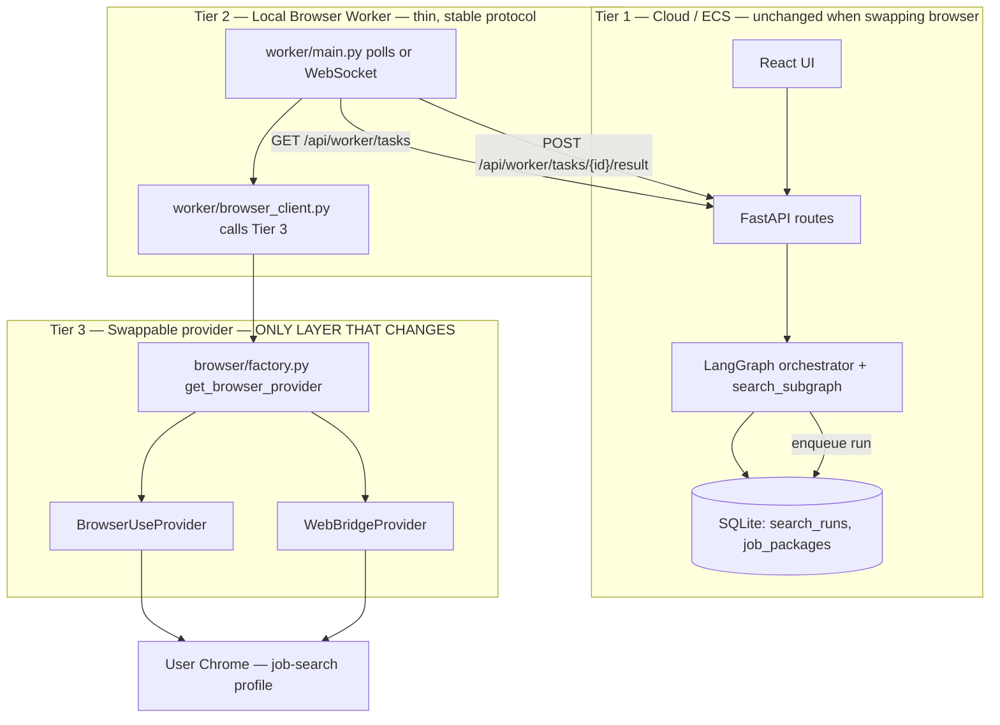

# Browser Provider Abstraction — Modular Search Layer

**Status:** Locked for MVP build (2026-07-02)  
**Decision:** Ship **Browser-Use** first; swap to **Kimi WebBridge** later by changing one layer only.  
**Related:** [`JobPilot-System-Design.md`](./JobPilot-System-Design.md) §4–5 · [`design-decisions.md`](./design-decisions.md) §2

---

## 1. Goals

| Goal | How |
|------|-----|
| Search uses the user's **real Chrome** and **home IP** | Browser Worker runs on the user's machine |
| Orchestrator can live on **ECS** | Worker pulls tasks from API; browser never runs on server |
| **Browser-Use** for hackathon speed | v1 provider — Python SDK, no extension |
| **WebBridge** later without rewriting the app | Same `BrowserProvider` interface + env flag |
| LangGraph stays provider-agnostic | Subgraph calls `browser.search_listings()` only |

**Non-goals (this layer):** Playwright scripts, server-side scraping, Gmail send, HITL CV edit.

---

## 2. Architecture (three tiers)



### Invariant (never break)

> **Tier 1 never imports `browser_use` or calls WebBridge HTTP.**  
> **Tier 3 never talks to SQLite or JWT cookies directly.**

---

## 3. Stable contracts (types + interface)

All providers implement the same Python protocol. Types are shared across ECS, worker, and LangGraph.

### 3.1 Domain types (`backend/app/models/browser.py`)

```python
from enum import Enum
from typing import Literal

Platform = Literal["linkedin", "indeed"]

class BrowserHealth(str, Enum):
    READY = "ready"           # provider can run a search
    NOT_INSTALLED = "not_installed"
    DAEMON_DOWN = "daemon_down"      # WebBridge only
    PROFILE_SETUP = "profile_setup"  # Chrome profile / login needed
    BUSY = "busy"
    ERROR = "error"

class RawJobListing(BaseModel):
    """Provider output — before URL normalize / dedupe."""
    title: str
    company: str
    url: str
    description_text: str = ""
    source_platform: Platform

class SearchListingsRequest(BaseModel):
    role: str
    platform: Platform
    max_listings: int = 8
    max_pages: int = 3
    # Optional context for LLM task prompt (not sent to job sites)
    skills_summary: str = ""
    chrome_profile_directory: str | None = None  # override; see §7

class SearchListingsResult(BaseModel):
    listings: list[RawJobListing]
    provider: str              # "browser-use" | "webbridge"
    duration_ms: int
    warnings: list[str] = []   # e.g. "captcha encountered"
```

### 3.2 Provider protocol (`backend/app/services/browser/base.py`)

```python
from typing import Protocol, runtime_checkable

@runtime_checkable
class BrowserProvider(Protocol):
    """Swappable browser automation backend. Implementations live in providers/."""

    name: str  # "browser-use" | "webbridge"

    async def health(self) -> BrowserHealth:
        """Can we run a search right now?"""
        ...

    async def search_listings(self, req: SearchListingsRequest) -> SearchListingsResult:
        """
        Opaque browser agent: navigate platform, search role, extract up to N listings.
        Internal ReAct loop stays inside the provider — not LangGraph nodes.
        """
        ...

    async def close(self) -> None:
        """Release browser / sessions."""
        ...
```

### 3.3 Factory (`backend/app/services/browser/factory.py`)

```python
def get_browser_provider() -> BrowserProvider:
    provider = settings.browser_provider  # env: BROWSER_PROVIDER
    if provider == "browser-use":
        return BrowserUseProvider(...)
    if provider == "webbridge":
        return WebBridgeProvider(...)
    raise ValueError(f"Unknown BROWSER_PROVIDER: {provider}")
```

**Rule:** LangGraph `search_subgraph`, routes, and worker import **only** `get_browser_provider()` — never `browser_use` or WebBridge URLs.

---

## 4. Provider implementations

### 4.1 v1 — `BrowserUseProvider` (`providers/browser_use.py`)

| Aspect | Detail |
|--------|--------|
| Dependency | `browser-use` (pip) |
| Chrome | `Browser.from_system_chrome(profile_directory=...)` |
| Agent | `Agent(task=..., browser=browser, llm=...)` — one task string per search |
| Extension | **None** |
| User UX | Second Chrome window; **separate profile** from JobPilot tab (§7) |

**Task prompt template (locked shape):**

```
Search {platform} for "{role}" jobs.
Extract up to {max_listings} listings.
For each return JSON objects with: title, company, url, description_text.
Stop at {max_listings} results or {max_pages} pages.
Return ONLY a JSON array.
```

**Parse:** Provider validates JSON array → `list[RawJobListing]`. On parse failure, return `warnings` + empty list (subgraph marks run partial/failed).

### 4.2 v2 — `WebBridgeProvider` (`providers/webbridge.py`) — later

| Aspect | Detail |
|--------|--------|
| Dependency | HTTP client to `http://127.0.0.1:10086` |
| Chrome | User's extension + daemon |
| Agent | LLM tool loop: `navigate`, `snapshot`, `click`, `fill` |
| Extension | **Required** (user install) |
| User UX | Same browser / tab possible; no second profile required |

**Same `SearchListingsRequest` / `SearchListingsResult`.** Only `health()` and internal loop differ.

### 4.3 Side-by-side

| | Browser-Use (v1) | WebBridge (v2) |
|---|------------------|----------------|
| Build effort | ~5–8 h (browser slice) | ~12–16 h (browser slice) |
| User install | Local worker + Chrome | Worker + extension + daemon |
| JobPilot tab stays open | Yes (different Chrome profile) | Yes (same browser) |
| LinkedIn login | Once in job-search profile | Uses existing session |
| Swap cost | New file + factory branch | New file + factory branch |

---

## 5. Where code runs

### 5.1 ECS (Tier 1)

| Module | Runs browser? |
|--------|----------------|
| `routes/search.py` | No — creates `search_runs`, enqueues work |
| `graph/subgraphs/search.py` | No on ECS — delegates to worker result |
| `services/browser/*` | **Not imported on ECS in cloud mode** |

In **cloud mode**, the orchestrator waits for worker to POST listing results. Browser code runs only on the worker machine.

### 5.2 Local Browser Worker (Tier 2)

Standalone process on the user's PC:

```text
worker/
  main.py              # entry: poll API, heartbeat, run tasks
  config.py            # WORKER_TOKEN, API_BASE, BROWSER_PROVIDER
  browser_client.py    # get_browser_provider() + search_listings()
  requirements.txt     # browser-use, httpx, pydantic
```

**MVP loop:**

```text
every 3s:
  GET  /api/worker/tasks/next     (Authorization: Bearer <worker_token>)
  if task:
    result = await browser_client.run_search(task)
    POST /api/worker/tasks/{id}/result
```

Worker token: per-user JWT or long-lived device token issued from JobPilot Settings → "Connect this computer".

### 5.3 Dev mode (all local)

`BROWSER_EXECUTION=local` — FastAPI process imports `get_browser_provider()` directly (no worker). Faster iteration; same provider code path.

| Env | Who runs browser |
|-----|------------------|
| `BROWSER_EXECUTION=local` | API process (developer laptop) |
| `BROWSER_EXECUTION=worker` | Local worker (production default) |

---

## 6. API contract (worker ↔ cloud)

These endpoints are **stable** across browser providers.

### 6.1 User-facing (unchanged by provider)

| Method | Path | Body | Response |
|--------|------|------|----------|
| `POST` | `/api/search` | `{ role, platform }` | `{ runId, status: "pending" }` |
| `GET` | `/api/runs/{runId}/status` | — | `{ status, progress?, jobsReadyCount?, error? }` |
| `GET` | `/api/jobs?runId=` | — | `[ JobPackage, ... ]` |

See [`design-decisions.md`](./design-decisions.md) §2 for async polling rules.

### 6.2 Worker-facing (new)

| Method | Path | Purpose |
|--------|------|---------|
| `POST` | `/api/worker/register` | Issue device token (authenticated user) |
| `GET` | `/api/worker/health` | `{ provider, browserHealth }` — UI polls via backend proxy optional |
| `GET` | `/api/worker/tasks/next` | Worker pulls next `search` task for this user |
| `POST` | `/api/worker/tasks/{taskId}/result` | `{ listings: RawJobListing[], warnings? }` |
| `POST` | `/api/worker/tasks/{taskId}/fail` | `{ error, code }` |

Task payload (server → worker):

```json
{
  "taskId": "uuid",
  "runId": 42,
  "role": "Senior React Developer",
  "platform": "linkedin",
  "maxListings": 8,
  "skillsSummary": "React, TypeScript, Python",
  "chromeProfileDirectory": "Profile 1"
}
```

---

## 7. Chrome profile strategy (Browser-Use v1)

**Problem:** Same Chrome profile cannot be used by normal Chrome and Browser-Use at once.

**Solution:** Two profiles — do **not** ask users to close JobPilot.

| Profile | Chrome name (example) | Purpose |
|---------|----------------------|---------|
| `Default` | Personal | User keeps JobPilot open here |
| `Profile 1` | Job search (rename in Chrome) | Automation + LinkedIn/Indeed login |

**One-time setup (in-app copy):**

1. Open Chrome → Add profile "Job search"
2. In that profile, log into LinkedIn (and Indeed if needed)
3. In JobPilot Settings, confirm "Job browser ready"

Store preference in DB: `profiles.browser_profile_directory` (optional column) default `"Profile 1"`.

**Do not say:** "Close Chrome."  
**Do say:** "We open your **job-search** Chrome window. JobPilot stays open in your main window."

WebBridge v2 can drop the second profile requirement.

---

## 8. LangGraph integration

Search subgraph calls the abstraction once:

```python
# graph/subgraphs/search.py (pseudocode)

async def invoke_browser_node(state: SearchState) -> SearchState:
    if settings.browser_execution == "worker":
        # ECS: task already dispatched; node waits on DB for worker result
        listings = await wait_for_worker_listings(state.run_id, timeout=120)
    else:
        provider = get_browser_provider()
        result = await provider.search_listings(SearchListingsRequest(
            role=state.role,
            platform=state.platform,
            max_listings=state.max_listings,
            skills_summary=state.skills_summary,
        ))
        listings = result.listings

    normalized = normalize_urls(listings)
    filtered = drop_applied(normalized, state.user_id)
    return {**state, "listings": filtered}
```

**Normalize + dedupe** stay in the subgraph (deterministic, not provider-specific).

---

## 9. Configuration

### 9.1 Environment variables

| Variable | Default | Where | Purpose |
|----------|---------|-------|---------|
| `BROWSER_PROVIDER` | `browser-use` | worker + local dev | `browser-use` \| `webbridge` |
| `BROWSER_EXECUTION` | `worker` | API | `local` \| `worker` |
| `BROWSER_CHROME_PROFILE` | `Profile 1` | worker | Chrome profile directory name |
| `WEBBRIDGE_URL` | `http://127.0.0.1:10086` | worker | WebBridge daemon base URL |
| `BROWSER_SEARCH_MAX_LISTINGS` | `8` | API + worker | Cap per run |
| `BROWSER_SEARCH_MAX_PAGES` | `3` | worker | Agent page cap |

ECS `.env` does **not** need `browser-use` installed — only worker does.

### 9.2 Dependencies

```text
# requirements.txt (API / ECS) — no browser-use
# worker/requirements.txt
browser-use>=0.12.0
httpx>=0.27.0
pydantic>=2.0
```

Add `webbridge` client deps only when implementing v2 (stdlib `urllib` or `httpx` is enough).

---

## 10. Proposed file layout

```text
backend/app/
  models/
    browser.py                 # RawJobListing, SearchListingsRequest, BrowserHealth
  services/
    browser/
      __init__.py              # export get_browser_provider, BrowserProvider
      base.py                  # Protocol
      factory.py               # env switch
      prompts.py               # shared task prompt template
      normalize.py             # URL strip tracking params (used by subgraph)
      providers/
        __init__.py
        browser_use.py         # v1
        webbridge.py           # v2 (stub until implemented)
  routes/
    search.py                  # POST /api/search
    runs.py                    # GET status
    worker.py                  # worker task queue
  graph/
    subgraphs/
      search.py                # invoke_browser → normalize → drop_applied

worker/                        # separate installable package
  main.py
  config.py
  browser_client.py
  requirements.txt
  README.md                    # user setup: profile + pip install + run

scripts/
  run_search_local.py          # dev smoke test without full API
```

---

## 11. Frontend UX (provider-agnostic)

Search page shows **browser readiness** before enabling "Start search":

| State | UI |
|-------|-----|
| Worker offline | "Install search helper on this computer" + link to `worker/README.md` |
| Profile not set up | "Log into LinkedIn in your Job search Chrome profile" (v1) |
| Ready | Enable "Start search" |
| Searching | Redirect to `/runs/:runId` poll UI |

**v2 WebBridge:** Replace profile setup card with "Install Kimi WebBridge extension" card. Same `GET /api/worker/health` shape.

---

## 12. Error codes (stable)

| Code | HTTP | Meaning |
|------|------|---------|
| `worker_offline` | 503 | No worker heartbeat in 60s |
| `browser_not_ready` | 503 | `health() != READY` |
| `browser_profile_setup` | 409 | LinkedIn not logged in job profile |
| `search_timeout` | 504 | Worker did not return in time |
| `search_parse_failed` | 502 | Agent returned invalid JSON |
| `platform_blocked` | 502 | CAPTCHA / block detected |

Providers map internal errors → these codes in worker `fail` payload.

---

## 13. Swapping Browser-Use → WebBridge (checklist)

When adding WebBridge, **do not change:**

- React routes, `POST /api/search`, poll endpoints
- `search_runs` / `job_packages` schema
- LangGraph parent graph structure
- Normalize / dedupe / application subgraph

**Do change:**

1. Add `providers/webbridge.py` implementing `BrowserProvider`
2. Add `BROWSER_PROVIDER=webbridge` to worker env
3. Update worker `README.md` and Search page setup card
4. Implement `WebBridgeProvider.health()` → ping `:10086`
5. (Optional) Remove `BROWSER_CHROME_PROFILE` requirement in UI when WebBridge

**Estimated swap:** ~12–16 h for provider + worker health + docs (not full app rewrite).

---

## 14. Testing strategy

| Level | What |
|-------|------|
| Unit | `normalize.py`, JSON parse of mock agent output |
| Provider | Mock `Browser` / mock HTTP; no real Chrome in CI |
| Integration | `scripts/run_search_local.py` on dev machine with real Chrome |
| E2E | User laptop: worker + ECS + one LinkedIn search → jobs in UI |

CI runs unit only. Integration manual before demo.

---

## 15. Implementation order (hackathon)

| Step | Hours (est.) | Deliverable |
|------|----------------|-------------|
| 1 | 2 | `models/browser.py`, `base.py`, `factory.py`, stub providers |
| 2 | 4 | `BrowserUseProvider.search_listings()` + `scripts/run_search_local.py` |
| 3 | 4 | `POST /api/search`, `search_runs` persistence, background enqueue |
| 4 | 4 | `worker/main.py` poll loop + task result POST |
| 5 | 4 | Search UI → run progress page |
| 6 | 2 | Profile setup copy + `browser_profile_directory` setting |
| **Total** | **~20 h** | End-to-end demo with Browser-Use |

WebBridge: add as Step 2b later (~+12 h), not blocking MVP.

---

## 16. Decision log

| Date | Decision |
|------|----------|
| 2026-07-02 | v1 provider = **Browser-Use** (faster build, no extension) |
| 2026-07-02 | v2 optional = **Kimi WebBridge** (same interface) |
| 2026-07-02 | Browser Worker always on **user machine**; ECS orchestrates only |
| 2026-07-02 | Separate Chrome **job-search profile** for v1; JobPilot tab stays open |
| 2026-07-02 | LangGraph never imports provider SDKs — only `BrowserProvider` |

---

## 17. References

- [Browser-Use — Real Browser](https://docs.browser-use.com/open-source/customize/browser/real-browser)
- [Kimi WebBridge](https://www.kimi.com/features/webbridge)
- [`JobPilot-System-Design.md`](./JobPilot-System-Design.md) §4–5
- [`design-decisions.md`](./design-decisions.md) §2 (async search)

**Build command (when ready):** `/build` from a plan derived from §15.
