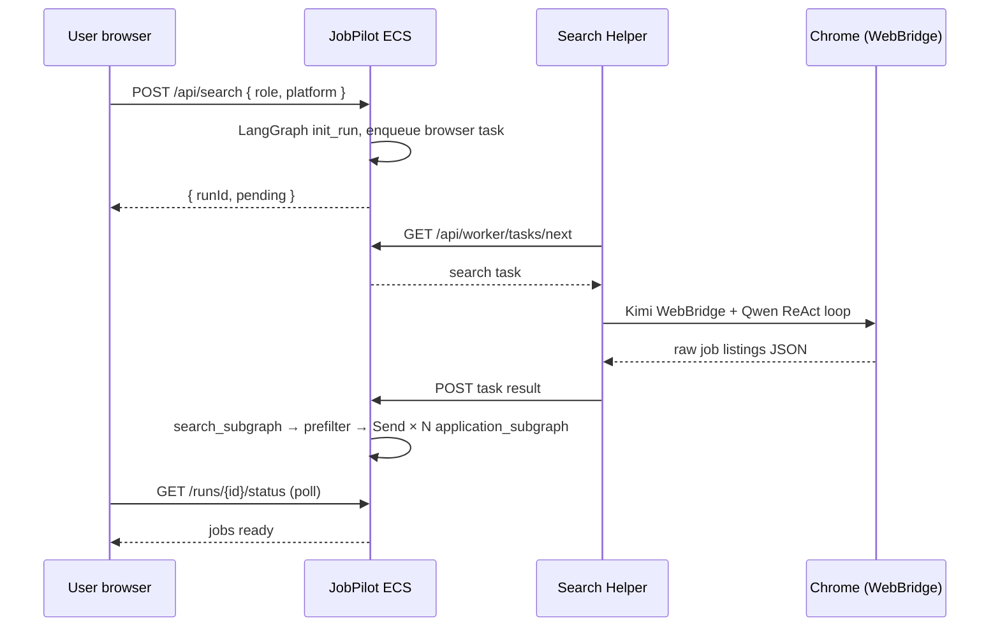
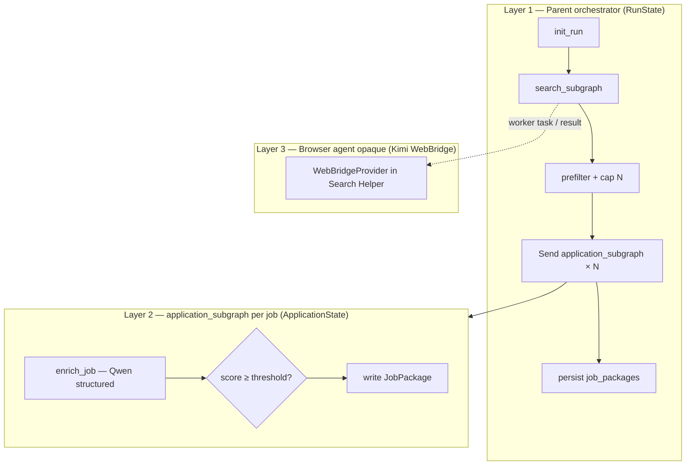

# JobPilot Agent Build Guide — Locked Architecture

**Status:** Locked for implementation (branch: `jobpilot-with-brosweruse`)  
**Start here when building:** main LangGraph orchestrator + search subgraph + application sub-agents + Search Helper  
**Related specs:** [`browser-provider-abstraction.md`](./browser-provider-abstraction.md) · [`JobPilot-System-Design.md`](./JobPilot-System-Design.md) · [`design-decisions.md`](./design-decisions.md)

---

## 1. Locked deployment model (do not change without explicit decision)

We **rejected** these alternatives after review:

| Alternative | Why not for JobPilot |
|-------------|----------------------|
| **draw.io-style** — entire app as offline static files in the browser tab | Cannot run Python/LangGraph, cannot hide Qwen API key, cannot drive Chrome for LinkedIn; fails **Alibaba Cloud deploy proof** for Qwen hackathon |
| **Full local backend** — API + DB + browser all on user PC | Conflicts with shipped **multi-user ECS** app; judges need a **URL** + cloud screenshot; heavy install for everyone |

**Locked model:**

```text
┌─────────────────────────────────────────────────────────────────┐
│  TIER 1 — Alibaba ECS (always for hackathon + production)        │
│  React UI · FastAPI · LangGraph parent + subgraphs · SQLite     │
│  Qwen (DASHSCOPE_API_KEY server-side only)                       │
└────────────────────────────┬────────────────────────────────────┘
                             │ HTTPS: auth, profile, POST /search, poll
┌────────────────────────────┴────────────────────────────────────┐
│  TIER 2 — JobPilot Search Helper (user PC, install once)         │
│  Polls ECS for browser tasks · runs BrowserProvider              │
└────────────────────────────┬────────────────────────────────────┘
                             │
┌────────────────────────────┴────────────────────────────────────┐
│  TIER 3 — Kimi WebBridge (inside Helper only)                    │
│  HTTP to 127.0.0.1:10086 · Qwen ReAct loop · real Chrome         │
│  (replaces Browser-Use — see kimi-webbridge-provider.md)         │
└────────────────────────────┬────────────────────────────────────┘
                             ▼
              User's Chrome (LinkedIn already logged in)
```

**Hackathon submission:** Judges use **website on ECS** (signup, CV, GitHub, search with paired Search Helper). Real LinkedIn search runs via **Search Helper** on the user's PC. See [§8](#8-hackathon--qwen-cloud-alignment).

---

## 2. JobPilot Search Helper — user experience (locked)

### 2.1 Naming

| Internal code | User-facing |
|---------------|-------------|
| `worker/` | **JobPilot Search Helper** |
| `WORKER_TOKEN` | **Computer pairing code** |
| `worker_offline` | “Search Helper not connected” |
| `Profile 1` | *(deprecated — Browser-Use)* |
| Kimi WebBridge | **Browser automation** (user-facing: extension + daemon) |

### 2.2 Install once vs every session

| Action | Frequency |
|--------|-----------|
| Download & install Search Helper (`.exe` / installer) | **Once per computer** |
| Pair with JobPilot account | **Once per computer** (until revoked in Settings) |
| Chrome + LinkedIn login | **Once** in normal Chrome (WebBridge uses existing session) |
| **Run** Search Helper (tray / background) | **Each search session** — not reinstall |
| Open JobPilot in browser | Anytime — no install |

### 2.3 One-time setup flow

1. User uses JobPilot at `http://43.98.197.132` — signup, CV, GitHub (no Helper).
2. Settings / Search → **Connect this computer for job search**.
3. Download **JobPilot Search Helper** → install → tray shows *Waiting for JobPilot…*
4. JobPilot shows pairing code → user confirms → Helper **Connected**.
5. Install **Kimi WebBridge** extension + daemon; log into LinkedIn in normal Chrome once.
6. Search page shows **Ready to search**.

**Copy (locked):**  
- Do **not** say “Close Chrome.”  
- Do say: “Keep JobPilot open. Search uses your existing Chrome via Kimi WebBridge.”

**Provider guide:** [`kimi-webbridge-provider.md`](./kimi-webbridge-provider.md)

### 2.4 Every search session



### 2.5 Search page status (UI contract)

| Status | Enable Start search? | Action |
|--------|----------------------|--------|
| Helper not connected | No | Download + pair |
| Chrome profile not ready | No | Job browser setup guide |
| Ready | Yes | — |
| Searching | — | `/runs/:runId` progress |

### 2.6 Packaging (hackathon)

| Phase | Deliverable |
|-------|-------------|
| Dev | `worker/` + `pip` (see [`worker/README.md`](../worker/README.md)) |
| Demo | Windows `.exe` (PyInstaller) or zip + `install.bat` |
| Later | Tauri/Electron tray app with auto-update |

---

## 3. LangGraph — main agent and sub-agents

### 3.1 What to build (three LangGraph layers)

Only **Layer 1** and **Layer 2** are LangGraph graphs in our repo. **Layer 3** is inside `BrowserProvider` (Kimi WebBridge + Qwen ReAct loop), invoked from the worker — not LangGraph nodes.



### 3.2 Component roster

| Component | LangGraph? | Where it runs | State |
|-----------|------------|---------------|-------|
| **Parent orchestrator** | Yes | ECS | `RunState` |
| **search_subgraph** | Yes | ECS | `SearchState` |
| **application_subgraph** | Yes | ECS | `ApplicationState` (one per job) |
| **BrowserProvider** | No (opaque) | Search Helper | — |
| CV edit / send | No (API routes) | ECS | Post-MVP HITL |

### 3.3 Parent graph nodes (build order)

| # | Node | File (target) | Responsibility |
|---|------|---------------|----------------|
| 1 | `init_run` | `graph/nodes/init_run.py` | Create `run_id`, load profile + `user_id`, set `search_runs.status` |
| 2 | `search_subgraph` | `graph/subgraphs/search.py` | Wait for worker listings → normalize → drop applied URLs |
| 3 | `prefilter` | `graph/nodes/match.py` | Skill overlap filter, cap N (default 8) |
| 4 | `fanout` | `graph/orchestrator.py` | `Send("application_subgraph", {...})` per job |
| 5 | `persist` | `graph/nodes/persist.py` | Update `search_runs`, finalize run status |

Entry: `POST /api/search` → `asyncio.create_task(run_parent_graph(run_id))` → return immediately.

### 3.4 search_subgraph (browser boundary)

**Critical rule:** This subgraph **never** imports `browser_use`. On ECS it:

1. Inserts a row in `worker_tasks` (or equivalent) with `type: browser_search`.
2. Polls DB (or waits on asyncio event) until Helper posts `RawJobListing[]` or timeout.
3. Runs `normalize.py` + `drop_applied(user_id)`.

In **local dev** (`BROWSER_EXECUTION=local`), same subgraph calls `get_browser_provider().search_listings()` in-process — no worker.

### 3.5 application_subgraph (per-job sub-agent)

One invocation per listing after prefilter:

| Step | Qwen? | Output |
|------|-------|--------|
| `enrich_job` | Yes — one structured call | match score, summary, CV tweak suggestion, email draft stub |
| Threshold gate | No | Skip if score < 60 (configurable) |
| `package_out` | No | INSERT `job_packages` — UI polls immediately |

Parallelism: LangGraph `Send` — up to N concurrent subgraph runs.

### 3.6 HITL (out of scope for first agent slice)

Job detail, CV edit, approve/send are **FastAPI routes**, not graph nodes. Build after first search → job list works.

---

## 4. Code map — where to implement

```text
backend/app/
  models/
    browser.py              # RawJobListing, SearchListingsRequest, BrowserHealth
    search.py                 # RunStatus, SearchRequest, JobPackageResponse (new)
  services/
    browser/
      base.py                 # BrowserProvider protocol
      factory.py              # BROWSER_PROVIDER switch
      prompts.py              # Shared browser task prompt
      normalize.py            # URL normalize, dedupe keys
      providers/
        browser_use.py        # deprecated
        webbridge.py          # v1 — Kimi WebBridge
    search_store.py           # search_runs, worker_tasks, job_packages CRUD (new)
    qwen.py                   # extend for enrich_job (or profile_llm split)
  graph/
    state.py                  # RunState, SearchState, ApplicationState
    orchestrator.py           # compile parent graph
    nodes/
      init_run.py
      match.py
      persist.py
    subgraphs/
      search.py
      application.py
  routes/
    search.py                 # POST /api/search
    runs.py                   # GET /api/runs/{id}/status
    jobs.py                   # GET /api/jobs?runId=
    worker.py                 # Helper poll + result + heartbeat + pairing

worker/                       # JobPilot Search Helper (installable)
  main.py                     # poll loop, heartbeat
  browser_client.py           # get_browser_provider() + run task
  config.py
  requirements.txt

frontend/src/
  api/search.ts               # POST search, poll runs
  pages/RunProgressPage.tsx   # /runs/:runId (new)
  components/search/
    SearchHelperStatus.tsx    # pairing + readiness card
```

**Import rule (enforce in code review):**

```text
backend/app/graph/**     →  may import services/search_store, services/browser ONLY if BROWSER_EXECUTION=local
backend/app/routes/**    →  never import browser_use
worker/**                →  may import backend.app.services.browser (shared package or copied types)
```

---

## 5. API contract (stable across providers)

### 5.1 User APIs

| Method | Path | Notes |
|--------|------|-------|
| `POST` | `/api/search` | `{ role, platform }` → `{ runId, status: "pending" }` |
| `GET` | `/api/runs/{runId}/status` | Poll every 2–3s |
| `GET` | `/api/jobs?runId=` | Partial results while running |

### 5.2 Search Helper APIs

| Method | Path | Notes |
|--------|------|-------|
| `POST` | `/api/worker/pair` | User session → issue `WORKER_TOKEN` |
| `POST` | `/api/worker/heartbeat` | Helper alive + `browserHealth` |
| `GET` | `/api/worker/tasks/next` | Long-poll or 3s poll |
| `POST` | `/api/worker/tasks/{id}/result` | `{ listings: RawJobListing[] }` |
| `POST` | `/api/worker/tasks/{id}/fail` | `{ code, error }` |
| `DELETE` | `/api/worker/pair` | Revoke device token |

### 5.3 Database

**`search_runs`** — `role`, `platform`, `status`, `error`, `jobs_ready_count`, `user_id`.

**`job_packages`** — `run_id`, `title`, `company`, `url`, `score`, `summary`, `status`, JSON draft fields.

**`worker_devices`** (new): `user_id`, `token_hash`, `label`, `last_seen_at`, `browser_health`.

**`worker_tasks`** (new): `id`, `user_id`, `run_id`, `type`, `payload_json`, `status`, `result_json`, `created_at`.

---

## 6. Environment variables

### ECS (`deploy/env.production.example`)

```env
BROWSER_EXECUTION=worker
# BROWSER_PROVIDER not needed on ECS — browser runs in Helper only
```

### Search Helper (`worker/.env`)

```env
JOBPILOT_API_BASE=http://43.98.197.132
WORKER_TOKEN=
BROWSER_PROVIDER=webbridge
WEBBRIDGE_URL=http://127.0.0.1:10086
DASHSCOPE_API_KEY=
QWEN_MODEL=qwen-plus
```

### Local dev (API + browser same machine)

```env
BROWSER_EXECUTION=local
BROWSER_PROVIDER=webbridge
WEBBRIDGE_URL=http://127.0.0.1:10086
```

---

## 7. Implementation phases (build checklist)

Use this order on `jobpilot-with-brosweruse`. Check off in PRs.

### Phase A — Contracts (no Chrome yet)

- [ ] `models/browser.py`, `models/search.py`
- [ ] `services/browser/base.py`, `factory.py`, stub `browser_use.py`
- [ ] `search_store.py` + migrate `search_runs`, `job_packages`, `worker_*` tables
- [x] `routes/search.py`, `routes/runs.py`, `routes/jobs.py` — real DB-backed APIs

### Phase B — Search Helper skeleton

- [ ] `routes/worker.py` pairing + heartbeat + task queue
- [ ] `worker/main.py` poll loop
- [ ] Frontend `SearchHelperStatus.tsx`

### Phase C — Kimi WebBridge in Helper

- [ ] `providers/webbridge.py` — `search_listings()` + `agent_loop.py`
- [ ] `WebBridgeProvider.health()` → ping `:10086`
- [ ] `scripts/run_search_local.py` smoke test
- [ ] End-to-end: Helper → LinkedIn → results in DB
- [ ] Remove deprecated `browser_use` / `browser_client.py` Browser-Use path

**Guide:** [`kimi-webbridge-provider.md`](./kimi-webbridge-provider.md)

### Phase D — LangGraph parent + search subgraph

- [ ] `graph/state.py`, `graph/subgraphs/search.py`
- [ ] Wire `POST /search` → background graph → worker task

### Phase E — Application sub-agents

- [ ] `graph/subgraphs/application.py` + Qwen `enrich_job`
- [ ] `Send` fan-out in `orchestrator.py`
- [ ] `GET /api/jobs` returns scored packages

### Phase F — UI + hackathon

- [ ] `RunProgressPage.tsx`, wire Search page
- [ ] Package Search Helper `.exe` for demo machine

### Phase G — Cleanup (post-WebBridge E2E)

- [ ] Remove `browser-use` from `worker/requirements.txt`
- [ ] Remove `BROWSER_CHROME_PROFILE` from UI and worker config
- [ ] Update Settings card — WebBridge install only

---

## 8. Hackathon / Qwen Cloud alignment

From **`Qwen Cloud Proof of Deployment.docx`**:

| Requirement | How JobPilot satisfies it |
|-------------|---------------------------|
| Proof of **Alibaba Cloud** deployment | ECS screenshot + live `http://43.98.197.132` |
| **Qwen Cloud APIs** | Server-side CV skills, README import, `enrich_job` scoring |
| Public repo + architecture diagram | This doc + [`JobPilot-System-Design.md`](./JobPilot-System-Design.md) |
| Video demo 1–3 min | Website flow + optional real search on presenter PC |

**Judges:** ECS website with paired Search Helper for real search. **Video:** website flow + real LinkedIn search on presenter PC.

---

## 9. Rejected approaches (record)

| Date | Rejected | Reason |
|------|----------|--------|
| 2026-07-02 | Full client-side / draw.io offline model | No cloud backend proof; no browser automation |
| 2026-07-02 | Full local backend on user PC | Conflicts with ECS multi-user product |
| 2026-07-02 | Browser automation on ECS only | Datacenter IP; no user LinkedIn session |

**Locked:** ECS + Search Helper + **Kimi WebBridge v1** (replaces Browser-Use). Provider guide: [`kimi-webbridge-provider.md`](./kimi-webbridge-provider.md).

---

## 10. References

- [`browser-provider-abstraction.md`](./browser-provider-abstraction.md) — `BrowserProvider` protocol detail
- [`JobPilot-System-Design.md`](./JobPilot-System-Design.md) — full system diagrams
- [`design-decisions.md`](./design-decisions.md) — async `/search` + poll
- [`worker/README.md`](../worker/README.md) — Helper install for developers
- [`currently-working-feature.md`](../currently-working-feature.md) — active task tracker

**When ready to implement:** `/build` using Phase A→F from §7.
