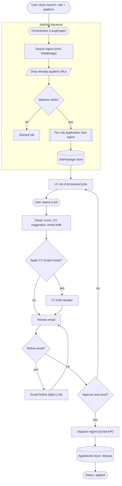
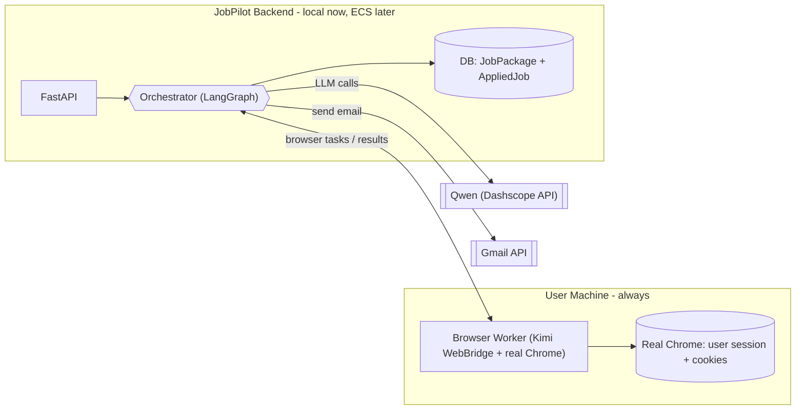
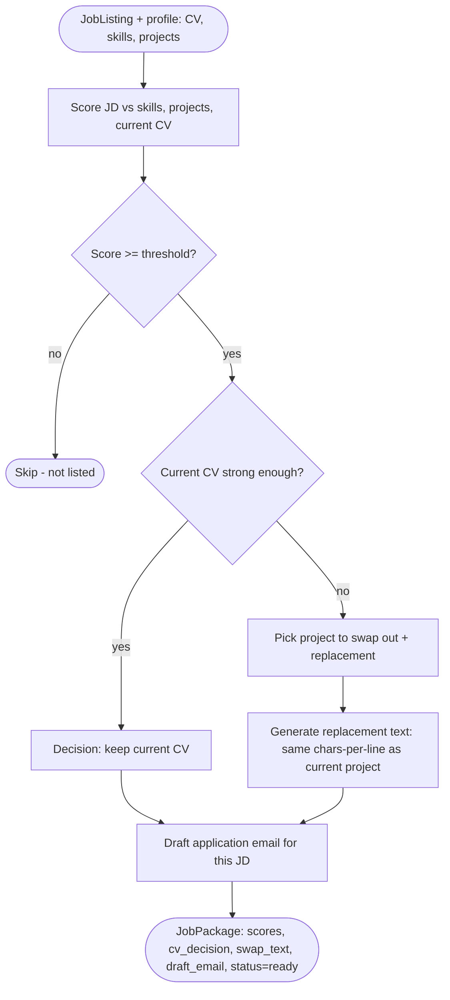

# JobPilot Backend System Design

Deliverable: a new document at `docs/system-design.md` describing the backend agentic system, with mermaid for the whole system and for each agent's internals. Repo is greenfield today (only [scripts/test_qwen.py](scripts/test_qwen.py), [scripts/test_model.py](scripts/test_model.py), `requirements.txt`, and the two PRDs), so this defines the backend from scratch.

## Confirmed decisions

- Scope: per-job sub-agent that fires only for matching jobs (not every listing, not lazy-on-click-only). Flow: `search -> drop already-applied + cheap skill prefilter -> per matching job run Application Sub-Agent -> list in UI -> user opens job -> apply CV swap + review/refine email -> send -> record to prevent duplicates`.
- Application Sub-Agent output per job: match score, CV decision (`keep` or `swap`), the swap project text rewritten to the **same characters-per-line** as the current project, current vs suggested CV score, and a drafted email. This is the "work is complete here" point; results get listed in the UI.
- CV editing happens when the user opens a job and clicks "Edit CV" (applies the suggested swap) - a separate handler, not part of the per-job sub-agent.
- Topology = single local process for the hackathon, with a "deploy to ECS later" note. In both modes a Browser Worker drives the user's real Chrome with the user's session/cookies; in cloud mode that worker is a thin local process the orchestrator delegates to.

## Assumptions (correct me if off)

- Match gate is two-stage for cost: a free skill/keyword prefilter, then the sub-agent's LLM score with a threshold; cap to top N jobs per run.
- Persistence: SQLite for MVP (`JobPackage`, `AppliedJob`), Postgres when on ECS.
- Profile = CV text + a user-maintained skills/projects list; GitHub scanner stays post-MVP.
- Orchestrator = LangGraph graph + code routing (no separate LLM orchestrator) for MVP.
- Dedupe key = normalized `job_url` + `platform`.

## Diagram 1 - Whole agentic system



## Diagram 2 - Deployment topology (local now, ECS later)



## Diagram 3 - Per-Job Application Sub-Agent (core)



The full doc will also include per-agent component diagrams for the Search Agent, CV Edit Handler, Email Refine, and Dispatch/Send Agent (same style as Diagram 3).

## State and data models (sketch for the doc)

```python
class JobListing(TypedDict):
    job_id: str
    title: str
    company: str
    url: str          # normalized; dedupe key with platform
    platform: str
    jd_text: str

class JobPackage(TypedDict):
    job: JobListing
    match_score: int
    cv_decision: str          # "keep" | "swap"
    swap_out_project: str | None
    swap_in_text: str | None  # chars-per-line matched to current
    current_cv_score: int
    suggested_cv_score: int
    draft_email: str
    status: str               # "ready" | "applied" | "failed"

class RunState(TypedDict):    # LangGraph shared state
    role: str
    platform: str
    profile: dict             # cv_text, skills[], projects[]
    listings: list[JobListing]
    packages: list[JobPackage]
    errors: list[str]
```

## API surface (for the doc)

- `POST /search` - body `{role, platform}`; runs search + filter + per-job sub-agent; returns run id + processed jobs
- `GET /jobs`, `GET /jobs/{id}` - list / detail of `JobPackage`s
- `POST /jobs/{id}/edit-cv` - apply swap, return tailored CV preview
- `POST /jobs/{id}/refine-email` - light LLM polish of current draft
- `POST /jobs/{id}/send` - dedupe check, Gmail send, persist `AppliedJob`
- Setup: `POST /profile` (CV + skills/projects), Gmail OAuth callback

## Proposed backend layout (documented, not built here)

```text
app/
  main.py            FastAPI app + routes
  config.py          env loading (DASHSCOPE_API_KEY, QWEN_*, GOOGLE_*)
  graph/
    state.py         TypedDict/Pydantic state + models
    orchestrator.py  LangGraph StateGraph + routing
    nodes/ search.py  match.py  application.py  cv_edit.py  email_refine.py  dispatch.py
  services/
    qwen.py  browser.py  gmail.py  cv.py  store.py
```

## Cost controls (called out in the doc)

- Cheap prefilter before any LLM; LLM scoring only for prefiltered jobs.
- Cap jobs processed per run (top N); parallel fan-out across matching jobs via LangGraph.
- CV edit and email refine are on-demand (user click), not part of the batch run.
- Send path uses no LLM.

## Note on keeping diagrams accurate

Best practice (validated via web search) is to also generate the live graph from code with `graph.get_graph().draw_mermaid()` once the orchestrator exists, so the doc never drifts. The doc will mention this as a follow-up.