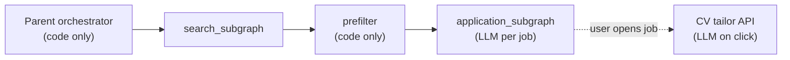

# JobPilot — LLM Routing & Cost Plan

**Status:** Planned — not implemented yet (document decisions before Settings UI and agent wiring)  
**Related:** [JobPilot-System-Design.md](./JobPilot-System-Design.md) · [jobpilot-agent-build-guide.md](./jobpilot-agent-build-guide.md) · [design-decisions.md](./design-decisions.md) · [docs/database-schema.md](../docs/database-schema.md)

This plan defines **which model runs where**, **what data each step receives**, and **how to keep Qwen costs under control** while leaving room for per-user overrides in Settings later.

---

## 1. Goals

| Goal | Approach |
|------|----------|
| Good job-match and email quality | Strong model on **Application subgraph** (once per surviving job) |
| Fast, cheap profile setup | Light model on skills extraction and repo card summary |
| Accurate CV tailoring per job | **Full `readme_md`** at tailor time — not the short UI `description` |
| Predictable hackathon / ECS cost | Code prefilter before LLM; cap jobs per run; tiered models |
| User control (later) | Per-user `llm_preferences` in SQLite — scoped by `user_id` |

---

## 2. Project data: two layers (locked)

GitHub import already stores two different shapes. **Do not collapse them.**

| Field | Purpose | Shown in UI? | Used by |
|-------|---------|--------------|---------|
| `description` | 5+ line technical summary for project cards | Yes | Settings, welcome gate, quick scan |
| `readme_md` | Full README snapshot at import (up to 64 KB) | **No** (server-only) | CV tailor, application agent, deep match |
| `repo_full_name` | GitHub identifier | Yes (`repoFullName`) | Re-import, traceability |

### Import-time LLM input vs storage

```
GitHub API
    │
    ├─► readme_md  ──────────────► SQLite (full, per user, up to 65_536 chars)
    │
    └─► readme[:4000] + CV summary ─► summarize_repo() ─► description (5+ lines)
```

**Why truncate for import summarization only?**

- Lower token cost and latency when importing many repos in parallel.
- Top of README usually has stack and overview — enough for a **listing card**.

**Why that is not enough for CV tailoring:**

- Job-specific rewrites need architecture, tradeoffs, and metrics that often appear later in the README.
- **Tailoring must read `readme_md`**, not `description` alone.

### Tailoring input contract (when agents ship)

```text
CV tailor / project swap:
  - job_description (full)
  - cv_text (full, decrypted server-side)
  - project.readme_md   ← primary source
  - project.description ← optional hint only
  - user instruction (optional, HITL refine)
```

---

## 3. Orchestrator does not use an LLM (MVP)

The **parent LangGraph orchestrator** is **code routing only**:

- init run → `search_subgraph` → skill/keyword prefilter → `Send` × N → persist

There is **no** “powerful orchestrator model” in the locked architecture. Do not allocate model budget or Settings UI for it unless we explicitly add an LLM planner post-MVP.



---

## 4. LLM touchpoints map

| Component | LLM? | Runs how often | Complexity | Planned default model |
|-----------|------|----------------|------------|------------------------|
| Skill extraction | Yes | Once per CV upload | Low | `qwen-turbo` |
| Repo summary (`description`) | Yes | Once per GitHub import | Low–medium | `qwen-turbo` |
| Parent orchestrator | **No** | Every search | — | — |
| Search prefilter | **No** | Every listing | — | — |
| Browser search (Search Helper) | Yes | Many steps per search | **High** | Strong model in **worker** config |
| Application subgraph (`enrich_job`) | Yes | Once per **prefiltered** job | **Highest** | `qwen3.7-plus` |
| CV tailor (Edit CV) | Yes | On user click | Medium | `qwen-turbo` |
| Email refine | Yes | Optional, on user click | Low | `qwen-turbo` |
| Gmail send / dispatch | **No** | On send | — | — |

**Current config** (`config/llm.yaml`):

```yaml
profile:
  model: qwen-turbo      # skills + repo summary

agent:
  model: qwen3.7-plus    # application subgraph (when built)
```

Search Helper browser LLM (Kimi WebBridge + Qwen) is **not** in this file — it lives in `worker/.env` (separate process).

---

## 5. Model tiers (cost vs quality)

### Tier A — Fast / cheap (`qwen-turbo`)

Use for **high volume** or **short structured output**:

- Extract skills from CV
- Generate repo card `description` at import
- CV bullet rewrite (constrained length, grounded in `readme_md`)
- Email tone polish

### Tier B — Strong (`qwen3.7-plus` or `qwen-plus`)

Use when **judgment** matters and call count is bounded:

- Application subgraph: match score, `keep` vs `swap` project, draft application email
- Browser ReAct loop (worker) — many steps; quality affects search success

### Tier C — No LLM

- Orchestrator routing, dedupe, prefilter, Gmail send

### Cost rule of thumb

```
Total cost ≈ (jobs_after_prefilter × application_model_cost)
           + (browser_steps × browser_model_cost)
           + (user_clicks × tailor_model_cost)   ← usually small
```

Put the **strong** model on Application subgraph, not on CV tailor, unless user explicitly upgrades tailor in Settings.

---

## 6. Per-user model preferences (planned)

**Not implemented yet.** Store in `profiles` row as JSON, same isolation as `projects` — `WHERE user_id = ?` on every read/write.

### Proposed schema

```json
{
  "llm_preferences": {
    "application_model": "qwen3.7-plus",
    "cv_tailor_model": "qwen-turbo",
    "email_refine_model": "qwen-turbo"
  }
}
```

| Field | Powers | Settings UI label (proposed) |
|-------|--------|------------------------------|
| `application_model` | Application subgraph `enrich_job` | **Job analysis model** |
| `cv_tailor_model` | CV swap / bullet rewrite | **CV tailoring model** |
| `email_refine_model` | Optional email polish | **Email polish model** |

**Out of Settings (admin / env defaults):**

- `profile.model` — skills + repo summary (`PROFILE_LLM_MODEL` / `config/llm.yaml`)
- Browser search model — Search Helper local config (not web Settings)

### API behavior (future)

- `GET /api/profile` — return `llmPreferences` with defaults filled in
- `PUT /api/profile` — merge preferences; validate against allowlist of model IDs
- Agent code: `resolve_model("cv_tailor", user_id)` → user pref → `llm.yaml` → env fallback

### Security

- Preferences are **per-user** in SQLite; no cross-account access (same pattern as `readme_md`).
- Model IDs are server-side only; user cannot inject API keys or arbitrary endpoints.

---

## 7. Settings UI (planned, minimal)

Avoid six dropdowns. **Three choices** for MVP:

| Section | Control | Default |
|---------|---------|---------|
| AI models | Job analysis | `qwen3.7-plus` |
| AI models | CV tailoring | `qwen-turbo` |
| AI models | Email polish | `qwen-turbo` |

Helper text examples:

- **Job analysis:** “Used when scoring jobs and drafting application emails.”
- **CV tailoring:** “Used when you edit a project bullet for a specific role. Uses your stored README.”

Profile import models stay hidden unless we add an “Advanced” section later.

---

## 8. Config resolution order (planned)

When an agent calls Qwen:

```text
1. User llm_preferences.<task>   (if set and allowed)
2. config/llm.yaml.<section>     (profile | agent | future: cv_tailor)
3. .env override                 (QWEN_MODEL, PROFILE_LLM_MODEL)
4. Hardcoded safe default        (qwen-turbo)
```

Central helper (to build later):

```python
# backend/app/services/llm_config.py  (planned)
def resolve_model(task: Literal["profile", "application", "cv_tailor", "email_refine"], user_id: int) -> str: ...
```

---

## 9. Implementation phases

| Phase | Scope | Depends on |
|-------|--------|------------|
| **0 (done)** | Store `readme_md` + rich `description`; server-only README | GitHub import, `StoredProject` |
| **1** | `llm_config.resolve_model()` + extend `llm.yaml` sections | Agent scaffold |
| **2** | Application subgraph uses `application_model` + full profile context | LangGraph `enrich_job` |
| **3** | CV tailor route uses `readme_md` + `cv_tailor_model` | Job detail HITL |
| **4** | Settings UI: 3 model dropdowns + `llm_preferences` in profile API | Phase 1 |
| **5** | Search Helper: document browser model in worker README | Browser provider |

**Do not block Phase 1 agents on Settings UI** — use `llm.yaml` defaults until Phase 4.

---

## 10. Allowlisted models (initial)

Validate user selections against this list (expand as Dashscope adds models):

| Model ID | Tier | Typical use |
|----------|------|-------------|
| `qwen-turbo` | A | Profile, CV tailor, email refine |
| `qwen-plus` | B | Optional upgrade for CV tailor |
| `qwen3.7-plus` | B | Application subgraph, browser (worker) |

---

## 11. Open questions (resolve when implementing)

| # | Question | Lean |
|---|----------|------|
| 1 | Raise import summarization from 4k to 8k–12k chars? | Optional; storage already has full README |
| 2 | Encrypt `readme_md` like `cv_text`? | Defer unless compliance requires it |
| 3 | Expose “View source README” in Settings? | Nice-to-have; not required for agents |
| 4 | Per-run cost cap (max jobs scored)? | Yes — align with `dev-time-hardening.md` top-N cap |

---

## 12. Summary

| Decision | Choice |
|----------|--------|
| Document name | **LLM Routing & Cost Plan** (this file) |
| Listing vs tailoring data | `description` vs full `readme_md` |
| Orchestrator model | **None** (code routing only) |
| Strongest default LLM spend | Application subgraph + browser worker |
| CV tailor default | `qwen-turbo` + full `readme_md` |
| User-facing model settings | 3 dropdowns later; env/yaml until then |
| Storage | Per-user `llm_preferences` in SQLite `profiles` |

---

*Created: 2026-07-02 — captures architecture discussion before agent and Settings implementation.*
