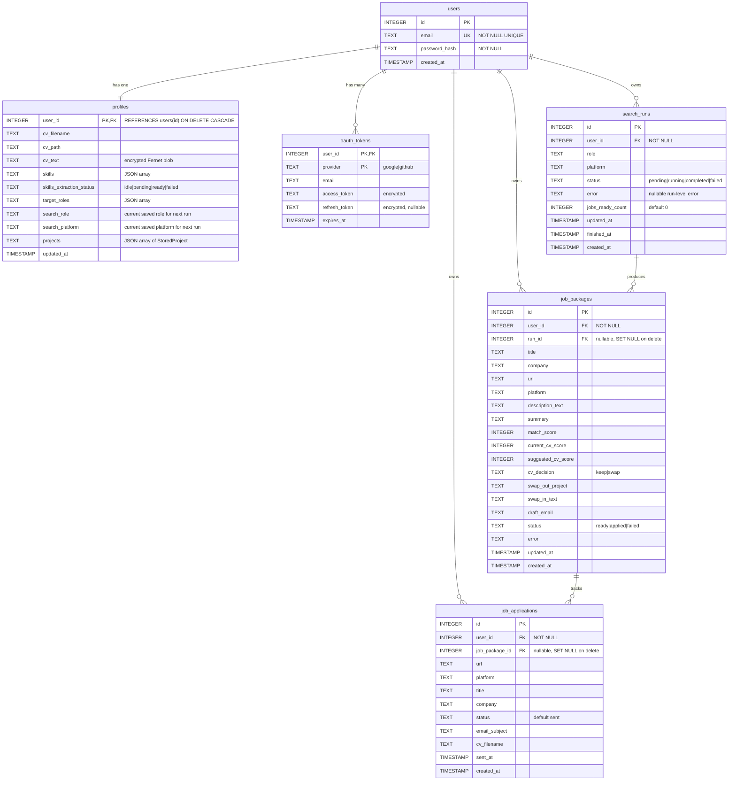

# JobPilot Database Schema

SQLite database used by the JobPilot API. All user-owned data is scoped by `user_id`; there is no shared profile or project row between accounts.

**Database file:** `data/jobpilot.db` (configurable via `Settings.db_path`)

---

## Entity-relationship diagram



---

## Table summary

| Table | Purpose | User isolation |
| ------- | --------- | ---------------- |
| `users` | Account email + password hash | Primary identity |
| `profiles` | CV, skills, target roles, saved search preference, projects JSON | **1:1** with `users.id` via `user_id` PK |
| `oauth_tokens` | Google / GitHub tokens (encrypted) | Composite PK `(user_id, provider)` |
| `search_runs` | Search run lifecycle and polling status | `user_id` FK on every row |
| `job_packages` | Per-job scored output produced during a run | `user_id` FK on every row |
| `job_applications` | Sent / tracked applications and dedupe source | `user_id` FK on every row |

---

## Search tables

### `search_runs`

One row per user-initiated search request.

| Column | Meaning |
| -------- | --------- |
| `id` | Run identifier used by polling APIs |
| `user_id` | Owner of the run |
| `role`, `platform` | Search input |
| `status` | Run state, e.g. `pending`, `running`, `completed`, `failed` |
| `error` | Run-level failure message when the full run fails |
| `jobs_ready_count` | Number of completed `job_packages` ready for UI |
| `updated_at` | Last status update time |
| `finished_at` | Completion time when run ends |
| `created_at` | Row creation time |

### `job_packages`

One row per job that passes through the application subgraph and is surfaced to the UI.

| Column | Meaning |
| -------- | --------- |
| `id`, `user_id`, `run_id` | Ownership and run linkage |
| `title`, `company`, `url`, `platform` | Core job metadata |
| `description_text` | Full or normalized job description text snapshot |
| `summary` | Short agent summary for the UI |
| `match_score` | Final per-job score |
| `current_cv_score`, `suggested_cv_score` | Before/after CV fit estimates |
| `cv_decision` | `keep` or `swap` |
| `swap_out_project`, `swap_in_text` | Suggested CV change payload |
| `draft_email` | Draft email generated for the job |
| `status` | `ready`, `applied`, or `failed` |
| `error` | Per-job failure message when scoring fails |
| `updated_at`, `created_at` | Package timestamps |

### `job_applications`

One row per tracked/sent application. This is also the dedupe source for "already applied" checks.

| Column | Meaning |
| -------- | --------- |
| `id`, `user_id`, `job_package_id` | Ownership and package linkage |
| `url`, `platform` | Dedupe key data |
| `title`, `company` | Stored job snapshot at send time |
| `status` | Application state; current default is `sent` |
| `email_subject` | Stored outbound subject line |
| `cv_filename` | CV artifact used for send |
| `sent_at`, `created_at` | Send and row timestamps |

**Constraint:** `job_applications` has a unique index on `(user_id, platform, url)` when `url` is not null, so the same user cannot persist the same applied URL twice on the same platform.

---

## `profiles.projects` JSON shape

Each element in the `projects` column is a `StoredProject` object:

```json
{
  "id": "uuid",
  "name": "JobPilot",
  "description": "5+ line technical summary (API + UI)",
  "source": "github",
  "repo_full_name": "user/repo",
  "readme_md": "# Full README at import time (server-only, not returned by API)"
}
```

| Field | In API response | Notes |
| ------- | ----------------- | ------- |
| `id`, `name`, `description`, `source` | Yes | User-visible project card |
| `repo_full_name` | Yes (`repoFullName`) | GitHub repo identifier |
| `readme_md` | **No** | Stored for agents / CV tailoring; stripped in `ProfileResponse` |

`cv_text` in `profiles` is encrypted at rest. `readme_md` is stored in plain text inside the user's JSON blob (same row isolation as CV).

### Search preference fields in `profiles`

- `target_roles` stores the full saved list of possible roles
- `search_role` stores the currently selected role for the next search run
- `search_platform` stores the currently selected platform for the next search run

When the user starts a search, the backend reads `search_role` and `search_platform` from `profiles`, then copies them into `search_runs` as the snapshot for that run.

---

## Access pattern

```text
JWT cookie → get_current_user() → user_id
    → SELECT ... FROM profiles WHERE user_id = ?
    → SELECT ... FROM oauth_tokens WHERE user_id = ? AND provider = ?
    → SELECT ... FROM search_runs WHERE user_id = ?
    → SELECT ... FROM job_packages WHERE user_id = ?
```

No API route queries profile, OAuth, or search data without filtering on the authenticated `user_id`.

---

## Cascade deletes

Deleting a `users` row cascades to:

- `profiles`
- `oauth_tokens`
- `search_runs`
- `job_packages`
- `job_applications`

Deleting a `search_runs` row sets `job_packages.run_id` to null.  
Deleting a `job_packages` row sets `job_applications.job_package_id` to null.

---

*Last updated: 2026-07-03 — expanded `search_runs`, `job_packages`, and `job_applications` for Phase A agent/search work.*

**Phase 2 extension (planned):** `project_readme_chunks`, `user_evidence_indexes`, FTS5, and per-user FAISS files — full design in [`discussion/phase-2-retrieval-storage-design.md`](discussion/phase-2-retrieval-storage-design.md).
