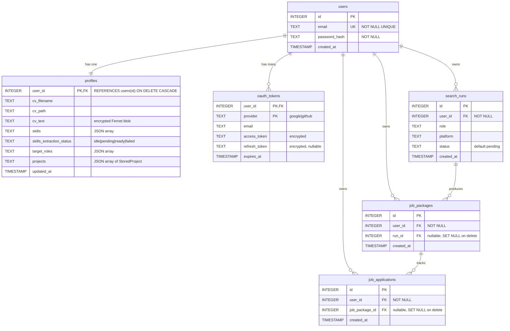

# JobPilot Database Schema

SQLite database used by the JobPilot API. All user-owned data is scoped by `user_id`; there is no shared profile or project table row between accounts.

**Database file:** `data/jobpilot.db` (configurable via `Settings.db_path`)

---

## Entity-relationship diagram



---

## Table summary

| Table | Purpose | User isolation |
|-------|---------|----------------|
| `users` | Account email + password hash | Primary identity |
| `profiles` | CV, skills, target roles, projects JSON | **1:1** with `users.id` via `user_id` PK |
| `oauth_tokens` | Google / GitHub tokens (encrypted) | Composite PK `(user_id, provider)` |
| `search_runs` | Job search batch runs | `user_id` FK on every row |
| `job_packages` | Scored job results per run | `user_id` FK on every row |
| `job_applications` | Sent / tracked applications | `user_id` FK on every row |

---

## `profiles.projects` JSON shape

Each element in the `projects` column is a `StoredProject` object:

```json
{
  "id": "uuid",
  "name": "JobPilot",
  "description": "5+ line technical summary (API + UI)",
  "source": "github",
  "repo_full_name": "user/repo",
  "readme_md": "# Full README at import time (server-only, not returned by API)"
}
```

| Field | In API response | Notes |
|-------|-----------------|-------|
| `id`, `name`, `description`, `source` | Yes | User-visible project card |
| `repo_full_name` | Yes (`repoFullName`) | GitHub repo identifier |
| `readme_md` | **No** | Stored for agents / CV tailoring; stripped in `ProfileResponse` |

`cv_text` in `profiles` is encrypted at rest. `readme_md` is stored in plain text inside the user's JSON blob (same row isolation as CV).

---

## Access pattern

```
JWT cookie → get_current_user() → user_id
    → SELECT ... FROM profiles WHERE user_id = ?
    → SELECT ... FROM oauth_tokens WHERE user_id = ? AND provider = ?
```

No API route queries profile or OAuth data without filtering on the authenticated `user_id`.

---

## Cascade deletes

Deleting a `users` row cascades to:

- `profiles`
- `oauth_tokens`
- `search_runs`
- `job_packages`
- `job_applications`

---

*Last updated: 2026-07-02 — includes GitHub `readme_md` storage per project.*
