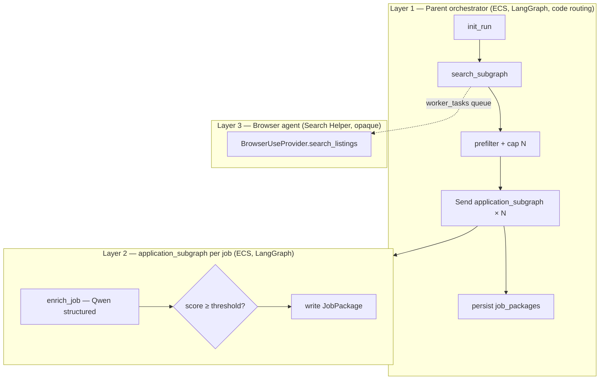
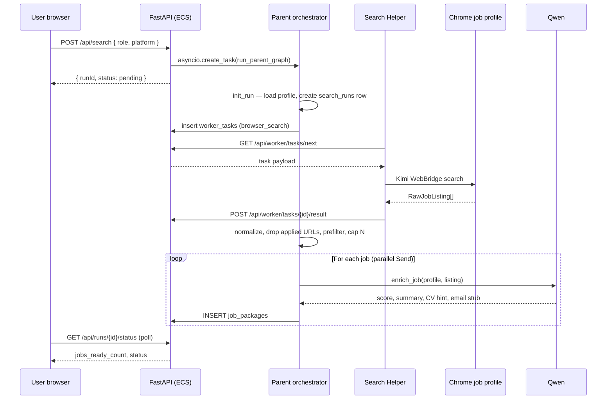

# Discussion — Agentic System Design

**Purpose:** Living doc for design conversations before and during implementation.  
**Status:** Discussion (2026-07-03) — nothing in `backend/app/graph/` yet.  
**Authoritative specs (locked unless we change them here):**  
[`System Design/jobpilot-agent-build-guide.md`](../../System%20Design/jobpilot-agent-build-guide.md) · [`System Design/JobPilot-System-Design.md`](../../System%20Design/JobPilot-System-Design.md) · [`System Design/kimi-webbridge-provider.md`](../../System%20Design/kimi-webbridge-provider.md) · [`System Design/browser-provider-abstraction.md`](../../System%20Design/browser-provider-abstraction.md)

> **2026-07-05:** Browser provider is **Kimi WebBridge** (replaces Browser-Use). Worker protocol unchanged.

---

## 1. Short answer: do we have an orchestrator?

**No — not in code.** The repo has **zero LangGraph implementation** today:

| Expected path | Exists? |
|---------------|---------|
| `backend/app/graph/orchestrator.py` | No |
| `backend/app/graph/state.py` | No |
| `backend/app/graph/subgraphs/search.py` | No |
| `backend/app/graph/subgraphs/application.py` | No |
| `POST /api/search` | No |
| `worker/main.py` | No |
| `services/browser/` (`BrowserProvider`) | No |

**What we do have** that the orchestrator will depend on:

- Multi-user auth, profiles, CV parse, GitHub import (`backend/app/`)
- Qwen for profile tasks (`profile_llm.py` — skills extraction, README summarization)
- SQLite stubs: `search_runs`, `job_packages`, `job_applications` (`db.py`)
- Full written architecture in `System Design/`

So: **orchestrator = designed and locked, not built.**

---

## 2. What “orchestrator” means in JobPilot

The PRD lists an **“Orchestrator Agent”** that routes between sub-agents. The **locked backend design** narrows that:

> **Parent orchestrator = LangGraph `StateGraph` + Python routing — not an LLM agent.**

See [`llm-routing-and-cost-plan.md`](../../System%20Design/llm-routing-and-cost-plan.md) §3.

| Concept | MVP design | Uses Qwen? |
|---------|------------|------------|
| **Parent orchestrator** | Fixed pipeline: `init_run` → `search_subgraph` → `prefilter` → `Send` × N → `persist` | **No** |
| **search_subgraph** | Enqueue browser task, wait for listings, normalize, drop applied URLs | **No** (on ECS) |
| **application_subgraph** | One structured `enrich_job` call per job → score gate → write `job_packages` | **Yes** |
| **Browser agent (Layer 3)** | Kimi WebBridge + Qwen ReAct loop inside Search Helper | **Yes** (in worker) |
| **HITL** (CV edit, email refine, send) | FastAPI routes when user clicks — **outside** the graph | On demand |

**Implication:** We are not building a “supervisor LLM” that decides what to do next. The workflow is a **deterministic graph** with one expensive LLM step per surviving job (`enrich_job`).

### PRD vs locked design (worth aligning in discussion)

| PRD wording | Locked implementation |
|-------------|----------------------|
| Orchestrator Agent controls flow | Code-based LangGraph parent graph |
| Separate Scoring, CV Optimization, Email Drafting agents | **Merged** into one `enrich_job` structured call per job (MVP) |
| LangGraph calls browser SDK directly | Browser runs in **Search Helper** on user PC (WebBridge HTTP); ECS only sees task queue + JSON results |
| Gmail send in MVP | **Cancelled** for current scope (LinkedIn/Indeed focus) |

If we want separate LLM nodes per concern (score → CV → email as three calls), that is a **scope/cost tradeoff** — see §6 open questions.

---

## 3. Three execution layers (the mental model)



**Ownership rule (locked):**

| Layer | Owns |
|-------|------|
| LangGraph | Workflow order, parallelism, DB writes for a search run |
| BrowserProvider | Chrome tabs, navigation, extraction ReAct loop |
| Qwen | Per-job enrichment (and profile tasks already shipped) |
| FastAPI routes | HITL after the job list exists |

**Import rule:** `backend/app/graph/**` must **never** import `browser_use` on ECS. Browser SDKs live only in `worker/` (or in-process when `BROWSER_EXECUTION=local` for dev).

---

## 4. End-to-end flow (one search run)



**Async contract:** User never blocks on the full run. UI polls every 2–3s. Partial `job_packages` appear as each application subgraph finishes.

---

## 5. State: three TypedDicts, not one blob

LangGraph uses **isolated state per graph** (see main system design §7):

| State | Owner | Key fields |
|-------|-------|------------|
| `RunState` | Parent orchestrator | `run_id`, `profile`, `listings`, `matched_jobs`, `packages` (reducer), `status` |
| `SearchState` | search_subgraph | `raw_listings`, `listings` (post-normalize), `errors` |
| `ApplicationState` | One per `Send` | `job`, `match_score`, `cv_decision`, `draft_email`, `status` |

**Discussion note:** `packages` on `RunState` should use `Annotated[list, operator.add]` so parallel `Send` results merge correctly. Easy to get wrong on first implementation — see `dev-time-hardening.md` §4.

---

## 6. Open questions (discuss here)

Use this section to record decisions. Strike or move rows to §7 when resolved.

### 6.1 Orchestrator shape

| # | Question | Options | Lean |
|---|----------|---------|------|
| A | Single `enrich_job` call vs multi-node application subgraph? | (1) One structured Qwen call **(locked MVP)** (2) Separate nodes: score → CV → email | **(1)** — cost + speed for hackathon |
| B | Add an LLM “planner” orchestrator post-MVP? | Yes / No | **No** until we hit flows code cannot route |
| C | Who compiles the graph? | Module-level `compiled_graph = build_graph()` at import vs per-request | **Import-time compile** (LangGraph norm) |

### 6.2 Browser boundary

| # | Question | Options | Lean |
|---|----------|---------|------|
| D | How does `search_subgraph` wait on ECS? | (1) Poll `worker_tasks` in a loop (2) asyncio.Event wired from result POST handler | **(2)** cleaner; **(1)** simpler first |
| E | Demo mode without Helper? | Mock listings injected in `search_subgraph` when `DEMO_SEARCH=true` | **Rejected** — real worker queue + Search Helper only |
| F | `BROWSER_EXECUTION=local` for dev? | Same subgraph calls `get_browser_provider()` in-process | **Yes** — avoids worker during early graph work |

### 6.3 Prefilter and caps

| # | Question | Options | Lean |
|---|----------|---------|------|
| G | Default cap N jobs per run? | 5 / 8 / 10 | **8** (in build guide) |
| G | Score threshold to persist package? | 50 / 60 / 70 | **60** (system design) |
| H | Prefilter: skill overlap rule? | ≥2 hits OR ≥30% of listed skills | **Locked** in system design §10 |

### 6.4 What ships before HITL

| # | Question | Options | Lean |
|---|----------|---------|------|
| I | First demo milestone? | Search → scored job list only **(Phase E)** | Agreed in build guide |
| J | CV edit / send in hackathon MVP? | In / Out | **Out** of first agent slice; list + scores first |

### 6.5 Dependencies

| # | Question | Notes |
|---|----------|-------|
| K | Add `langgraph` to root `requirements.txt`? | Not listed today — needed Phase D |
| L | LangGraph version pin? | Match Qwen + OpenAI-compatible client versions |
| M | Worker shares `backend.app.models` or copies types? | Build guide: shared package preferred |

---

## 7. Decision log (fill as we discuss)

| Date | Topic | Decision | Rationale |
|------|-------|----------|-----------|
| 2026-07-05 | Browser provider | **Kimi WebBridge v1** (replaces Browser-Use) | Real Chrome sessions |
| 2026-07-02 | Deployment | ECS + Search Helper + Browser-Use spike | Hackathon + real LinkedIn session |
| 2026-07-02 | Orchestrator type | Code routing, not LLM | Cost, predictability |
| 2026-07-03 | Repo status | **No orchestrator code yet** | Phase A–F not started |
| | | | |

---

## 8. Proposed implementation order (for discussion)

Does this order still feel right?

1. **Phase A** — Types, DB (`worker_devices`, `worker_tasks`), real APIs `[x]`
2. **Phase B** — Worker pairing + poll loop (no Chrome)
3. **Phase C** — Kimi WebBridge in Helper (real listings) — [`kimi-webbridge-provider.md`](../../System%20Design/kimi-webbridge-provider.md)
4. **Phase D** — LangGraph parent + `search_subgraph` wired to worker queue
5. **Phase E** — `application_subgraph` + `enrich_job` + `Send` fan-out
6. **Phase F** — Run progress UI + job list

**Rejected:** mock listings or `DEMO_SEARCH` shortcut — build only the real worker → ECS → graph path.

---

## 9. Related files

| Doc | Role |
|-----|------|
| [`jobpilot-agent-build-guide.md`](../../System%20Design/jobpilot-agent-build-guide.md) | Phase checklist, code map, API tables |
| [`JobPilot-System-Design.md`](../../System%20Design/JobPilot-System-Design.md) | Full topology, state shapes, API |
| [`browser-provider-abstraction.md`](../../System%20Design/browser-provider-abstraction.md) | `BrowserProvider` protocol, tier boundaries |
| [`llm-routing-and-cost-plan.md`](../../System%20Design/llm-routing-and-cost-plan.md) | Which steps use Qwen |
| [`design-decisions.md`](../../System%20Design/design-decisions.md) | Async `/search`, `run_id`, dedupe |
| [`currently-working-feature.md`](../../currently-working-feature.md) | Active task tracker |

---

## 10. Notes from discussion

<!-- Add bullets below as we talk through the design -->

- **2026-07-03:** Initial doc created. Confirmed: orchestrator is **specified, not implemented**. Locked model is LangGraph parent graph with code routing on ECS, not an LLM supervisor.

### Q: Search subgraph and browser agent — are they the same? Should they be one?

**Question:** I did not Understand the Search Subgraph and broswer agent is both are same should be one

**Answer:**

Good question — from your point of view **search is one action**. The split is **where code runs**, not two different user-facing features.

## Your intuition is right (user view)

When you click **Start search**, you want:

> "Find jobs on LinkedIn for this role."

That **is one job**. You should not think of it as two products.

## Why the design splits it (engineer view)

```text
┌─────────────────────────────────────┐
│  ECS (cloud)                        │
│  search_subgraph                    │
│  • create task                      │
│  • wait for results               │
│  • clean URLs, remove applied jobs  │
└──────────────┬──────────────────────┘
               │  task queue / API
               ▼
┌─────────────────────────────────────┐
│  Your PC (Search Helper)            │
│  browser agent                      │
│  • open Chrome                      │
│  • click, scroll, read LinkedIn     │
│  • return raw job list              │
└─────────────────────────────────────┘
```

| Piece | Where | Job |
|-------|--------|-----|
| **search_subgraph** | Cloud | Orchestration: "run search", wait, clean data |
| **browser agent** | Your PC | Actually control Chrome on LinkedIn |

**They are not the same because Chrome cannot run on ECS.** LinkedIn needs your logged-in session and your home IP. So the "hands on keyboard" part must live on your machine.

## Analogy

Think of **ordering food**:

- **search_subgraph** = the app that places the order and formats the receipt  
- **browser agent** = the driver who goes to the restaurant  

Same "search" for you — two roles behind the scenes.

## When they *are* almost one

In **local dev** (`BROWSER_EXECUTION=local`), both can run on the same machine: `search_subgraph` calls the browser directly. Then it feels like one unit — but still two layers in code:

1. **Workflow** (LangGraph) — what step comes next  
2. **Browser tool** (Kimi WebBridge) — how to click and scrape  

We don't put every click inside LangGraph; that would be hundreds of nodes. WebBridge + Qwen ReAct loop runs inside the Search Helper.

## Short answer

| Question | Answer |
|----------|--------|
| Are they the same feature? | **Yes** — both are "job search" |
| Are they the same code/component? | **No** — cloud orchestration vs local browser control |
| Could we merge them? | Only if everything ran on your PC — but then we lose cloud multi-user + hackathon deploy |

**Mental model:**  
**search_subgraph** = the search **manager** (cloud)  
**browser agent** = the search **worker** (your Chrome)

One search for the user; two parts because browser must stay local.
