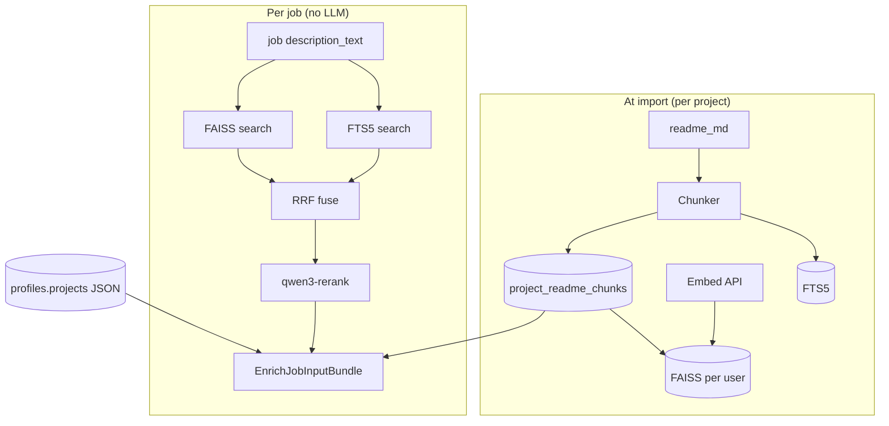
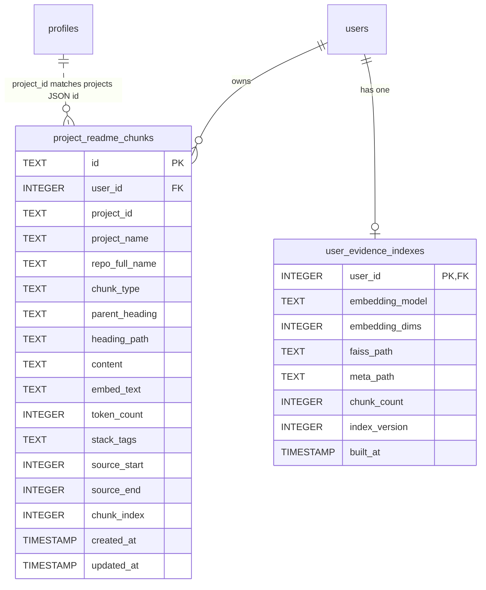

# Phase 2 — Agreed Stack and Storage Design

**Status:** Locked for implementation (2026-07-16)

**Scope:** Agreed technology stack, SQLite schema, FAISS index layout, metadata
model, and on-disk files for the README retrieval pipeline (Phase 2).

**Related docs:**

- Build plan → [`.agent/plans/jobpilot_project_evidence_phase2_plan.md`](../../.agent/plans/jobpilot_project_evidence_phase2_plan.md)
- `enrich_job` input bundle → [`application-subagent-input-spec.md`](application-subagent-input-spec.md)
- Chunking + hybrid retrieval → [`project-evidence-retrieval-discussion.md`](project-evidence-retrieval-discussion.md)
- Existing DB → [`database-schema.md`](../database-schema.md)

---

## Agreed stack (Phase 2)

| Layer | Choice | Role |
| --- | --- | --- |
| **Primary DB** | SQLite (`data/jobpilot.db`) | Chunk text, metadata, FTS keyword index, index bookkeeping |
| **Vector index** | **FAISS** (on-disk, per user) | Dense similarity search over all portfolio chunks |
| **Keyword search** | **SQLite FTS5** | BM25-style lexical match (exact tech names) |
| **Embeddings** | **`text-embedding-v4`** @ **1024** dims (DashScope API) | Chunk + job query vectors |
| **Embedding fallback** | **`text-embedding-v3`** @ **1024** dims (full re-index if used) | Only when v4 API fails |
| **Reranker** | **`qwen3-rerank`** | Rerank fused top-20 candidates once per job |
| **Rerank fallback** | **RRF-only** (skip rerank call) | When rerank API fails |
| **Chunker** | Python Markdown parser (heading parents + paragraph child splits) | Run at GitHub import/refresh only |
| **Evidence cards** | `profiles.projects` JSON (Phase 1) | Layer 2a — not duplicated in chunk tables |
| **Application input** | `retrieve_project_evidence()` → one `enrich_job` call | No LLM during retrieval |

### Design principles

1. **One logical collection per user** — all project chunks searchable together; every row tagged with `project_id`.
2. **SQLite is source of truth** for chunk text and metadata; FAISS holds vectors only.
3. **Index at import**, search at job time — no README chunking during search runs.
4. **Per-project refresh** — delete/rebuild chunks for one `project_id`; rebuild that user's FAISS + FTS rows.
5. **User isolation** — every query filters `user_id`; one FAISS file per user.
6. **Worker unchanged** — retrieval uses `description_text` from listings only.

### Explicitly not in Phase 2 storage

| Item | Where it stays |
| --- | --- |
| `readme_md` full text | `profiles.projects[].readme_md` (Phase 1) |
| `portfolio_overview`, `evidence_card` | `profiles.projects` JSON (Phase 1) |
| Embedding vectors in SQLite BLOB | **No** — FAISS files only |
| Separate FAISS index per project | **No** — one index per user |
| Pinecone / pgvector / Chroma | **No** — ECS + SQLite + FAISS |
| `tongyi-embedding-vision-plus` / `vision-flash` | **No** — multimodal; README evidence is text-only |

---

## Embedding and rerank models (locked)

Models available on Qwen Cloud quota (2026-07-16). Locked choices for hierarchical
README chunk retrieval + hybrid search.

### Embedding: `text-embedding-v4` @ 1024 dimensions

| Setting | Value |
| --- | --- |
| **Primary model** | `text-embedding-v4` |
| **Dimensions** | `1024` (default; best balance for README semantic retrieval + FAISS) |
| **Fallback model** | `text-embedding-v3` @ `1024` dims — only when v4 API fails |
| **API** | DashScope native embedding endpoint (for `text_type` support) |
| **Output type** | `dense` only — FTS5 already covers keyword/BM25 |

#### Supported dimensions (reference)

| Model | Dimensions |
| --- | --- |
| `text-embedding-v4` | 2048, 1536, **1024** (default), 768, 512, 256, 128, 64 |
| `text-embedding-v3` | **1024** (default), 768, 512 |

Do **not** change dimensions after indexes are built without a full re-embed and
FAISS rebuild.

#### `text_type` (asymmetric encoding)

| When | `text_type` | Applied to |
| --- | --- | --- |
| GitHub import / refresh | `document` | Each chunk `embed_text` |
| Per-job retrieval | `query` | Job `title` + `description_text` |

Omit `text_type` only for non-search embedding tasks (not used in Phase 2).

#### Models not used

| Model | Reason |
| --- | --- |
| `tongyi-embedding-vision-plus` | Image/video multimodal — wrong modality for README Markdown |
| `tongyi-embedding-vision-flash` | Same |
| `text-embedding-v3` as primary | Older; use only as fallback |

#### Fallback rules

1. Retry `text-embedding-v4` once on transient errors.
2. On persistent v4 failure, switch to `text-embedding-v3` @ 1024 for that operation.
3. If fallback is used during **import**, record `embedding_model` in
   `user_evidence_indexes` and rebuild the full user FAISS index with v3 vectors.
4. **Never mix** v4 and v3 vectors in the same FAISS index.

### Reranker: `qwen3-rerank`

| Setting | Value |
| --- | --- |
| **Model** | `qwen3-rerank` |
| **Input pool** | Top **20** candidates after RRF (all projects mixed — one call per job) |
| **`top_n`** | **8** (feeds layer 2b chunk selection before bundle caps) |
| **`instruct`** | English only — see below |

**`instruct` (locked):**

```text
Given a job posting, retrieve relevant project evidence passages that demonstrate the candidate's fit for the role.
```

#### Why `qwen3-rerank` fits JobPilot

- Designed for RAG: many retrieval candidates → few high-quality results
- Up to 500 documents per request (we send ~20)
- Up to 4,000 tokens per document (chunks are ~250–500 tokens)
- Cross-project ranking in **one** batch — required for swap-aware retrieval

#### Rerank fallback

If `qwen3-rerank` fails: **skip rerank**, use RRF ordering only (BM25 top-30 +
vector top-30 → fuse → take top 8). Log the failure; do not substitute another
rerank model.

### End-to-end model flow

```text
IMPORT (per chunk):
  embed_text → text-embedding-v4, text_type=document, dimensions=1024
  → FAISS (per user)

PER JOB:
  title + description_text → text-embedding-v4, text_type=query, dimensions=1024
  → FAISS top-30
  + FTS5 BM25 top-30
  → RRF fuse → top-20
  → qwen3-rerank(top_n=8)
  → EnrichJobInputBundle
```

---

## Architecture overview

```text
GitHub import / refresh
        ↓
build_project_evidence()          Phase 1 (done) → profiles.projects JSON
        ↓
chunk_readme() + embed_chunks()   Phase 2 (new)
        ↓
SQLite project_readme_chunks  +  FTS5  +  FAISS data/faiss/{user_id}.index
        ↓
retrieve_project_evidence(job)    hybrid BM25 + vector + qwen3-rerank
        ↓
EnrichJobInputBundle → enrich_job()
```



---

## On-disk layout

```text
data/
├── jobpilot.db                          # SQLite (existing + new tables)
└── faiss/
    ├── {user_id}.index                  # FAISS binary index
    └── {user_id}.meta.json              # row → chunk_id mapping + build info
```

### `data/faiss/{user_id}.meta.json`

```json
{
  "user_id": 42,
  "embedding_model": "text-embedding-v4",
  "embedding_dims": 1024,
  "index_type": "IndexFlatIP",
  "chunk_ids": ["chunk-uuid-1", "chunk-uuid-2"],
  "chunk_count": 2,
  "built_at": "2026-07-16T18:00:00Z",
  "index_version": 3
}
```

- FAISS row `i` maps to `chunk_ids[i]`.
- Rebuild entire user index after any chunk add/remove for that user (cheap at portfolio scale).

---

## SQLite schema (new tables)

### ER extension



`project_id` references `StoredProject.id` inside `profiles.projects` JSON — not a
SQL FK (projects are not normalized to a separate table).

---

### Table: `project_readme_chunks`

Canonical store for every searchable retrieval unit (README sections and
Phase 1 evidence claims).

```sql
CREATE TABLE IF NOT EXISTS project_readme_chunks (
    id              TEXT PRIMARY KEY,           -- UUID chunk_id (stable across rebuilds until deleted)
    user_id         INTEGER NOT NULL REFERENCES users(id) ON DELETE CASCADE,
    project_id      TEXT NOT NULL,              -- StoredProject.id from profiles.projects
    project_name    TEXT NOT NULL,
    repo_full_name  TEXT,                       -- nullable for manual projects
    chunk_type      TEXT NOT NULL DEFAULT 'readme_section'
                    CHECK (chunk_type IN ('readme_section', 'evidence_claim')),
    parent_heading  TEXT,                       -- top-level README heading, if any
    heading_path    TEXT NOT NULL,              -- e.g. "Agentic architecture > Parent graph pipeline"
    content           TEXT NOT NULL,            -- chunk text shown to LLM / UI citations
    embed_text        TEXT NOT NULL,            -- prefixed text sent to embedding model
    token_count       INTEGER NOT NULL DEFAULT 0,
    stack_tags        TEXT NOT NULL DEFAULT '[]', -- JSON array from evidence_card.tech_stack
    source_start      INTEGER,                  -- optional offset into readme_md
    source_end        INTEGER,
    chunk_index       INTEGER NOT NULL DEFAULT 0, -- order within project + type
    created_at        TIMESTAMP DEFAULT CURRENT_TIMESTAMP,
    updated_at        TIMESTAMP DEFAULT CURRENT_TIMESTAMP
);

CREATE INDEX IF NOT EXISTS idx_chunks_user_id
    ON project_readme_chunks (user_id);

CREATE INDEX IF NOT EXISTS idx_chunks_user_project
    ON project_readme_chunks (user_id, project_id);

CREATE UNIQUE INDEX IF NOT EXISTS idx_chunks_user_project_slot
    ON project_readme_chunks (user_id, project_id, chunk_type, heading_path, chunk_index);
```

#### Column reference

| Column | Required | Purpose |
| --- | ---: | --- |
| `id` | yes | Primary key; FAISS `meta.json` maps row → this id |
| `user_id` | yes | Tenant isolation |
| `project_id` | yes | Which portfolio project this chunk belongs to |
| `project_name` | yes | Display, embed prefix, retrieval output |
| `repo_full_name` | no | GitHub repos only |
| `chunk_type` | yes | `readme_section` or `evidence_claim` |
| `parent_heading` | no | Fast filter by top README section |
| `heading_path` | yes | Citation path for UI and `enrich_job` |
| `content` | yes | Raw evidence text |
| `embed_text` | yes | `Project: …\nStack: …\nSection: …\nContent: …` |
| `token_count` | yes | Budget enforcement |
| `stack_tags` | yes | JSON array; optional BM25 boost / display |
| `source_start`, `source_end` | no | Traceability into `readme_md` |
| `chunk_index` | yes | Stable ordering when one section splits into multiple children |

#### `chunk_type` values

| Value | Source at import |
| --- | --- |
| `readme_section` | Hierarchical README chunker |
| `evidence_claim` | `evidence_card.evidence[]` from Phase 1 (one row per claim) |

Claims use `heading_path` = `source_section` from the claim object.

---

### Table: `user_evidence_indexes`

Bookkeeping for each user's FAISS index (not chunk text).

```sql
CREATE TABLE IF NOT EXISTS user_evidence_indexes (
    user_id           INTEGER PRIMARY KEY REFERENCES users(id) ON DELETE CASCADE,
    embedding_model   TEXT NOT NULL,
    embedding_dims    INTEGER NOT NULL,
    faiss_path        TEXT NOT NULL,             -- e.g. data/faiss/42.index
    meta_path         TEXT NOT NULL,             -- e.g. data/faiss/42.meta.json
    chunk_count       INTEGER NOT NULL DEFAULT 0,
    index_version     INTEGER NOT NULL DEFAULT 1, -- increment on each rebuild
    built_at          TIMESTAMP,
    updated_at        TIMESTAMP DEFAULT CURRENT_TIMESTAMP
);
```

---

### FTS5: `project_readme_chunks_fts`

Keyword/BM25 search over the same rows. External-content FTS keeps one source of truth.

```sql
CREATE VIRTUAL TABLE IF NOT EXISTS project_readme_chunks_fts USING fts5(
    project_name,
    heading_path,
    content,
    stack_tags,
    content='project_readme_chunks',
    content_rowid='rowid',
    tokenize='porter unicode61'
);

-- Triggers to keep FTS in sync (created in migration)
-- INSERT / DELETE / UPDATE on project_readme_chunks → mirror to _fts
```

Search always joins back to `project_readme_chunks` on `rowid` and filters
`user_id = ?`.

---

## FAISS index design

### Scope

| Question | Answer |
| --- | --- |
| One index per user or per project? | **Per user** — all projects together |
| How is project identified? | `project_id` on SQLite row (via `chunk_id` lookup) |
| Index type (initial) | `IndexFlatIP` on L2-normalized vectors (cosine via inner product) |
| When to upgrade | `IndexHNSWFlat` if chunk count per user exceeds ~5k (unlikely for READMEs) |

### Build algorithm

```text
1. SELECT id, embed_text FROM project_readme_chunks WHERE user_id = ? ORDER BY project_id, chunk_index
2. Batch embed via DashScope (or read cache if added later)
3. L2-normalize vectors
4. faiss.IndexFlatIP(dim) → add(all vectors)
5. Write data/faiss/{user_id}.index
6. Write meta.json with ordered chunk_ids
7. UPSERT user_evidence_indexes
```

### Query algorithm

```text
1. Embed job title + description_text (same model)
2. L2-normalize query vector
3. faiss index.search(query, k=30) → row indices
4. Map indices → chunk_ids via meta.json
5. Load rows from SQLite (filter user_id)
```

---

## Metadata used at retrieval time

Every search hit (BM25, vector, or reranked) returns this shape internally:

```json
{
  "chunk_id": "uuid",
  "user_id": 42,
  "project_id": "proj-abc",
  "project_name": "JobPilot",
  "repo_full_name": "alice/JobPilot",
  "chunk_type": "readme_section",
  "heading_path": "Engineering highlights",
  "content": "...",
  "stack_tags": ["FastAPI", "LangGraph"],
  "source_start": 4200,
  "source_end": 5100,
  "scores": {
    "bm25": 12.4,
    "vector": 0.82,
    "rrf": 0.031,
    "rerank": 0.91
  }
}
```

`embed_text` is **not** sent to `enrich_job` — only `content`, paths, and project labels.

---

## Chunking rules (stored rows)

Applied at import in `readme_chunker` service:

```text
readme_md
  → split on Markdown headings (# .. ######) = parent sections
  → preserve code blocks, tables, lists as atomic units inside a section
  → if section > ~500 tokens: split on paragraph boundaries (~250–500 tokens)
  → small overlap only within the same parent section
  → never merge unrelated headings
```

Each resulting section row:

- `chunk_type = readme_section`
- `heading_path` = breadcrumb of headings
- `embed_text` = contextual prefix + `content`

After chunk rows are written, insert `evidence_claim` rows from
`evidence_card.evidence[]` for the same `project_id`.

---

## Lifecycle operations

### GitHub import (new project)

```text
1. build_project_evidence() → update profiles.projects JSON (Phase 1)
2. DELETE project_readme_chunks WHERE user_id=? AND project_id=?  (no-op if new)
3. INSERT readme_section rows + evidence_claim rows
4. FTS triggers update automatically
5. rebuild_user_faiss_index(user_id)
```

### GitHub refresh (existing project)

Same as import — replace all chunks for that `project_id` only, then rebuild
user FAISS index.

### Delete project from profile

```text
DELETE project_readme_chunks WHERE user_id=? AND project_id=?
rebuild_user_faiss_index(user_id)
```

### Delete user

```text
CASCADE deletes project_readme_chunks + user_evidence_indexes
Delete data/faiss/{user_id}.index and .meta.json
```

---

## Hybrid retrieval (reads storage)

Runs in `retrieve_project_evidence()` — no LLM.

```text
Input: user_id, job { title, description_text }, profile

1. BM25: FTS5 search on job text → top 30 chunk_ids (filter user_id)
2. Vector: FAISS search → top 30 chunk_ids
3. Fuse with RRF (k=60)
4. `qwen3-rerank` top 20 candidates in one batch (all projects mixed); `top_n=8`
5. Select chunk_project_ids (swap-aware union — see input spec)
6. Attach layer 1 + 2a from profiles.projects JSON
7. Attach layer 2b chunks for selected projects (cap ~4–8 chunks total)
```

---

## Config additions (`config/llm.yaml`)

```yaml
embedding:
  model: text-embedding-v4
  fallback_model: text-embedding-v3
  dimensions: 1024
  output_type: dense
  text_type_document: document
  text_type_query: query
  batch_size: 10   # DashScope max per request

rerank:
  model: qwen3-rerank
  top_n: 8
  candidate_pool: 20
  instruct: >-
    Given a job posting, retrieve relevant project evidence passages
    that demonstrate the candidate's fit for the role.

retrieval:
  bm25_top_k: 30
  vector_top_k: 30
  rrf_k: 60
  chunk_project_cap_formula: "min(8, max(4, ceil(portfolio_count * 0.6)))"
  max_chunks_per_job: 8
  max_chunks_per_project: 2
```

New settings paths under `backend/app/config.py`: `embedding_model`,
`embedding_fallback_model`, `embedding_dimensions`, `rerank_model`, retrieval caps.

New data path: `settings.faiss_dir = data_dir / "faiss"`.

---

## Services (implementation map)

| Service | Responsibility |
| --- | --- |
| `readme_chunker.py` | Markdown → chunk dicts |
| `embedding_client.py` | DashScope embed batch API |
| `evidence_index_store.py` | SQLite CRUD for chunks + FTS + index bookkeeping |
| `faiss_index.py` | Build/load/search per-user FAISS |
| `retrieve_project_evidence.py` | Hybrid search + bundle packer |

Wiring: call index build from `github.py` after `build_project_evidence()` succeeds.

---

## What stays in `profiles.projects` JSON (unchanged)

Phase 2 does **not** move these to new tables:

```json
{
  "id": "proj-uuid",
  "name": "JobPilot",
  "description": "...",
  "source": "github",
  "repo_full_name": "alice/JobPilot",
  "readme_md": "# full readme ...",
  "portfolioOverview": "...",
  "evidenceCard": { }
}
```

Chunks table indexes **into** README content; cards remain the Layer 2a source for
`enrich_job` without duplication.

---

## Cascade deletes (updated)

Deleting a `users` row cascades to:

- `project_readme_chunks`
- `user_evidence_indexes`

Application code also deletes `data/faiss/{user_id}.*`.

---

## Phase 2 implementation checklist

- [ ] Migration in `backend/app/db.py` — tables, FTS5, triggers
- [ ] `config/llm.yaml` embedding + retrieval section
- [ ] `readme_chunker.py`
- [ ] `embedding_client.py`
- [ ] `evidence_index_store.py`
- [ ] `faiss_index.py` + `data/faiss/` directory on init
- [ ] Wire GitHub import/refresh + project delete
- [ ] `retrieve_project_evidence.py`
- [ ] Tests: chunker, index rebuild, hybrid search, user isolation
- [ ] Eval fixtures: job → expected `project_id` + `heading_path`
- [ ] Update [`database-schema.md`](../database-schema.md) after migration lands

---

## Locked decisions summary

| Topic | Decision |
| --- | --- |
| Vector store | FAISS on disk |
| Index granularity | **One index per user** (all projects) |
| Chunk store | SQLite `project_readme_chunks` |
| Keyword index | SQLite FTS5 |
| Vectors in SQLite | No |
| Project identity on chunks | `project_id` + `project_name` on every row |
| Claims | Stored as `chunk_type=evidence_claim` rows |
| Rebuild trigger | Any chunk add/remove for user → rebuild FAISS |
| Retrieval scope | Search all user chunks; filter/limit in bundle packer |
| Embedding model | `text-embedding-v4` @ 1024 dims; `text_type` document/query |
| Embedding fallback | `text-embedding-v3` @ 1024 — full re-index; never mix with v4 |
| Rerank model | `qwen3-rerank`, `top_n=8`, pool=20, English `instruct` |
| Rerank fallback | RRF-only (no rerank call) |
| Vision embedding models | Not used |
