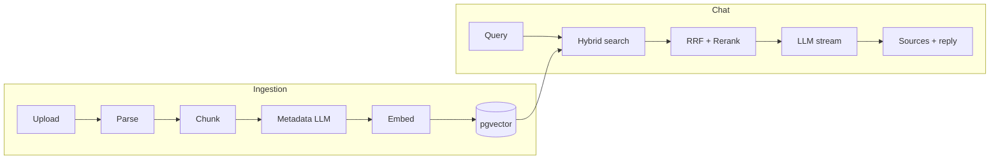

# agentic-rag-sub-agents

A production-oriented **Retrieval-Augmented Generation (RAG)** application with threaded chat and manual document ingestion. Upload your files, index them into pgvector, and chat with grounded answers backed by source citations.

Built as a modular masterclass codebase — **Modules 1–8 are complete & validated** ([v3](https://github.com/HamzaFayaz/agentic-rag-sub-agents/releases/tag/v3) for Modules 1–6; [v4](https://github.com/HamzaFayaz/agentic-rag-sub-agents/releases/tag/v4) for Module 7; [v5](https://github.com/HamzaFayaz/agentic-rag-sub-agents/releases/tag/v5) for Module 8). Module 7 adds a multi-tool agent (RAG + Text-to-SQL + web search). Module 8 adds a document analyst sub-agent for whole-document reads. Configuration is via environment variables; there is no admin UI.

---

## Features

### Chat

- Threaded conversations with persistent history in Supabase
- Streaming responses over SSE (Server-Sent Events)
- **Multi-tool agent** — LLM chooses tools per question (not always-on RAG)
- Retrieval-augmented answers with inline source citations
- **Text-to-SQL** — read-only queries on safe metadata views (counts, lists, filters)
- **Web search** — Tavily fallback for online/current questions (optional)
- **Document analyst sub-agent** — `analyze_document` for whole-doc summaries, deep reads, and compare (token-aware single/multi pass)
- Tool activity UI: SQL attribution, web URL chips, doc source citations, sub-agent progress chips
- ChatGPT-style UI: centered welcome input, canvas-style assistant replies, dark mode toggle
- Stateless Chat Completions API — you own memory, not the LLM provider

### Document ingestion

- Drag-and-drop upload for `.txt`, `.md`, `.pdf`, `.docx`, `.html`
- Real-time processing status via Supabase Realtime
- **Record manager** — SHA-256 content hashing; skip unchanged re-uploads, update in place when content changes
- **Multi-format parsing** — Docling with pypdf / plain-text fallback
- **Structure-aware chunking** — FIXED, SECTION, or parent–child strategies based on document structure
- **LLM metadata extraction** — doc type, topics, and summary per document (fail-open)
- Cascade delete — document row, chunks, and storage object removed together

### Retrieval

- **Hybrid search** — vector similarity (pgvector) + PostgreSQL full-text search
- **RRF merge** — Reciprocal Rank Fusion combines both result sets
- **Cohere reranking** — optional; degrades gracefully without an API key
- **Parent context expansion** — child chunks retrieve surrounding section context for the LLM

### Security & observability

- Supabase Auth (email/password) with Row-Level Security on every table
- Users can only see and retrieve their own documents and threads
- **LangSmith tracing** — full RAG pipeline spans from chat turn through ingest (optional)

---

## Tech stack

| Layer | Technology |
|-------|------------|
| Frontend | React 19, TypeScript, Vite, Tailwind CSS, shadcn/ui |
| Backend | Python, FastAPI, Pydantic |
| Database | Supabase (Postgres, pgvector, Auth, Storage, Realtime) |
| LLM | OpenAI-compatible Chat Completions API |
| Embeddings | `text-embedding-3-small` |
| Parsing | Docling (+ pypdf fallback) |
| Reranking | Cohere `rerank-v3.5` (optional) |
| Observability | LangSmith |

No LangChain or LangGraph — raw SDK calls only.

---

## Architecture

### Ingestion pipeline

```text
Upload → parse (Docling) → metadata.parser → chunk (structure-aware)
       → metadata.llm (gpt-4o-mini) → embed children → pgvector → ready
```

### Chat / retrieval pipeline (Module 7–8)

```text
User message → LLM tool loop (max 3 iterations)
             → search_documents | query_database | web_search | analyze_document
             → stream final answer → save metadata (sources, tools, SQL)
```

**Sub-agent routing (`analyze_document`):** If the document's total tokens fit `SUB_AGENT_CONTEXT_TOKEN_BUDGET`, the analyst runs a single LLM pass over stitched chunks. Larger documents use internal map-reduce batches (capped by `SUB_AGENT_INTERNAL_MAX_PASSES`), returning a compact report (~2k tokens) to the main agent. At most `SUB_AGENT_MAX_PER_TURN` (default 2) analyses per chat turn — enough for compare-two-files, not unbounded fan-out.

**RAG vs SQL boundary:** `document_chunks.content` is RAG-only. Row counts, lists, and filters over `documents` metadata use SQL on safe views (`v_user_document_stats`, etc.) — never chunk text or embeddings.

```text
Legacy always-on RAG (Modules 2–6):
User message → embed query → hybrid search → RRF → rerank → stream
```



---

## Getting started

### Prerequisites

1. [Supabase](https://supabase.com) project with **Email** auth enabled
2. [OpenAI](https://platform.openai.com) API key — `gpt-4o-mini` + `text-embedding-3-small`
3. **Optional:** [Cohere](https://cohere.com) API key for reranking (`COHERE_API_KEY`)
4. **Optional:** [Tavily](https://tavily.com) API key for web search (`TAVILY_API_KEY`)
5. **Optional:** Postgres pooler URL (`DATABASE_URL`) for Text-to-SQL with RLS
6. **Optional:** [LangSmith](https://smith.langchain.com) — set `LANGSMITH_API_KEY` and `LANGSMITH_TRACING=true`

### 1. Database migrations

Run in the Supabase **SQL Editor**, in order:

| # | Migration | Purpose |
|---|-----------|---------|
| 1 | `001_threads_messages.sql` | Chat threads and messages + RLS |
| 2 | `002_documents_rag.sql` | Documents, chunks, pgvector, storage RLS |
| 3 | `003_record_manager.sql` | Content hash, unique `(user_id, filename)` |
| 4 | `004_metadata.sql` | `documents.metadata` jsonb |
| 5 | `005_chunk_structure.sql` | Section / parent–child chunk columns |
| 6 | `006_hybrid_search.sql` | Full-text search + keyword RPC |
| 7 | `007_text_to_sql_views.sql` | Safe read-only views for Text-to-SQL |
| 8 | `008_document_token_count.sql` | `total_token_count` column + backfill for sub-agent budgeting |

Confirm `threads`, `messages`, `documents`, and `document_chunks` exist with RLS enabled.

### 2. Storage bucket

Dashboard → **Storage** → create a **private** bucket named `documents`.

### 3. Environment

```bash
cp .env.example backend/.env
cp .env.example frontend/.env
```

Fill in `SUPABASE_URL`, `SUPABASE_ANON_KEY`, `OPENAI_API_KEY`, and matching `VITE_*` values. See [Configuration](#configuration) for all options.

### 4. Backend

```bash
cd backend
python -m venv venv
venv\Scripts\activate          # Windows
# source venv/bin/activate     # macOS/Linux
pip install -r requirements.txt
uvicorn app.main:app --reload --port 8000
```

Health check: `curl http://localhost:8000/health`

### 5. Frontend

```bash
cd frontend
npm install
npm run dev
```

Open **http://localhost:5173** — sign up, upload documents on **Documents**, then chat on **Chat**.

### Windows dev scripts

From the repo root:

```bat
Scripts\start-dev.bat    # launches backend + frontend in separate windows
Scripts\stop-dev.bat     # stops project servers
```

The start script auto-selects an available backend port (8000–8002) and configures the Vite proxy.

---

## Configuration

All variables are documented in `.env.example`. Key groups:

| Group | Variables | Notes |
|-------|-----------|-------|
| Core | `SUPABASE_*`, `OPENAI_*`, `CORS_ORIGINS` | Required |
| RAG | `RAG_TOP_K`, `RAG_MATCH_THRESHOLD`, `CHUNK_SIZE`, `CHUNK_OVERLAP` | Retrieval tuning |
| Chunking | `MAX_CHUNK_TOKENS`, `MIN_HEADINGS_FOR_SECTION` | Structure-aware routing |
| Metadata | `METADATA_EXTRACTION_ENABLED`, `METADATA_MODEL` | LLM extraction per doc |
| Hybrid / rerank | `COHERE_API_KEY`, `RERANK_*`, `HYBRID_CANDIDATE_K` | Rerank is fail-open |
| Multi-tool agent | `TEXT_TO_SQL_*`, `WEB_SEARCH_*`, `TAVILY_*`, `DATABASE_URL`, `AGENT_MAX_TOOL_ITERATIONS` | SQL + web are fail-open |
| Sub-agent | `SUB_AGENT_ENABLED`, `SUB_AGENT_MAX_PER_TURN`, `SUB_AGENT_CONTEXT_TOKEN_BUDGET`, `SUB_AGENT_INTERNAL_MAX_PASSES`, `SUB_AGENT_OUTPUT_MAX_TOKENS`, `SUB_AGENT_MODEL` | Whole-doc analyst; omit when disabled |
| LangSmith | `LANGSMITH_API_KEY`, `LANGSMITH_TRACING`, `LANGSMITH_LOG_CHUNK_TEXT` | Optional tracing |
| Frontend | `VITE_SUPABASE_*`, `VITE_API_URL` | Leave `VITE_API_URL` empty to use Vite proxy |

If SSE streaming appears all-at-once, set `VITE_API_URL=http://localhost:8000` in `frontend/.env`.

---

## API reference

| Method | Path | Description |
|--------|------|-------------|
| `GET` | `/health` | Health check |
| `GET` | `/api/me` | Auth test (Bearer JWT) |
| `GET` | `/api/documents` | List current user's documents (includes `content_hash`, `metadata`) |
| `POST` | `/api/documents/upload` | Multipart upload; response includes `ingest_action` |
| `DELETE` | `/api/documents/{id}` | Delete document, chunks, and storage object |
| `POST` | `/api/chat/stream` | SSE chat — `tool_start` / `tool_end`, `subagent_progress`, `sources`, `token` events |

### Supported upload formats

`.txt` · `.md` · `.pdf` · `.docx` · `.html` (max size: `MAX_UPLOAD_BYTES`, default 10 MB)

### Record manager (`ingest_action`)

Per user, each **filename** is one logical slot:

| Scenario | `ingest_action` | Behavior |
|----------|-----------------|----------|
| New filename | `created` | New row; parse, chunk, embed |
| Same filename, same SHA-256 hash, status `ready` | `unchanged` | Return existing row; no re-processing |
| Same filename, different hash | `updated` | Same document `id`; replace storage, re-index |

Hash is computed over full file bytes. Different filenames with identical content remain separate rows.

### Chat stream example

```bash
curl -N -X POST http://localhost:8000/api/chat/stream \
  -H "Authorization: Bearer YOUR_SUPABASE_JWT" \
  -H "Content-Type: application/json" \
  -d '{"thread_id":"THREAD_UUID","content":"What does the document say about X?"}'
```

---

## LangSmith tracing

Enable in `backend/.env`:

```env
LANGSMITH_API_KEY=lsv2_...
LANGSMITH_TRACING=true
LANGSMITH_PROJECT=agentic-rag-module-1
```

Set `LANGSMITH_LOG_CHUNK_TEXT=true` to log full chunk bodies (default: 200-char snippets).

| Span | When | What you see |
|------|------|--------------|
| `chat_turn` | Each chat message | `thread_id`, query, tool usage |
| `rag_retrieve` | `search_documents` tool | Filenames, scores, chunk ids, snippets |
| `query_database` | SQL tool | SQL preview, row count |
| `web_search` | Web tool | Query, result URLs |
| `document_analyze` | `analyze_document` tool | Filename, mode, pass count |
| `document_analyze_pass` | Each internal analyst LLM call | Pass label (map/reduce) |
| `hybrid_rrf` | Hybrid merge | Vector/keyword counts, top candidate ids |
| `cohere_rerank` | Rerank step | Top indices and relevance scores |
| `build_rag_prompt` | Prompt assembly | Chunk count, system prompt length |
| `chat_completion` | LLM stream | Full messages + assistant text |
| `embed_texts` | Query/chunk embed | Count, model, char length |
| `document_ingest` | Upload indexing | Filename, chunk strategy/count, status |
| `metadata_extract` | Ingest LLM step | Parsed `metadata.llm` or null |

Ingest traces are separate from chat traces. Retrieval spans nest under `chat_turn`.

---

## Project structure

```text
agentic-rag-sub-agents/
├── backend/app/
│   ├── main.py              FastAPI entry point
│   ├── config.py            Settings (Pydantic)
│   ├── routes/              chat.py, documents.py
│   └── services/            chunking, embedding, hybrid, reranker,
│                            ingestion, metadata, parsing, retrieval,
│                            sub_agent, tracing, tool_dispatcher
├── frontend/src/
│   ├── pages/               Chat, Documents, Login, Signup
│   ├── components/          chat, documents, auth, layout, ui
│   └── hooks/               useChatStream, useDocuments, useThreads, …
├── supabase/migrations/     Postgres schema, RLS, pgvector RPCs
├── Scripts/                 start-dev / stop-dev (Windows)
├── samples/                 Test documents
└── .agent/plans/            Module build plans
```

---

## Security smoke test

1. Create User A and User B (separate sign-ups)
2. User A uploads a document and asks a grounded question
3. As User B, confirm the document is not visible and chat does not retrieve User A's chunks
4. Optional: `POST /api/chat/stream` with User B's JWT and User A's `thread_id` → expect **403**

---

## Module progress

| Module | Status | Summary |
|--------|--------|---------|
| 1 — App shell + observability | Complete | Auth, threaded chat, SSE streaming, LangSmith |
| 2 — BYO retrieval + RAG | Complete | Upload, chunk, embed, pgvector, source citations |
| 3 — Record manager | Complete | Content hashing, skip unchanged, update in place |
| 4 — Metadata extraction | Complete | LLM structured metadata per document |
| 5 — Multi-format support | Complete | Docling parsing, structure-aware chunking |
| 6 — Hybrid search + reranking | Complete | Vector + FTS, RRF, Cohere rerank |
| 7 — Multi-tool agent | Complete & validated | Tool-calling loop, Text-to-SQL, Tavily web search |
| 8 — Sub-agents | Complete & validated | `analyze_document` analyst, token-aware routing, per-turn cap |

See `PROGRESS.md` for the detailed checklist.

---

## Releases

| Version | Scope |
|---------|-------|
| [v1](https://github.com/HamzaFayaz/agentic-rag-sub-agents/releases/tag/v1) | Modules 1 & 2 — App shell + RAG |
| [v2](https://github.com/HamzaFayaz/agentic-rag-sub-agents/releases/tag/v2) | Module 3 — Record manager + UI polish |
| [v3](https://github.com/HamzaFayaz/agentic-rag-sub-agents/releases/tag/v3) | Modules 4–6 — Metadata, multi-format, hybrid retrieval + LangSmith |
| [v4](https://github.com/HamzaFayaz/agentic-rag-sub-agents/releases/tag/v4) | Module 7 — Multi-tool agent (RAG + SQL + web search) |
| [v5](https://github.com/HamzaFayaz/agentic-rag-sub-agents/releases/tag/v5) | Module 8 — Document analyst sub-agent |

---

## Further reading

- [`PRD.md`](PRD.md) — full product scope and module roadmap
- [`PROGRESS.md`](PROGRESS.md) — implementation checklist
- [`Discussion/module-7-tool-routing-flow.md`](Discussion/module-7-tool-routing-flow.md) — Module 7 agent flow (diagram + file map)
- [`Discussion/modules-7-8.md`](Discussion/modules-7-8.md) — Module 8 sub-agent design
- [`cursor.md`](cursor.md) — agent / development conventions
- [`.github/RELEASE_v5.md`](.github/RELEASE_v5.md) — Module 8 release notes
- [`.github/RELEASE_v4.md`](.github/RELEASE_v4.md) — Module 7 release notes
- [`.github/RELEASE_v3.md`](.github/RELEASE_v3.md) — Modules 4–6 release notes
