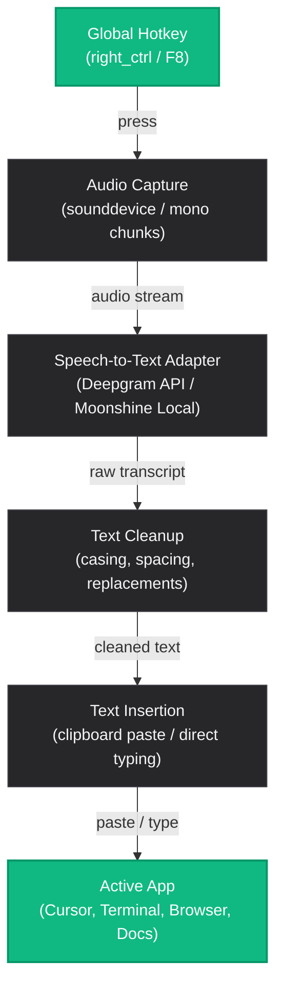

# Voice Automation

A Windows push-to-talk voice dictation tool I built to reduce typing friction in AI engineering workflows.

It runs in the background, listens only while a hotkey is held, transcribes speech, cleans the transcript, and inserts the result into the currently focused application. The design is intentionally lightweight: short recording windows, background processing, and explicit backend choice between cloud and local speech models.

It supports two speech-to-text modes:

- **Deepgram API mode** for high-accuracy cloud transcription.
- **Moonshine local mode** for offline, CPU-friendly transcription.

The project is framed as a personal productivity tool, but it is built like a real desktop utility: tray-first UI, secure API key storage, app-data config, model download management, and Windows packaging.

## License

This project is open source under the [MIT License](LICENSE).

## Why This Exists

Modern technical work involves constant context switching: coding in Cursor, writing prompts, using terminals, searching documentation, messaging, and testing ideas in browsers. Voice input can remove a lot of small typing overhead, but most dictation tools are either app-specific, always listening, or awkward to use inside developer workflows.

Voice Automation is designed as a lightweight system-wide dictation shortcut:

1. Hold a hotkey.
2. Speak.
3. Release the hotkey.
4. The transcript is pasted into the active app.

The goal is not to replace the keyboard. The goal is to make common text-heavy actions faster.

The project is built with robust software engineering principles: clear system boundaries, latency-aware processing, explicit online/offline trade-offs, and a polished desktop UI that behaves like a production utility instead of a demo.

## Features

- Global push-to-talk hotkey.
- Records only while the hotkey is held.
- Works across normal Windows text fields.
- Supports Deepgram cloud transcription.
- Supports Moonshine local transcription.
- Tray-first Windows desktop app with Home and Settings screens.
- Secure Deepgram API key storage with the Windows credential store.
- Moonshine model selection, download, and verification from the desktop UI.
- Clipboard paste insertion with direct typing fallback.
- Optional command execution in terminals by ending speech with "run" or "execute".
- Lightweight transcript cleanup and word replacements.
- Small overlay HUD for recording/transcription feedback.
- Config-driven backend switching.
- Diagnostics and environment checks for setup debugging.

## Engineering Highlights

* **Asynchronous Multi-Threaded Pipeline**: Engineered a non-blocking execution flow using Python threading and global thread pools (`QThreadPool`) to prevent OS hotkey lag and GUI freezes during concurrent microphone capture and STT processing.
* **Quantized Local CPU Inference**: Integrated the **Moonshine** model family, optimizing inference latency on resource-constrained host machines (CPU-only execution, leveraging compressed parameters from 26M to 245M).
* **OS-Level Credential Security**: Implemented secure credential storage for external APIs using the system keyring service (`keyring` wrapper for Windows Credential Manager) instead of plaintext configuration files.
* **Abstract STT Adapter Interface**: Designed a decoupled, polymorphic adapter pattern (`SttAdapter`) allowing seamless runtime swaps between Deepgram cloud transcription and local Moonshine models.
* **Regex-based Text Normalization**: Built a custom processing pipeline for token normalization, casing correction, and custom dictionary mappings to ensure high-accuracy insertion.

## Inference & Performance Trade-offs

The engine is profiled to run on CPU-only hosts alongside CPU-heavy IDEs (such as Cursor/VS Code) and terminals.

| Model / Provider | Parameter Count | Mode | Typical RTF (Real-Time Factor) | Best Use Case |
| :--- | :---: | :---: | :---: | :--- |
| **Deepgram API** | *N/A (Cloud)* | Cloud Streaming | < 0.1 | High-accuracy technical prompt dictation (requires network) |
| **Moonshine Tiny** | 26M | Local CPU | ~0.15 | Ultra-fast short commands, lowest CPU footprint |
| **Moonshine Small** | 123M | Local CPU | ~0.35 | Normal conversational typing with balanced latency |
| **Moonshine Medium** | 245M | Local CPU | ~0.60 | High-accuracy local typing |


## System Design



### Latency Strategy

- Push-to-talk only, not always listening.
- Short audio chunks so the recording loop stays responsive.
- Background transcription so the UI and hotkey listener stay usable.
- Direct typing fallback when clipboard paste is not suitable.
- Offline Moonshine mode when network latency or privacy is a concern.

## Backend Modes

### Deepgram API Mode

Deepgram is the recommended cloud mode in this project because it provides stronger transcription accuracy for real usage. This is useful when dictating technical language, prompts, commands, or longer natural speech.

Deepgram also provides generous free credits, which makes it practical for personal productivity automation.

To use Deepgram mode:

1. Create a Deepgram account.
2. Generate an API key from the Deepgram dashboard.
3. Copy `.env.example` to `.env`.
4. Add your API key to `.env`.
5. Keep `model_provider` set to `deepgram` in `voice_automation_config.json`.

Example config:

```json
{
    "model_provider": "deepgram",
    "sample_rate": 8000,
    "deepgram_api_key": ""
}
```

The API key can be set either in `voice_automation_config.json` or in a `.env` file:

```env
DEEPGRAM_API_KEY=your_api_key_here
```

In the desktop app, the key is stored in the operating system credential store through `keyring`, not in the JSON config file.

### Moonshine Local Mode

Moonshine is included for local/offline transcription. It is useful when you want the system to run without sending audio to a cloud API.

Example config:

```json
{
    "model_provider": "moonshine",
    "model_arch": 5,
    "sample_rate": 16000
}
```

Available Moonshine model architecture values:

| Model | `model_arch` |
|---|---:|
| Tiny | `0` |
| Base | `1` |
| Tiny Streaming | `2` |
| Base Streaming | `3` |
| Small Streaming | `4` |
| Medium Streaming | `5` |

For better local accuracy, use `model_arch: 5` for Moonshine Medium Streaming.

Download the selected Moonshine model:

```bat
python -m voice_automation download-model
```

The setup script also runs the model download command:

```bat
setup.bat
```

Important: model download is for Moonshine mode. If `model_provider` is set to `deepgram`, the downloader will not download a Moonshine model until the config is switched to `moonshine`.

## Installation

Requirements:

- Windows
- Python 3.11 or newer
- Microphone access

Create and activate a virtual environment:

```bat
python -m venv .venv
call .venv\Scripts\activate.bat
```

Install the project:

```bat
pip install -e .
```

Or run the setup script:

```bat
setup.bat
```

If you are using Deepgram, create your `.env` file after installation:

```bat
copy .env.example .env
```

Then edit `.env` and set:

```env
DEEPGRAM_API_KEY=your_deepgram_api_key_here
```

## Configuration

The app uses:

```text
voice_automation_config.json
```

Current important settings:

| Setting | Purpose |
|---|---|
| `hotkey` | Key used for push-to-talk |
| `model_provider` | `deepgram` or `moonshine` |
| `deepgram_api_key` | API key for Deepgram mode |
| `model_arch` | Moonshine model architecture |
| `sample_rate` | Audio sample rate |
| `paste_mode` | `clipboard` or `type` |
| `max_record_seconds` | Safety limit for one recording |
| `replacements` | Custom word replacements |

Default hotkey:

```json
"hotkey": "right_ctrl"
```

### Deepgram Configuration

For cloud transcription, use:

```json
{
    "model_provider": "deepgram",
    "sample_rate": 8000,
    "deepgram_api_key": ""
}
```

The recommended approach is to keep `deepgram_api_key` empty in `voice_automation_config.json` and store the real key in `.env`.

### Moonshine Configuration

For local transcription, use:

```json
{
    "model_provider": "moonshine",
    "model_arch": 5,
    "sample_rate": 16000
}
```

Then download the local model:

```bat
python -m voice_automation download-model
```

## Usage

Run the application:

```bat
python -m voice_automation run
```

Or:

```bat
run.bat
```

Then:

1. Focus any text field.
2. Hold the configured hotkey.
3. Speak.
4. Release the hotkey.
5. The transcript is pasted into the focused app.

Run environment checks:

```bat
python -m voice_automation check
```

Download a Moonshine model:

```bat
python -m voice_automation download-model
```

Note: model download currently applies to Moonshine mode. Deepgram does not need a local model download.

## Desktop App

The desktop app is the V1 Windows-first interface for Voice Automation. It is tray-first and opens to a simple Home screen with Start and Stop controls. Settings handles backend selection, Deepgram key storage, Moonshine model management, hotkey choice, and recording limits.

Run the desktop app from source:

```bat
python -m voice_automation.desktop
```

If the project is installed with console scripts available, you can also run:

```bat
voice-automation-desktop
```

The tray menu includes Start Dictation, Stop Dictation, Settings, Check Environment, and Quit.
The tray menu also includes Diagnostics.

### Desktop Home Screen

The Home screen shows the current dictation status, backend readiness, the primary Start and Stop buttons, and quick access to Settings, Check Environment, and Diagnostics. Use Settings when you need to change the speech backend, Deepgram API key, Moonshine model, hotkey, or maximum recording time.

The desktop app uses direct typing mode by default and does not expose a paste-mode selector. The project still has CLI/config support for insertion behavior, but the desktop workflow is optimized around typing into the active application.

### Desktop Settings

The Settings screen is where desktop users configure:

| Setting | Purpose |
|---|---|
| Backend | Choose online Deepgram API or offline Moonshine Local |
| Deepgram API key | Save the cloud transcription key through the OS credential store |
| Moonshine model | Select and download the offline model |
| Hotkey | Choose the push-to-talk key |
| Max recording seconds | Safety cap for one recording |
| Sample rate | Advanced audio tuning value |
| Model storage | Moonshine download location |

The recommended default for `max_record_seconds` is `300` seconds. Normal push-to-talk still stops when the key is released; the time limit is a safety fallback in case a release event is missed or recording gets stuck.
The UI now shows readiness states so Start stays disabled until the selected backend is actually configured.

### Desktop Deepgram Setup

In the desktop Settings screen:

1. Select `Deepgram API` as the backend.
2. Paste your Deepgram API key into the API key field.
3. Save the key.
4. Save or apply the settings.

The desktop app stores the Deepgram API key in the operating system credential store through `keyring`, not in the JSON config file. The CLI still supports `.env` and JSON-based keys for development compatibility, but the desktop settings flow should use the keyring-backed field.

Deepgram mode does not require a local model download.

### Desktop Moonshine Setup

In the desktop Settings screen:

1. Select `Moonshine Local` as the backend.
2. Choose a Moonshine model:
   - Tiny `0`
   - Base `1`
   - Tiny Streaming `2`
   - Base Streaming `3`
   - Small Streaming `4`
   - Medium Streaming `5`
3. Click the Moonshine download button.
4. Save or apply the settings.

Moonshine runs locally after the selected model is downloaded. For the best local accuracy, use Medium Streaming `5`.
The UI verifies the selected Moonshine model before enabling Start.

### Building The Desktop Executable

The V1 package target is a Windows PyInstaller one-folder build. From an activated virtual environment with the project dependencies installed, build with the provided PyInstaller spec or build script:

```bat
pyinstaller voice_automation_desktop.spec
```

If a build script is present in your checkout, use it as the wrapper around the same PyInstaller build:

```bat
build_desktop.bat
```

Build outputs are written under `build\` and `dist\`.

## Project Structure

```text
voice_automation/
+-- __main__.py        CLI entrypoint
+-- orchestrator.py    Main runtime pipeline
+-- service.py         Engine daemon lifecycle manager
+-- audio.py           Microphone recording
+-- hotkey.py          Global push-to-talk listener
+-- stt.py             Deepgram and Moonshine adapters
+-- paste.py           Clipboard/direct text insertion
+-- cleanup.py         Transcript cleanup
+-- state.py           Thread-safe app state
+-- overlay.py         Tkinter status HUD
+-- check.py           Environment checks
+-- downloader.py      Moonshine model downloader
+-- config.py          Config and .env loading
+-- logger.py          Central logging configuration
```

## Engineering Notes

- The app is intentionally push-to-talk, not always listening.
- STT providers are hidden behind a common adapter interface.
- Audio capture and transcription run through background threads to keep the hotkey loop responsive.
- Clipboard insertion is preferred because it is faster and more reliable than typing character by character.
- Direct typing remains available as a fallback for apps where clipboard paste is not suitable.
- The desktop UI is tray-first and production-oriented rather than dashboard-heavy.
- Config is stored under `%APPDATA%\VoiceAutomation` for the desktop app.
- No silent backend fallback: the selected mode must be ready before dictation starts.

## Current Status

This is a working personal automation project focused on Windows productivity workflows. It is useful to me as an AI engineer because it reduces repetitive typing and keeps dictation close to the apps I already use.

The current desktop implementation includes:

- Tray-first Home and Settings UI
- Deepgram API key storage through the OS credential store
- Moonshine model download and readiness checks
- Diagnostics and environment checks
- App-data config for desktop use
- PyInstaller packaging target for Windows

Future improvements may include a richer first-run setup flow, more polished section-based Settings UI, better test coverage, and a production installer.
